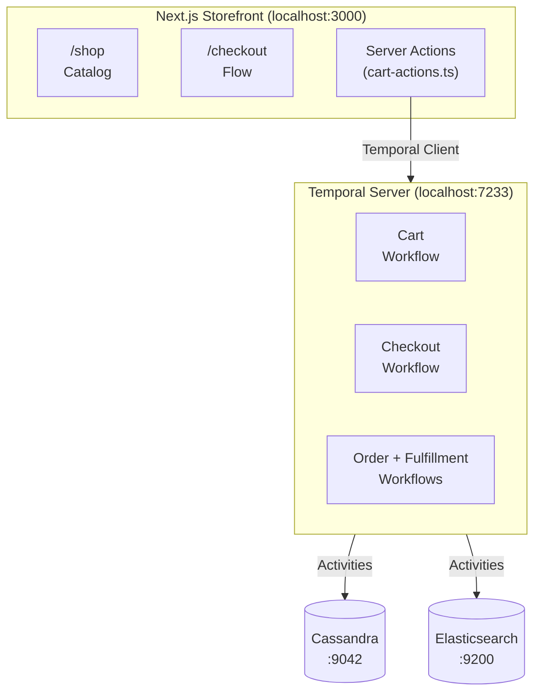

# Temporal Commerce Demo

A full-stack e-commerce application demonstrating [Temporal](https://temporal.io) durable execution patterns — cart management, checkout orchestration, order processing, and simulated fulfillment.

Built with **Next.js**, **Temporal TypeScript SDK**, **Cassandra**, and **Elasticsearch**.

## Architecture



### Temporal Workflows

| Workflow | Purpose | Key Patterns |
| ---------- | --------- | -------------- |
| **Cart** | Manages shopping cart state as a long-running workflow | `updateWithStart`, Query/Update handlers, entity lifecycle |
| **Checkout** | Orchestrates shipping → payment → order submission | State machine, step validation, `continueAsNew` |
| **Order** | Processes order from placement through fulfillment | Supplier routing, assignment tracking, status projections |
| **Fulfillment** | Simulates supplier order submission and shipping | Timer-based simulation, shipment tracking |
| **Inventory** | CQRS inventory management with reservations | Write-side mutations, read-side projections |
| **Identity** | Email-based shopper auth and address persistence | Cookie sessions, auto-create accounts, address pre-fill |

## Quick Start

### Prerequisites

- **Node.js** ≥ 20
- **Docker** (for Cassandra, Elasticsearch, Temporal)

### 1. Install dependencies

```bash
npm install
```

### 2. Start infrastructure

```bash
make init
```

This starts Cassandra, Elasticsearch, and Temporal via Docker Compose, then initializes the Cassandra schema.

### 3. Start the application

```bash
make app-start
```

This starts the Next.js dev server and Temporal workers concurrently.

### 4. Seed demo data

In another terminal:

```bash
make seed
```

### 5. Browse

- **Storefront** → [http://localhost:3000/shop](http://localhost:3000/shop)
- **Temporal UI** → [http://localhost:8233](http://localhost:8233)

## Makefile Targets

| Target | Description |
| -------- | ------------- |
| `make dev` | Start infrastructure (Cassandra, ES, Temporal) |
| `make init` | Full init: infrastructure + Cassandra schema |
| `make app-start` | Start storefront + Temporal workers |
| `make app-stop` | Stop application processes |
| `make seed` | Populate demo catalog data |
| `make workers` | Start Temporal workers only |
| `make stop` | Stop infrastructure containers |
| `make clean` | Stop + wipe all data volumes |

## Project Structure

```text
temporal-commerce-demo/
├── cassandra/              # CQL schema
├── sample-data/            # Demo catalog (catalog.json)
├── scripts/                # Seed orchestrator
├── src/
│   ├── app/
│   │   ├── api/
│   │   │   ├── auth/shopper/ # Shopper auth (login, logout, me, address)
│   │   │   ├── search/      # Product search API
│   │   │   └── dev/         # Developer tools (ES init, reindex)
│   │   ├── admin/           # Admin dashboard
│   │   └── shop/            # Storefront pages + Server Actions
│   │       ├── checkout/    # Multi-step checkout flow
│   │       └── orders/      # Order lookup by email
│   ├── components/         # UI components (NavBar, CartDrawer, AccountDropdown)
│   ├── context/            # React context (CartProvider, ShopperProvider)
│   ├── lib/                # Shared: Cassandra, ES, Temporal clients
│   └── temporal/
│       ├── contracts/      # Shared type definitions
│       ├── cart/           # Cart workflow + activities
│       ├── checkout/       # Checkout workflow + activities
│       ├── oms/            # Order management workflow
│       ├── fulfillment/    # Fulfillment simulation workflow
│       ├── inventory/      # CQRS inventory workflow
│       ├── identity/       # Shopper auth, users, API tokens, feature flags
│       └── worker.ts       # Unified Temporal worker
└── docker-compose.yml      # Local infrastructure
```

## Technology Stack

- **Frontend**: Next.js 15 (App Router), React, Tailwind CSS
- **Backend**: Next.js Server Actions + API Routes
- **Orchestration**: Temporal TypeScript SDK
- **Database**: Apache Cassandra (catalog, orders, inventory)
- **Search**: Elasticsearch (product search with faceted filtering)
- **Infrastructure**: Docker Compose (local), compatible with Temporal Cloud + AWS EKS

## License

MIT
