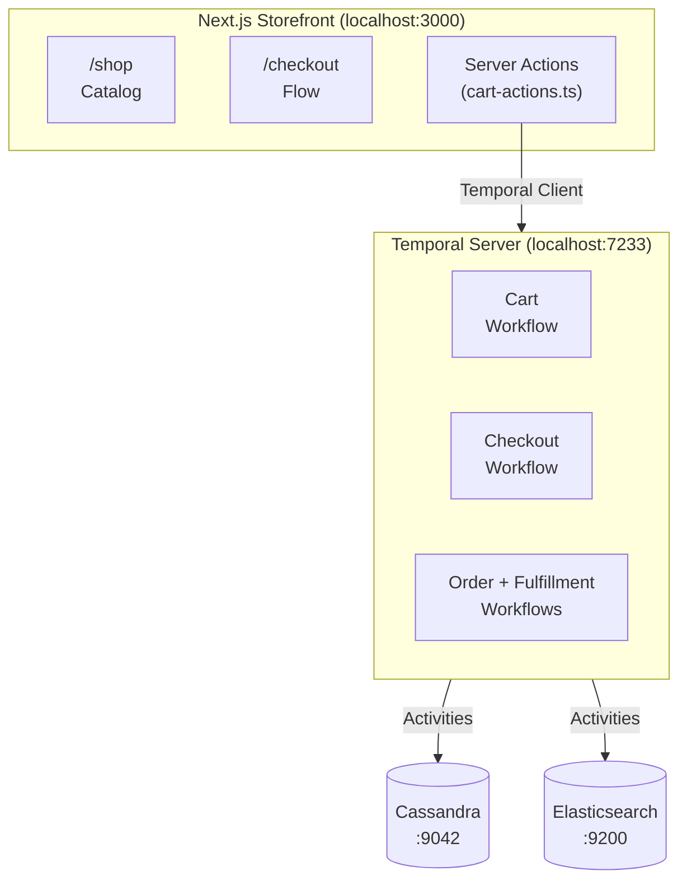

# Temporal Commerce Demo

A full-stack e-commerce application demonstrating [Temporal](https://temporal.io) durable execution patterns — cart management, checkout orchestration, order processing, and simulated fulfillment.

Built with **Next.js**, **Temporal TypeScript SDK**, **Cassandra**, and **Elasticsearch**.

> **Note:** This demo is derived from a much more comprehensive e-commerce platform currently under active development. It is a standalone extraction designed to showcase Temporal patterns without the full platform's multi-tenant, multi-supplier, and plugin architecture.

> **AI Disclosure:** AI tooling was used extensively for code generation and documentation. Not all output has been thoroughly reviewed yet. The product catalog — including images, descriptions, and metadata — was created using [Printify](https://printify.com/). All products were first created as real products in a Printify store; the data and mockup images were then exported and adapted for this demo.

## Architecture


```mermaid
graph TB
    subgraph nextjs["Next.js Storefront (localhost:3000)"]
        shop["/shop<br/>Catalog"]
        checkout["/checkout<br/>Flow"]
        actions["Server Actions<br/>(cart-actions.ts)"]
    end

    subgraph temporal["Temporal Server (localhost:7233)"]
        cartWF["Cart<br/>Workflow"]
        checkoutWF["Checkout<br/>Workflow"]
        orderWF["Order + Fulfillment<br/>Workflows"]
    end

    actions -->|"Temporal Client"| temporal
    temporal -->|"Activities"| cassandra[("Cassandra<br/>:9042")]
    temporal -->|"Activities"| elasticsearch[("Elasticsearch<br/>:9200")]
```

### Temporal Workflows

| Workflow | Purpose | Key Patterns |
| ---------- | --------- | -------------- |
| **Cart** | Manages shopping cart state as a long-running workflow | `updateWithStart`, Query/Update handlers, entity lifecycle |
| **Checkout** | Orchestrates shipping → payment → order submission | State machine, step validation, `continueAsNew` |
| **Order** | Processes order from placement through fulfillment | Supplier routing, assignment tracking, status projections |
| **Fulfillment** | Simulates supplier order submission and shipping | Timer-based simulation, shipment tracking |
| **Inventory** | CQRS inventory management with reservations | Write-side mutations, read-side projections |
| **Identity** | Email-based shopper auth and address persistence | Cookie sessions, auto-create accounts, address pre-fill |

Domain workflows are authored as **prepare → decide → finalize state machines** around
pure, unit-tested deciders (`src/temporal/framework`). Every workflow carries a parseable
`demo.{domain}.{entityId}` ID plus correlation Search Attributes, so one Temporal
visibility query (`CorrelationId = '<cartId>'`) returns the whole
cart → checkout → order → fulfillment journey; each state transition is also recorded to
Cassandra with a full context snapshot for the order-trace tool.

## Quick Start

### Prerequisites

- **Node.js** ≥ 20
- **Docker** (for Cassandra, Elasticsearch, Temporal)

> **Apple Silicon (M4 / M5) note:** the Elasticsearch images are pinned to a tag whose bundled JDK
> starts cleanly on newer Apple Silicon. If you swap in older Elasticsearch tags and the containers
> exit immediately with `Exited (134)` / `SIGILL`, see
> [Getting Started → Troubleshooting](GETTING_STARTED.md#elasticsearch-containers-crash-on-apple-silicon-sigill--exited-134).

### 1. Install dependencies

```bash
npm install
```

### 2. Initialize and Seed

```bash
npm run dev:init
```

This starts all Docker containers, initializes the database schemas, and seeds the initial catalog data.

### 3. Start the application

```bash
npm run dev:up
```

This starts the Next.js dev server and Temporal workers concurrently.

### 4. Browse

- **Storefront** → [http://localhost:3000/shop](http://localhost:3000/shop)
- **Temporal UI** → [http://localhost:8233](http://localhost:8233)
- **Order Trace (dev tool)** → [http://localhost:3000/dev/order-trace](http://localhost:3000/dev/order-trace) — cross-domain trace of an order's workflow journey with per-transition state history

## NPM Scripts

| Script | Description |
| -------- | ------------- |
| `npm run dev:start-all` | Start infrastructure (Docker) + storefront + workers |
| `npm run dev:stop-all` | Stop everything (storefront, workers + infrastructure) |
| `npm run dev:up` | Start storefront app (Next.js) + Temporal workers |
| `npm run dev:down` | Stop storefront app and Temporal worker processes |
| `npm run dev:init` | Full reset: wipe volumes ➔ start containers ➔ seed catalog ➔ stop app |
| `npm run dev:status` | Check status of all backend databases, services, and apps |
| `npm run dev:storefront` | Start storefront app only |
| `npm run dev:worker` | Start Temporal workers only |
| `npm run dev:seed` | Populate catalog and inventory data manually |
| `npm run db:init` | Apply Cassandra schema |
| `npm run db:verify` | Verify Cassandra schema consistency |
| `npm run infra:up` | Start Docker database infrastructure only |
| `npm run infra:up:obs` | Start infrastructure + observability (Jaeger, Prometheus, Grafana) |
| `npm run infra:down` | Stop Docker containers |
| `npm run infra:clean` | Stop Docker containers + wipe all data volumes |
| `npm run infra:ps` | List running Docker containers |

See [Getting Started](GETTING_STARTED.md) for detailed setup instructions.

## Project Structure

```text
temporal-commerce-demo/
├── cassandra/              # CQL schema
├── sample-data/            # Demo catalog (catalog.json)
├── scripts/                # Seed orchestrator
├── src/
│   ├── app/
│   │   ├── api/
│   │   │   ├── auth/shopper/ # Shopper auth (login, logout, me, address)
│   │   │   ├── search/      # Product search API
│   │   │   └── dev/         # Developer tools (ES init, reindex)
│   │   ├── admin/           # Admin dashboard
│   │   └── shop/            # Storefront pages + Server Actions
│   │       ├── checkout/    # Multi-step checkout flow
│   │       └── orders/      # Order lookup by email
│   ├── components/         # UI components (NavBar, CartDrawer, AccountDropdown)
│   ├── context/            # React context (CartProvider, ShopperProvider)
│   ├── lib/                # Shared: Cassandra, ES, Temporal clients
│   └── temporal/
│       ├── contracts/      # Shared type definitions
│       ├── cart/           # Cart workflow + activities
│       ├── checkout/       # Checkout workflow + activities
│       ├── oms/            # Order management workflow
│       ├── fulfillment/    # Fulfillment simulation workflow
│       ├── inventory/      # CQRS inventory workflow
│       ├── identity/       # Shopper auth, users, API tokens, feature flags
│       └── worker.ts       # Unified Temporal worker
└── docker-compose.yml      # Core infrastructure (6 containers)
└── docker-compose.observability.yml  # Opt-in: Jaeger, Prometheus, Grafana
```

## Observability (Optional)

The observability stack (Jaeger, Prometheus, Grafana) is opt-in. To enable:

```bash
# Persistent — add to .env.local:
OTEL_ENABLED=true

# Then npm run infra:up includes observability automatically.
# Or one-off:
npm run infra:up:obs
```

| Service | URL |
| --- | --- |
| Jaeger | [http://localhost:16686](http://localhost:16686) |
| Prometheus | [http://localhost:9090](http://localhost:9090) |
| Grafana | [http://localhost:3200](http://localhost:3200) (admin/admin) |

## Technology Stack

- **Frontend**: Next.js 16 (App Router), React, Tailwind CSS
- **Backend**: Next.js Server Actions + API Routes
- **Orchestration**: Temporal TypeScript SDK
- **Database**: Apache Cassandra (catalog, orders, inventory)
- **Search**: Elasticsearch (product search with faceted filtering)
- **Infrastructure**: Docker Compose (local), compatible with Temporal Cloud + Google Cloud Run

## AI Agent Tooling & Configuration

This repository includes metadata, configuration, and workflow automation guides optimized for AI coding assistants (such as Antigravity, Claude, and Gemini). These files help AI agents understand the codebase architecture, follow developer preferences, and automate repository tasks:

### Configuration Files
- **[AGENTS.md](file:///Users/jeffromine/src/portfolio/temporal-commerce-demo/AGENTS.md) / [CLAUDE.md](file:///Users/jeffromine/src/portfolio/temporal-commerce-demo/CLAUDE.md)**: Workspace-level agent rules and framework-specific guidelines (e.g. Next.js App Router rules).
- **[.antigravityignore](file:///Users/jeffromine/src/portfolio/temporal-commerce-demo/.antigravityignore)**: Instructs AI agents to ignore build output (`.next/`, `dist/`), dependencies (`node_modules/`), and temporary OS/IDE files to maintain a clean context window.
- **[.agent/rules.md](file:///Users/jeffromine/src/portfolio/temporal-commerce-demo/.agent/rules.md)**: Project-specific design standards, architecture constraints (e.g. Temporal determinism rules), and gotchas.

### Skills & Workflows
- **[.agent/skills/](file:///Users/jeffromine/src/portfolio/temporal-commerce-demo/.agent/skills/)**: Custom domain-specific knowledge folders (e.g. [nextjs.md](file:///Users/jeffromine/src/portfolio/temporal-commerce-demo/.agent/skills/nextjs.md), [typescript-temporal.md](file:///Users/jeffromine/src/portfolio/temporal-commerce-demo/.agent/skills/typescript-temporal.md)) containing guidelines to assist agents in writing correct, idiomatic code.
- **[.agent/workflows/](file:///Users/jeffromine/src/portfolio/temporal-commerce-demo/.agent/workflows/)**: Executable/runnable step-by-step guides that AI agents use to automate repository maintenance, testing, and debugging workflows:
  - **[demo-start-local-dev.md](file:///Users/jeffromine/src/portfolio/temporal-commerce-demo/.agent/workflows/demo-start-local-dev.md)**: Start database containers, storefront, and workers.
  - **[demo-initialize.md](file:///Users/jeffromine/src/portfolio/temporal-commerce-demo/.agent/workflows/demo-initialize.md)**: Wipe, re-initialize database container schemas, and seed data.
  - **[demo-status.md](file:///Users/jeffromine/src/portfolio/temporal-commerce-demo/.agent/workflows/demo-status.md)**: Check platform and infrastructure health.
  - **[demo-verify.md](file:///Users/jeffromine/src/portfolio/temporal-commerce-demo/.agent/workflows/demo-verify.md)** / **[demo-e2e-test.md](file:///Users/jeffromine/src/portfolio/temporal-commerce-demo/.agent/workflows/demo-e2e-test.md)**: Automated end-to-end checks, Cassandra schema consistency validation, and checkout flows.
  - **[demo-temporal-worker-changes.md](file:///Users/jeffromine/src/portfolio/temporal-commerce-demo/.agent/workflows/demo-temporal-worker-changes.md)**: Safe deployment guidelines for worker and workflow changes.
  - **[demo-project-hygiene.md](file:///Users/jeffromine/src/portfolio/temporal-commerce-demo/.agent/workflows/demo-project-hygiene.md)**: Check for git hygiene, secrets protection, and metadata cleanup.
  - **[demo-shutdown.md](file:///Users/jeffromine/src/portfolio/temporal-commerce-demo/.agent/workflows/demo-shutdown.md)**: Gracefully stop all background services.

## License

MIT

