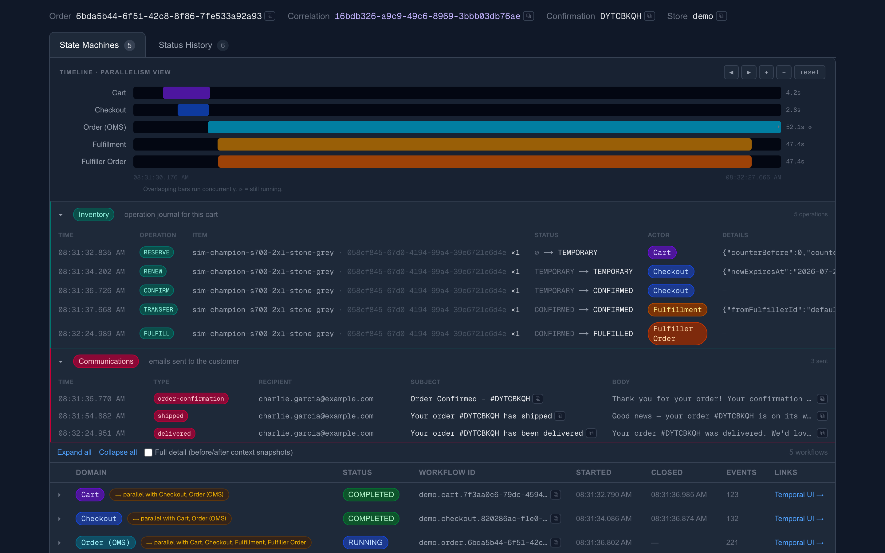
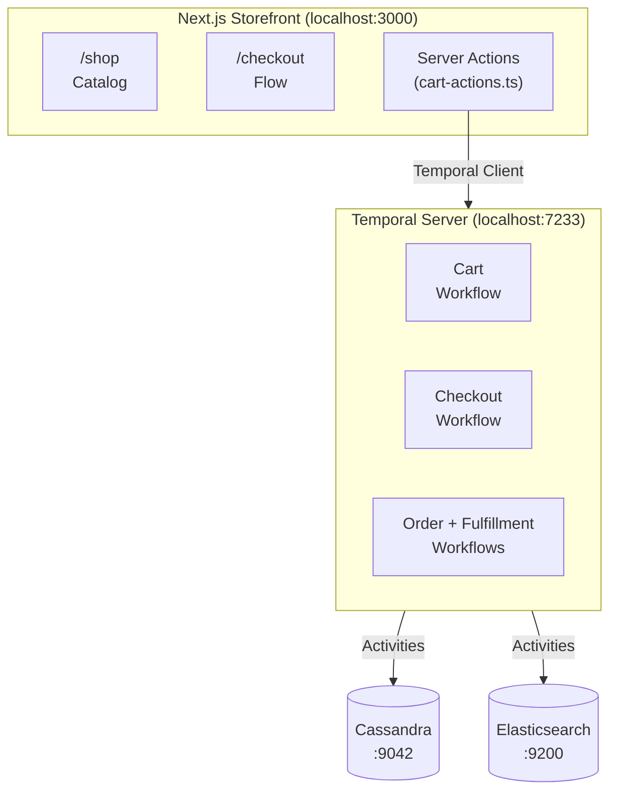
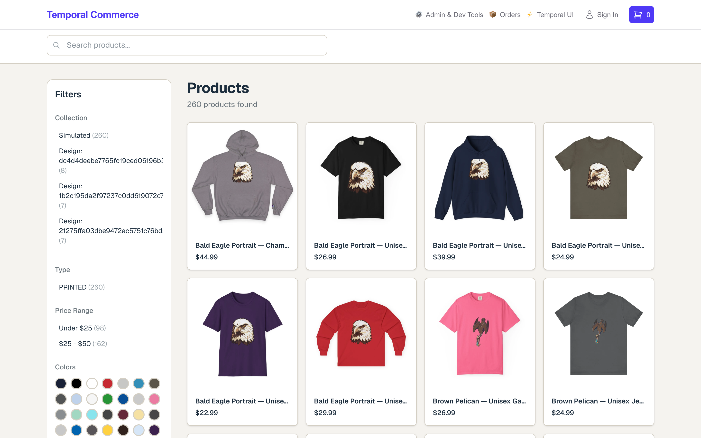
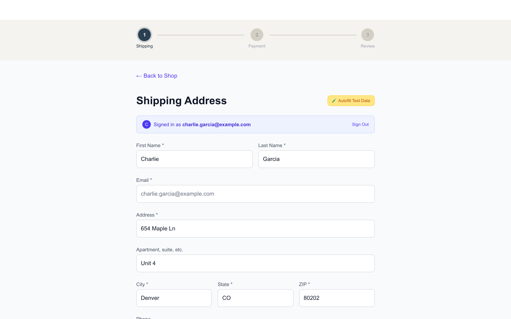
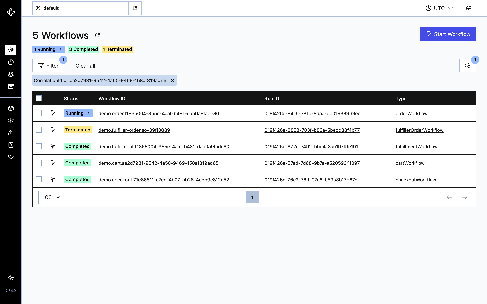

# Temporal Commerce Demo

[](https://github.com/night-heron-software/temporal-commerce-demo/actions/workflows/ci.yml)
[](LICENSE)
[](package.json)
[](https://nextjs.org)
[](https://temporal.io)

A full-stack e-commerce application demonstrating [Temporal](https://temporal.io) durable execution patterns — cart management, checkout orchestration, order processing, and simulated fulfillment.

Built with **Next.js**, **Temporal TypeScript SDK**, **Cassandra**, and **Elasticsearch**.



*The built-in Order Trace tool: one order's full cross-domain lifecycle — cart → checkout → OMS → fulfillment → fulfiller order — reconstructed from workflow state transitions recorded to Cassandra.*

> **Note:** This demo is derived from a much more comprehensive e-commerce platform currently under active development. It is a standalone extraction designed to showcase Temporal patterns without the full platform's multi-tenant, multi-supplier, and plugin architecture.

> **AI Disclosure:** AI tooling was used extensively for code generation and documentation. Correctness is enforced by the project's verification gates rather than line-by-line review: a three-level test suite (pure decider unit tests, workflow tests against Temporal's time-skipping test server, and a cross-domain e2e), CI checks for lint / types / formatting / diagram freshness, and custom ESLint rules that enforce the architecture's invariants. The product catalog — including images, descriptions, and metadata — was generated using AI and [Printify](https://printify.com/). All products were first created as real products in a Printify store; the data and mockup images were then exported and adapted for this demo.

## Why This Exists

Every e-commerce system is a distributed state machine. The traditional approach wires cart, payment, inventory, and fulfillment together with REST calls, message queues, cron jobs, and reconciliation scripts. This project demonstrates that Temporal can replace that entire infrastructure layer:

- **No message queue** — workflow signals replace all async messaging.
- **No cron jobs** — scheduled behavior is a workflow timer: a cart's 30-day expiry and a checkout's 1-hour timeout are declarations in the state machine, not jobs scanning for stale rows.
- **No dead-letter queues** — Temporal retry policies and activity timeouts absorb transient failures.
- **No saga orchestrator** — the checkout workflow *is* the saga.
- **No distributed transaction coordinator** — `updateWithStart` gives atomic create-or-update.

**Scale:** ~25,700 LOC · 6 Temporal workflow domains · 260 products · 10,411 variants

## What This Demonstrates

- **Workflows as state machines** — domain workflows are authored as **prepare → decide → finalize** loops around pure, unit-tested deciders (`src/temporal/framework`).
- **Cross-domain correlation** — every workflow carries a parseable `demo.{domain}.{entityId}` ID plus correlation Search Attributes, so one Temporal visibility query (`CorrelationId = '<cartId>'`) returns the whole cart → checkout → order → fulfillment journey.
- **Transition recording** — every state transition is snapshotted to Cassandra with full context, powering the Order Trace dev tool shown above.
- **Diagrams generated from source** — every state machine's diagram is auto-generated: see the [State Machine Reference](docs/reference/state-machine-diagrams.md) (Mermaid diagrams, per-state trigger tables, and the cross-domain orchestration graph), regenerated with `npm run docs:diagrams` and kept fresh by CI.
- **Three-level testing without Docker** — pure decider unit tests, workflow tests on Temporal's time-skipping test server, and a full cart→checkout→OMS→fulfillment e2e (`npm test` needs no containers).

### Temporal Workflows

| Workflow | Purpose | Key Patterns |
| ---------- | --------- | -------------- |
| **Cart** | Manages shopping cart state as a long-running workflow | `updateWithStart`, Query/Update handlers, entity lifecycle |
| **Checkout** | Orchestrates shipping → payment → order submission | State machine, step validation, `continueAsNew` |
| **Order** | Processes order from placement through fulfillment | Fulfiller routing, assignment tracking, status projections |
| **Fulfillment** | Simulates fulfiller order submission and shipping | Timer-based simulation, shipment tracking |
| **Inventory** | CQRS inventory management with reservations | Write-side mutations, read-side projections |
| **Identity** | Email-based shopper auth and address persistence | Cookie sessions, auto-create accounts, address pre-fill |

## Architecture


```mermaid
graph TB
    subgraph nextjs["Next.js Storefront (localhost:3000)"]
        shop["/shop<br/>Catalog"]
        checkout["/checkout<br/>Flow"]
        actions["Server Actions<br/>(cart-actions.ts)"]
    end

    subgraph temporal["Temporal Server (localhost:7233)"]
        cartWF["Cart<br/>Workflow"]
        checkoutWF["Checkout<br/>Workflow"]
        orderWF["Order + Fulfillment<br/>Workflows"]
    end

    actions -->|"Temporal Client"| temporal
    temporal -->|"Activities"| cassandra[("Cassandra<br/>:9042")]
    temporal -->|"Activities"| elasticsearch[("Elasticsearch<br/>:9200")]
```

## See It in Action

| Storefront | Checkout |
| --- | --- |
|  |  |

*Left: the storefront catalog — faceted search served by Elasticsearch. Right: the multi-step checkout; every step is a Temporal Update with validation guards enforcing the state machine.*



*One visibility query in the Temporal UI (`CorrelationId = "<cartId>"`) returns the entire journey: cart, checkout, order, fulfillment, and fulfiller-order workflows.*

## Quick Start

### Prerequisites

- **Node.js** ≥ 22
- **Docker** (for Cassandra, Elasticsearch, Temporal)

> **Apple Silicon (M4 / M5) note:** the Elasticsearch images are pinned to a tag whose bundled JDK
> starts cleanly on newer Apple Silicon. If you swap in older Elasticsearch tags and the containers
> exit immediately with `Exited (134)` / `SIGILL`, see
> [Getting Started → Troubleshooting](GETTING_STARTED.md#elasticsearch-containers-crash-on-apple-silicon-sigill--exited-134).

### 1. Install dependencies

```bash
npm install
```

### 2. Initialize and Seed

```bash
npm run dev:init
```

This starts all Docker containers, initializes the database schemas, and seeds the initial catalog data.

### 3. Start the application

```bash
npm run dev:up
```

This starts the Next.js dev server and Temporal workers concurrently.

### 4. Browse

- **Storefront** → [http://localhost:3000/shop](http://localhost:3000/shop)
- **Temporal UI** → [http://localhost:8233](http://localhost:8233)
- **Order Trace (dev tool)** → [http://localhost:3000/dev/order-trace](http://localhost:3000/dev/order-trace) — cross-domain trace of an order's workflow journey with per-transition state history

## NPM Scripts

| Script | Description |
| -------- | ------------- |
| `npm run dev:start-all` | Start infrastructure (Docker) + storefront + workers |
| `npm run dev:stop-all` | Stop everything (storefront, workers + infrastructure) |
| `npm run dev:up` | Start storefront app (Next.js) + Temporal workers |
| `npm run dev:down` | Stop storefront app and Temporal worker processes |
| `npm run dev:init` | Full reset: wipe volumes ➔ start containers ➔ seed catalog ➔ stop app |
| `npm run dev:status` | Check status of all backend databases, services, and apps |
| `npm run dev:storefront` | Start storefront app only |
| `npm run dev:worker` | Start Temporal workers only |
| `npm run dev:seed` | Populate catalog and inventory data manually |
| `npm run db:init` | Apply Cassandra schema |
| `npm run db:verify` | Verify Cassandra schema consistency |
| `npm run infra:up` | Start Docker database infrastructure only |
| `npm run infra:up:obs` | Start infrastructure + observability (Jaeger, Prometheus, Grafana) |
| `npm run infra:down` | Stop Docker containers |
| `npm run infra:clean` | Stop Docker containers + wipe all data volumes |
| `npm run infra:ps` | List running Docker containers |
| `npm test` | Run the vitest unit/workflow test suite (no Docker required) |
| `npm run test:watch` | Run tests in watch mode |
| `npm run docs:diagrams` | Regenerate the [State Machine Reference](docs/reference/state-machine-diagrams.md) from source |

See [Getting Started](GETTING_STARTED.md) for detailed setup instructions.

## Documentation

| Document | What's Inside |
| --- | --- |
| [Getting Started](GETTING_STARTED.md) | Clone-to-running setup, including Apple Silicon troubleshooting |
| [Project Description](docs/project-description.md) | The full architecture narrative: why Temporal, domain walkthroughs, diagrams |
| [Developer Guide](docs/developer-guide.md) | Day-to-day development: conventions, testing, debugging |
| [Temporal Lessons Learned](docs/temporal-lessons-learned.md) | 26 practical lessons from building on the Temporal TypeScript SDK |
| [State Machine Reference](docs/reference/state-machine-diagrams.md) | Auto-generated Mermaid diagrams + trigger tables for every workflow |
| [Demo Instructions](docs/demo-instructions.md) | Script for a 4–5 minute live demonstration |
| [Deployment Options](docs/cloud-deployment.md) | Survey of hosted options, with a stated bias toward serverless push and away from Kubernetes *(exploratory)* |
| [Testing Without Containers](docs/testing-guide.md) | The three-level test pyramid — full suite, no Docker |
| [Data Architecture for Scale](docs/data-architecture.md) | CQRS, Cassandra write side, Elasticsearch as the app's query API |
| [Worker Topology](docs/worker-scaling.md) | From one dev process to per-domain production scaling |
| [AI-First Development](docs/ai-development-guide.md) | The agent operating layer, runnable workflows, and gates |
| [Google App Engine: Scalability by Constraint](docs/google-app-engine-paved-path.md) | Research note: how GAE's paved path to scaling shaped this architecture |
| [Autoscaling by Push and by Pull](docs/push-vs-pull-autoscaling.md) | Research note: GAE/Cloud Run push scaling vs Temporal's pull model — stickiness, scale-to-zero, Serverless Workers |
| [Glossary](docs/glossary.md) | Terms of art — fulfiller vs fulfillment, command vs fact, reservation lifecycle |
| [ADR index](docs/adr/README.md) | Architecture decision records the source code cites by number |

## Project Structure

```text
temporal-commerce-demo/
├── cassandra/              # CQL schema
├── sample-data/            # Demo catalog (catalog.json)
├── scripts/                # Seed orchestrator
├── src/
│   ├── app/
│   │   ├── api/
│   │   │   ├── auth/shopper/ # Shopper auth (login, logout, me, address)
│   │   │   ├── search/      # Product search API
│   │   │   └── dev/         # Developer tools (ES init, reindex)
│   │   ├── admin/           # Admin dashboard
│   │   └── shop/            # Storefront pages + Server Actions
│   │       ├── checkout/    # Multi-step checkout flow
│   │       └── orders/      # Order lookup by email
│   ├── components/         # UI components (ShopNavBar, CartDrawer, AccountDropdown)
│   ├── context/            # React context (CartProvider, ShopperProvider)
│   ├── lib/                # Shared: Cassandra, ES, Temporal clients
│   └── temporal/
│       ├── contracts/      # Shared type definitions
│       ├── framework/      # prepare → decide → finalize state machine kit
│       ├── cart/           # Cart workflow + activities
│       ├── checkout/       # Checkout workflow + activities
│       ├── oms/            # Order management workflow
│       ├── fulfillment/    # Fulfillment simulation workflow
│       ├── inventory/      # CQRS inventory workflow
│       ├── identity/       # Shopper auth, users, API tokens, feature flags
│       └── worker.ts       # Unified Temporal worker
└── docker-compose.yml      # Core infrastructure (6 containers)
└── docker-compose.observability.yml  # Opt-in: Jaeger, Prometheus, Grafana
```

## Observability (Optional)

The observability stack (Jaeger, Prometheus, Grafana) is opt-in. To enable:

```bash
# Persistent — add to .env.local:
OTEL_ENABLED=true

# Then npm run infra:up includes observability automatically.
# Or one-off:
npm run infra:up:obs
```

| Service | URL |
| --- | --- |
| Jaeger | [http://localhost:16686](http://localhost:16686) |
| Prometheus | [http://localhost:9090](http://localhost:9090) |
| Grafana | [http://localhost:3200](http://localhost:3200) (admin/admin) |

## Technology Stack

- **Frontend**: Next.js 16 (App Router), React, Tailwind CSS
- **Backend**: Next.js Server Actions + API Routes
- **Orchestration**: Temporal TypeScript SDK
- **Database**: Apache Cassandra (catalog, orders, inventory)
- **Search**: Elasticsearch (product search with faceted filtering)
- **Infrastructure**: Docker Compose (local), compatible with Temporal Cloud + Google Cloud Run

## Demo Limitations

Deliberate simplifications that keep the focus on the Temporal patterns:

- **Payments are mocked** — the payment step exercises the state machine, not a real gateway.
- **Emails are stubbed** — order confirmation / shipping notifications are activities that log instead of send (`src/lib/email-service.ts`).
- **The `/admin` area is intentionally unauthenticated** — shopper auth is real (bcrypt, cookie sessions, tested); admin auth is out of scope for the demo.
- **Fulfillment is simulated** — fulfiller processing and shipping are timer-driven workflow simulations.

## AI Agent Tooling & Configuration

This repository treats AI coding agents as first-class contributors: [AGENTS.md](AGENTS.md) routes
an agent to the invariants and detail ([.agent/rules.md](.agent/rules.md), skills, ten runnable
workflow runbooks), and mechanical gates — determinism lint rules, CI-checked generated diagrams,
structural tests — enforce correctness without line-by-line review. The full tour of every surface
and the reasoning behind it: [AI-First Development](docs/ai-development-guide.md).

## License

MIT
