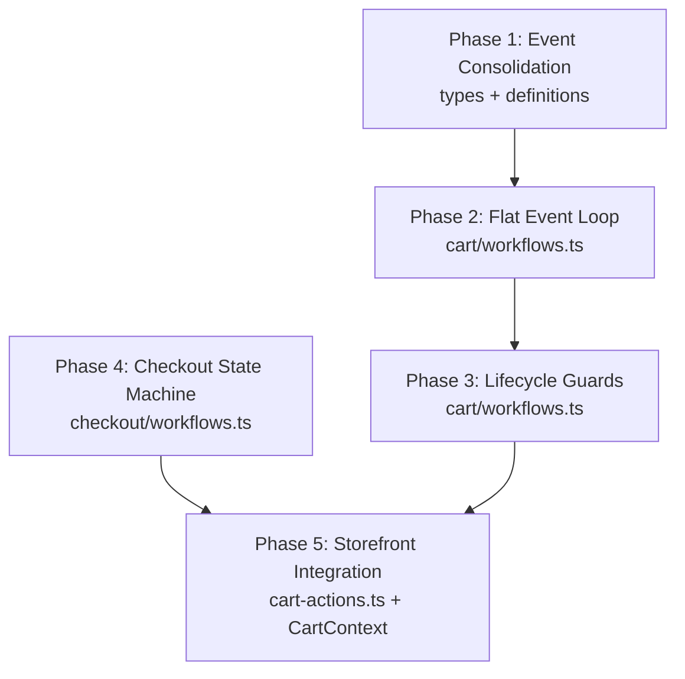

# temporal-commerce-demo: Cart/Checkout Refactor Plan

**STATUS: ✅ COMPLETE** — All 5 phases implemented, `npx tsc --noEmit` passes clean.
> This plan ports the stabilized cart/checkout orchestration patterns from `nightheron-platform` into `temporal-commerce-demo` — stripped of multi-tenancy (`storeId`), multi-repo module boundaries, and fulfillment plugin concerns.

---

## Current State vs. Target Architecture

### Cart Workflow

| Aspect | Demo (Current) | Nightheron (Target Pattern) |
|--------|---------------|---------------------------|
| **Update model** | N separate `setHandler()` calls (one per event type) | Single `cartUpdate` handler with discriminated union `CartEvent` |
| **Main loop** | `condition()` waiting on boolean flags, processes signals inline | Flat event loop via `UpdateExchange` slot — blocks until processed |
| **Projection flush** | Dirty flag + flush in main loop iteration | Synchronous `flushCart()` inside each event handler |
| **Checkout guard** | Re-enter allowed (clears stale state) | Explicit `checkoutInProgress` boolean, rejects duplicates |
| **Timeout race** | No version counter | `checkoutVersion` counter validates signal freshness |
| **Child policy** | `ABANDON` — orphans checkout on cart close | `REQUEST_CANCEL` — cancels checkout on cart close |
| **ES cleanup** | `deleteCart` on empty/abandoned/completed | Always `indexCart` (preserves historical data) |
| **Merge safety** | No `disownCheckout` | `disownCheckout` event prevents double-cancel during merge |
| **ContinueAsNew** | Inline in `incrementUpdateCount` helper | End-of-loop threshold check with `allHandlersFinished` |

### Checkout Workflow

| Aspect | Demo (Current) | Nightheron (Target Pattern) |
|--------|---------------|---------------------------|
| **Structure** | Imperative: register handlers → wait on booleans | State machine: `CheckoutStateFunction` with `CheckoutContext` |
| **State transitions** | Handlers mutate `state.step` directly | State functions return `{ next, state, response }` |
| **PaymentIntent failure** | Swallowed (advances to payment with no `clientSecret`) | Returns to shipping with error message |
| **Cancellation handling** | No `CancelledFailure` handling | `try/catch` with `nonCancellable` cleanup scope |
| **Timeout** | Single `condition()` with 1hr timeout | Per-update 1hr timeout in the state machine loop |
| **Version tracking** | None | `checkoutVersion` in input and all results |

---

## Refactoring Phases

### Phase 1: Cart Event Consolidation
**Files:** `cart/types.ts`, `cart/definitions.ts`, `cart/workflows.ts`

Replace N separate update handlers with a single discriminated union:

```typescript
// types.ts — Replace individual signal interfaces
export type CartEvent =
  | { type: 'addItem';        variantId: string; quantity: number; price: number; properties?: Record<string, unknown> }
  | { type: 'updateQuantity'; lineItemId: string; quantity: number }
  | { type: 'removeItem';     lineItemId: string }
  | { type: 'applyCoupon';    code: string }
  | { type: 'linkUser';       userId: string }
  | { type: 'mergeCarts';     sourceCartId: string; sourceItems: CartItem[]; checkoutWorkflowId?: string }
  | { type: 'adoptCheckout';  checkoutWorkflowId: string }
  | { type: 'disownCheckout' }
  | { type: 'beginCheckout' }
  | { type: 'destroyCart' };

// definitions.ts — Single update + signal + queries
export const cartUpdate = defineUpdate<CartUpdateResponse, [CartEvent]>('cartUpdate');
```

**Changes:**
1. Add `CartEvent` union and `CartUpdateResponse` to `types.ts`
2. Remove all individual signal interfaces (keep them temporarily as type aliases if the UI still imports them)
3. Replace `definitions.ts` with single `cartUpdate`, keep queries and `checkoutCompletedSignal`
4. Remove legacy `checkoutUpdate` and individual handler re-exports from `workflows.ts`

**Storefront impact:** All `cart-actions.ts` callers must switch from e.g. `addItemToCartUpdate` to `cartUpdate` with `{ type: 'addItem', ... }`.

### Phase 2: Cart Flat Event Loop
**Files:** `cart/workflows.ts`

Replace the boolean-flag main loop with the `UpdateExchange` pattern:

```typescript
interface UpdateExchange {
  event: CartEvent;
  processed: boolean;
  result?: CartUpdateResponse;
  error?: Error;
}
```

**Changes:**
1. Add `UpdateExchange` interface
2. Add `checkoutInProgress`, `checkoutVersion`, `checkoutWorkflowId` state variables
3. Replace all `setHandler(xxxUpdate, ...)` with single `setHandler(cartUpdate, ...)` that writes to exchange slot
4. Main loop: `condition(() => updateExchange || checkoutSignal)` → process exchange via `switch (event.type)`
5. Move `continueAsNew` check to end of loop iteration (not inline in `incrementUpdateCount`)
6. Move `allHandlersFinished` to before `continueAsNew` and after main loop exit

**Key behaviors to preserve:**
- Inventory reserve/release per item mutation
- Cart abandonment on empty
- `recalculateTotals()` after every item change

### Phase 3: Cart Lifecycle Guards
**Files:** `cart/workflows.ts`

Port the safety mechanisms:

1. **Duplicate checkout guard** — `beginCheckout` rejects if `checkoutInProgress` is true
2. **`disownCheckout` event** — clears `checkoutInProgress` and `checkoutWorkflowId` without cancelling checkout
3. **`checkoutVersion` counter** — increment on `beginCheckout`/`adoptCheckout`/`mergeCarts`, validate on signal receipt
4. **Child close policy** — Change `PARENT_CLOSE_POLICY_ABANDON` → `ParentClosePolicy.REQUEST_CANCEL`
5. **Terminal cleanup** — Cancel child checkout explicitly if `checkoutInProgress && checkoutWorkflowId` on exit
6. **ES retention** — Remove `deleteCart` from `flushCart`, always index

### Phase 4: Checkout State Machine
**Files:** `checkout/types.ts`, `checkout/definitions.ts`, `checkout/workflows.ts`

Replace the imperative handler-based structure with the state machine driver:

1. Define `CheckoutContext` (no `storeId` field — single-tenant)
2. Define `CheckoutStateFunction` type and state functions:
   - `shippingState` — handles `setShipping` update
   - `paymentState` — handles `setPayment` update
   - `reviewState` — handles `submitOrder` update
   - `cancelledState` / `completedState` — terminal states
3. Main loop: `while (!isTerminal(currentState))` → wait for update → dispatch to current state function → apply output
4. **PaymentIntent failure** — return to `shippingState` with error instead of swallowing
5. **`CancelledFailure` handling** — wrap reservation + state machine loop in try/catch, non-cancellable cleanup scope
6. **Version tracking** — accept `checkoutVersion` from input, include in all result objects

### Phase 5: Storefront Integration
**Files:** `src/app/shop/cart-actions.ts`, `src/context/CartContext.tsx`

Update all Temporal client calls to use the new single `cartUpdate`:

1. Replace `executeUpdate(handle, addItemToCartUpdate, [...])` → `executeUpdate(handle, cartUpdate, [{ type: 'addItem', ... }])`
2. Update `executeCheckoutUpdate` wrappers for the checkout state machine's update pattern
3. Add `disownCheckout` call in the cart merge flow before `destroyCart`
4. Update `getCheckoutState` if it currently falls back to the cart workflow

---

## Dependency Graph



Phases 1→2→3 and Phase 4 can run in parallel. Phase 5 depends on both tracks completing.

---

## Files Changed Summary

| File | Phases | Nature |
|------|--------|--------|
| `src/temporal/cart/types.ts` | P1 | Add `CartEvent` union; add `checkoutVersion` to I/O types; deprecate individual signal interfaces |
| `src/temporal/cart/definitions.ts` | P1 | Replace N updates with single `cartUpdate`; keep queries + signal |
| `src/temporal/cart/workflows.ts` | P2, P3 | Full rewrite: flat event loop, lifecycle guards, version tracking |
| `src/temporal/checkout/types.ts` | P4 | Add `checkoutVersion` to I/O types |
| `src/temporal/checkout/definitions.ts` | P4 | No change (checkout updates stay granular) |
| `src/temporal/checkout/workflows.ts` | P4 | Full rewrite: state machine driver, `CancelledFailure` handling |
| `src/temporal/contracts/cart.ts` | P1 | Mirror `CartEvent` union if contracts duplicate cart types |
| `src/app/shop/cart-actions.ts` | P5 | All Temporal client calls switch to `cartUpdate` |
| `src/context/CartContext.tsx` | P5 | Minor: update action function signatures |
| `src/temporal/cart/activities.ts` | — | No change (reserve/release/index/delete stay the same) |
| `src/temporal/cart/worker.ts` | P1 | Update registered workflow exports |

---

## What NOT to Port

These nightheron-specific concerns should **not** be included:

| Concern | Reason |
|---------|--------|
| `storeId` parameter everywhere | Demo is single-tenant |
| Multi-repo module boundaries (`@nightheron/contracts`, etc.) | Demo is a monorepo |
| `buildCheckoutInput()` helper | Can inline — no cross-package boundary |
| `initCheckoutFields()` helper | Can inline — less indirection for a demo |
| Fulfillment/supplier plugin orchestration | Out of scope for cart/checkout refactor |
| `transferReservations` (deferred in nightheron) | Still deferred |
| Store-not-found middleware | Single-tenant — no subdomain routing |

---

## Verification

After each phase:
1. `npx tsc --noEmit` — full compilation
2. `npm run dev:init` — reinitialize platform with seeded data
3. Manual storefront walkthrough: add items → checkout → shipping → payment → review → submit
4. Verify Temporal UI shows proper workflow hierarchy (cart parent → checkout child)
5. Test cancel flow: start checkout → cancel → verify cart returns to active
6. Test merge flow (if applicable): sign in with guest cart → verify items merge
