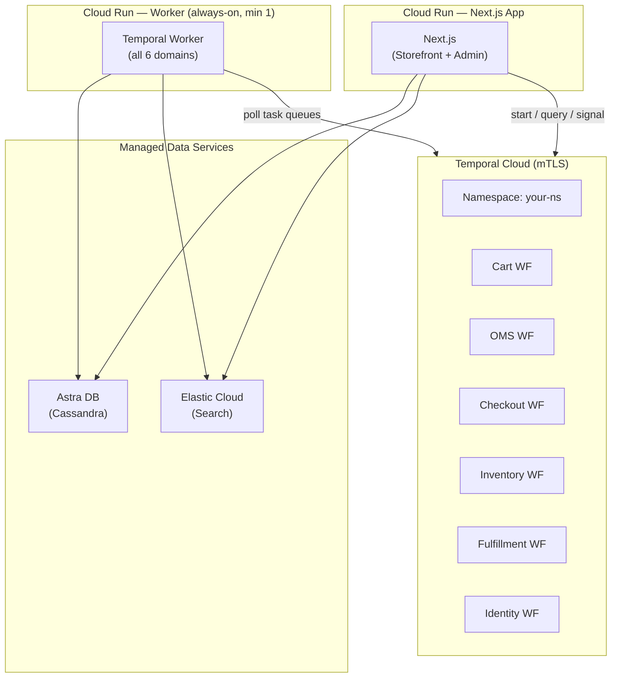

# Cloud Deployment Guide

Deploy the Temporal Commerce Demo to Temporal Cloud + Google Cloud for live presentation.

## Architecture



## Prerequisites

- Google Cloud CLI (`gcloud`) configured with a project
- Temporal Cloud account ([https://cloud.temporal.io](https://cloud.temporal.io))
- Docker installed locally (for building images)

---

## Step 1: Temporal Cloud Setup

### Create Namespace

1. Log in to [Temporal Cloud](https://cloud.temporal.io)
2. Create a new namespace (e.g., `temporal-commerce-demo`)
3. Generate mTLS certificates:

```bash
# Generate client certificate and key
temporal cloud cert generate \
  --namespace temporal-commerce-demo \
  --output-dir ./certs
```

1. Base64-encode the certificates for env vars:

```bash
export TEMPORAL_TLS_CERT=$(base64 < ./certs/client.pem)
export TEMPORAL_TLS_KEY=$(base64 < ./certs/client.key)
export TEMPORAL_ADDRESS="temporal-commerce-demo.xxxxx.tmprl.cloud:7233"
export TEMPORAL_NAMESPACE="temporal-commerce-demo"
```

---

## Step 2: Cassandra (Astra DB)

1. Create a free account at [astra.datastax.com](https://astra.datastax.com)
2. Create a database with keyspace `catalog`
3. Download the secure connect bundle
4. Run schema:

```bash
cqlsh --secure-connect-bundle=./secure-connect-bundle.zip \
  -u YOUR_CLIENT_ID -p YOUR_CLIENT_SECRET \
  -f cassandra/schema.cql
```

1. Set env vars:

```bash
export CASSANDRA_CONTACT_POINTS=xxx.astra.datastax.com:29042
export CASSANDRA_USE_TLS=true
export CASSANDRA_SECURE_BUNDLE_PATH=./secure-connect-bundle.zip
export CASSANDRA_KEYSPACE=catalog
```

---

## Step 3: Elasticsearch (Elastic Cloud)

1. Create a deployment at [cloud.elastic.co](https://cloud.elastic.co)
2. Get the Cloud ID and API key:

```bash
export ELASTICSEARCH_URL="https://your-deployment.es.cloud.elastic.co"
export ELASTICSEARCH_API_KEY="your-api-key"
```

---

## Step 4: Deploy Worker (Cloud Run)

The Temporal worker runs as an always-on Cloud Run service with `--min-instances 1` — it must stay running to poll task queues. Cloud Run's serverless model eliminates all cluster management while keeping costs proportional to usage.

### Build and Push Image

```bash
# Set your project ID
export GCP_PROJECT=$(gcloud config get-value project)

# Build and push to Artifact Registry in one step
gcloud builds submit \
  --tag us-docker.pkg.dev/$GCP_PROJECT/temporal-commerce/worker:latest \
  -f deploy/worker.Dockerfile .
```

### Store Secrets in Secret Manager

```bash
echo -n "$TEMPORAL_ADDRESS"          | gcloud secrets create temporal-address --data-file=-
echo -n "$TEMPORAL_NAMESPACE"        | gcloud secrets create temporal-namespace --data-file=-
echo -n "$TEMPORAL_TLS_CERT"         | gcloud secrets create temporal-tls-cert --data-file=-
echo -n "$TEMPORAL_TLS_KEY"          | gcloud secrets create temporal-tls-key --data-file=-
echo -n "$CASSANDRA_CONTACT_POINTS"  | gcloud secrets create cassandra-contact-points --data-file=-
echo -n "$CASSANDRA_KEYSPACE"        | gcloud secrets create cassandra-keyspace --data-file=-
echo -n "$CASSANDRA_USE_TLS"         | gcloud secrets create cassandra-use-tls --data-file=-
echo -n "$ELASTICSEARCH_URL"         | gcloud secrets create elasticsearch-url --data-file=-
echo -n "$ELASTICSEARCH_API_KEY"     | gcloud secrets create elasticsearch-api-key --data-file=-
```

### Deploy Worker Service

```bash
gcloud run deploy temporal-commerce-worker \
  --image us-docker.pkg.dev/$GCP_PROJECT/temporal-commerce/worker:latest \
  --region us-central1 \
  --no-allow-unauthenticated \
  --min-instances 1 \
  --max-instances 3 \
  --memory 1Gi \
  --cpu 1 \
  --no-cpu-throttling \
  --set-secrets "\
TEMPORAL_ADDRESS=temporal-address:latest,\
TEMPORAL_NAMESPACE=temporal-namespace:latest,\
TEMPORAL_TLS_CERT=temporal-tls-cert:latest,\
TEMPORAL_TLS_KEY=temporal-tls-key:latest,\
CASSANDRA_CONTACT_POINTS=cassandra-contact-points:latest,\
CASSANDRA_KEYSPACE=cassandra-keyspace:latest,\
CASSANDRA_USE_TLS=cassandra-use-tls:latest,\
ELASTICSEARCH_URL=elasticsearch-url:latest,\
ELASTICSEARCH_API_KEY=elasticsearch-api-key:latest"
```

> **Note:** `--no-cpu-throttling` is critical — without it, Cloud Run throttles CPU when no HTTP requests are active, which would stall the Temporal worker's task queue polling. Combined with `--min-instances 1`, this keeps at least one worker polling continuously.

---

## Step 5: Deploy Next.js App (Cloud Run)

### Build App Image

```bash
# Build the Next.js standalone image
gcloud builds submit \
  --tag us-docker.pkg.dev/$GCP_PROJECT/temporal-commerce/app:latest .
```

### Deploy App Service

```bash
gcloud run deploy temporal-commerce-app \
  --image us-docker.pkg.dev/$GCP_PROJECT/temporal-commerce/app:latest \
  --region us-central1 \
  --allow-unauthenticated \
  --min-instances 0 \
  --max-instances 10 \
  --memory 512Mi \
  --cpu 1 \
  --set-secrets "\
TEMPORAL_ADDRESS=temporal-address:latest,\
TEMPORAL_NAMESPACE=temporal-namespace:latest,\
TEMPORAL_TLS_CERT=temporal-tls-cert:latest,\
TEMPORAL_TLS_KEY=temporal-tls-key:latest,\
CASSANDRA_CONTACT_POINTS=cassandra-contact-points:latest,\
CASSANDRA_KEYSPACE=cassandra-keyspace:latest,\
CASSANDRA_USE_TLS=cassandra-use-tls:latest,\
ELASTICSEARCH_URL=elasticsearch-url:latest,\
ELASTICSEARCH_API_KEY=elasticsearch-api-key:latest"
```

---

## Step 6: Seed Cloud Data

With the Next.js app running against cloud infrastructure:

```bash
# Get the Cloud Run app URL
APP_URL=$(gcloud run services describe temporal-commerce-app \
  --region us-central1 --format='value(status.url)')

# Run seed script
npx tsx scripts/seed.ts $APP_URL
```

---

## Step 7: Verify

1. Browse the storefront at your Cloud Run app URL
2. Add items to cart, proceed through checkout
3. Check order appears in the admin panel
4. View workflow execution in [Temporal Cloud UI](https://cloud.temporal.io)
5. Use manual fulfillment controls to step the order through delivery

---

## Environment Variables Reference

| Variable | Required | Default | Description |
| :--------- | :--------- | :-------- | :------------ |
| `TEMPORAL_ADDRESS` | Yes | `localhost:7233` | Temporal server address |
| `TEMPORAL_NAMESPACE` | Yes | `default` | Temporal namespace |
| `TEMPORAL_TLS_CERT` | Cloud only | — | Base64-encoded mTLS client cert |
| `TEMPORAL_TLS_KEY` | Cloud only | — | Base64-encoded mTLS client key |
| `CASSANDRA_CONTACT_POINTS` | Yes | `localhost:9042` | Cassandra contact points |
| `CASSANDRA_KEYSPACE` | Yes | `catalog` | Cassandra keyspace name |
| `CASSANDRA_USE_TLS` | Cloud only | `false` | Enable TLS for Cassandra |
| `CASSANDRA_SECURE_BUNDLE_PATH` | Astra only | — | Path to Astra secure bundle |
| `ELASTICSEARCH_URL` | Yes | `http://localhost:9200` | Elasticsearch endpoint |
| `ELASTICSEARCH_API_KEY` | Cloud only | — | Elasticsearch API key |
| `NEXT_PUBLIC_APP_URL` | Yes | `http://localhost:3000` | Public app URL |
