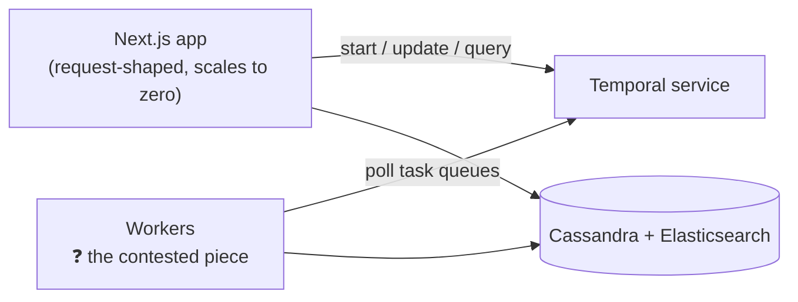

# Deployment Options

How this project could run somewhere other than a laptop — and which direction we'd like it to go.

> *This document was drafted with AI assistance.*

> **Status: exploratory.** This is not a paved path. The demo's supported, tested environment is
> local Docker Compose ([Getting Started](../GETTING_STARTED.md)); everything below is a survey of
> hosted options with a stated preference, not a committed deployment. Commands are illustrative
> starting points, not a validated runbook.

## The bias, stated up front

Two preferences shape this document, and it is more useful to declare them than to pretend the
survey is neutral:

1. **No Kubernetes.** Not "Kubernetes as a last resort" — no Kubernetes. A demo whose entire pitch
   is that Temporal deletes infrastructure (no message queue, no cron, no DLQ, no saga
   orchestrator) undercuts itself if deploying it requires a cluster, a KEDA installation, and a
   scaler to operate. If an option's answer to autoscaling is "run a control plane," it is the
   wrong option here regardless of technical merit.
2. **Prefer serverless push.** The destination is a worker that does not exist until there is work
   for it — invoked on demand by a platform that owns the demand signal, billed for what it
   executes, with nothing to keep warm and no scaler to operate. Lambda-shaped or Cloud
   Run-shaped, not fleet-shaped.

The second preference is currently aspirational. The honest position is that we prefer a thing that
is not yet generally available, and are running the boring shape in the meantime. The rest of this
document is mostly about that gap.

Why the preference is not merely fashion: a Temporal worker is a **pull** consumer, and pull
consumers are exactly the workload that push platforms scale worst — they have no queue visibility,
so a worker scaled to zero has no poller left to notice new work. The full analysis lives in
[Autoscaling by Push and by Pull](push-vs-pull-autoscaling.md); this document is the deployment-side
consequence of it.

## What's fixed, and what's actually being chosen

The application code is not part of the decision. Task queues are per-domain, the topology is a
deployment choice, and no option below requires a source change — that was the point of enforcing
it ([Worker Topology](worker-scaling.md)).

Four independently-hostable pieces:

| Piece | Shape | Constraint that drives the choice |
|:---|:---|:---|
| Next.js app (storefront + admin) | Request-shaped, stateless | None interesting — scales to zero anywhere |
| Temporal workers | **Long-poll consumers** | The hard one. Everything below is about this |
| Temporal service | Managed or self-hosted | Managed unless there's a reason |
| Cassandra + Elasticsearch | Stateful data tier | Managed; connection-pool topology varies by worker option (see Option A) |

Only the worker row is genuinely contested.


```mermaid
flowchart LR
  APP["Next.js app<br/>(request-shaped, scales to zero)"] -- "start / update / query" --> T["Temporal service"]
  W["Workers<br/>❓ the contested piece"] -- "poll task queues" --> T
  W --> D[("Cassandra + Elasticsearch")]
  APP --> D
```

---

## Worker options

### Option A — Serverless push (the destination, not yet available)

[Temporal Serverless Workers](https://docs.temporal.io/serverless-workers) is the feature that would
make the preference real. A Worker Controller Instance inside Temporal Cloud watches for sync-match
failure and task-queue backlog, and on either trigger **invokes your worker code** — assuming a
cross-account IAM role to call AWS Lambda. The invoked function starts a short-lived worker, drains
available tasks, and exits. Idle cost is zero, and there is no scaler to run: Temporal absorbed it.

This is the shape we want. It is also, today, not available to us:

| Blocker | Status as of this writing |
|:---|:---|
| Availability | **Pre-release.** Access by support ticket or account team only |
| Compute provider | **AWS Lambda only.** Google Cloud Run "coming soon" — not yet in pre-release |
| SDK | Go, Python, TypeScript — ✅ this project qualifies |
| Worker Versioning | **Mandatory.** Every workflow needs `Pinned` or `AutoUpgrade`; Lambda needs qualified ARNs mapped to Worker Deployment Versions. Not wired up here |
| Pricing | Unpublished |

A Cloud Run provider, when it lands, is worth preferring for more than platform familiarity: a
Cloud Run instance serves many invocations over a longer life than a Lambda execution environment,
so the warm-path reuse discussed below would be the normal case rather than the lucky one, and
connection pools would be spread across far fewer concurrent processes.

Constraints that deserve attention beyond the availability question, because they'd shape the
design rather than just delaying it:

- **Connection reuse is warm-path only — but it is available, and worth designing for.** Temporal's
  docs say "the Worker creates a fresh client connection on every invocation," which is scoped to
  the *Temporal* connection: the worker is constructed, drains, and exits per invocation by
  construction. Our own clients are a different question, and the platform answer is favorable —
  AWS
  [documents that objects declared outside the handler stay initialized](https://docs.aws.amazon.com/lambda/latest/dg/lambda-runtime-environment.html),
  naming database connections specifically, and recommends static initialization as the place to
  open them. So the Cassandra driver and Elasticsearch client belong in module scope, where a warm
  environment reuses them; only the Temporal connection is unavoidably per-invocation. (Temporal's
  phrasing — "no connection reuse or shared state across invocations" — reads broader than the
  Lambda behavior it runs on; worth confirming with them rather than inferring.)

  Three caveats keep this from being free, and they're the things to actually measure:
  reuse is **opportunistic**, not guaranteed — cold starts pay full connection setup, and Lambda
  terminates environments every few hours regardless; the environment is **frozen** between
  invocations, so a pooled socket can be dead on thaw and needs a liveness check rather than an
  assumption; and **each concurrent environment carries its own pool**, so a burst of N concurrent
  invocations means N × pool-size connections arriving at Cassandra and Elasticsearch at once.
  That last one is a scaling-limit question, not a latency question, and it is the one most likely
  to bite.
- **Activities are bounded by the invocation limit** (15 min on Lambda). Workflows are not — they
  span invocations freely. This project's activities are short, so the bound is comfortable, but it
  is a real constraint on future work.
- **Mixed topologies are restricted:** dynamic scaling can't be enabled on long-lived workers
  sharing a task queue with serverless workers. Per-domain queues make a partial migration possible
  (cart stays always-on, fulfillment goes serverless) — but not a per-queue blend.

An ephemeral worker also discards its sticky cache on exit, so the next invocation replays affected
workflows from history. Temporal has not published how sticky execution behaves under Serverless
Workers — treat that as inference. For this architecture the trade looks cheap: prepare → decide →
finalize keeps nothing in-process between tasks, and workflow state lives in Temporal. The sticky
cache is a throughput optimization here, not a correctness dependency.

Worth noting that this trade may not be permanent. Losing the cache is a consequence of *current*
push platforms treating instances as fungible, not of the push model itself — a routing key the
platform recognizes (Workflow ID, or a bucket of it) could deliver invocations to an instance that
already holds the cache, and Temporal's existing sticky fallback means such routing would only need
to be a hint rather than a guarantee. Speculative, unannounced by any vendor, and sketched with its
difficulties in
[Autoscaling by Push and by Pull § 3.4](push-vs-pull-autoscaling.md#34-could-push-model-stickiness-be-built-speculative).

**What would move this from aspiration to plan:** Cloud Run or general Lambda availability;
published pricing; measured cold start (Lambda init + worker init + data-tier connections) against
the `executeUpdateWithStart` round trip, since cart and checkout pay that latency in a user-facing
response; and Worker Versioning wired into the build.

### Option B — Always-on container worker (what works today)

The boring shape, and the one to run until Option A is real: a single container running all six
domain workers, on any platform that will keep a process alive. Cloud Run service, Render, Fly,
an EC2 instance, a Droplet — the platform is close to irrelevant, which is itself the argument for
it. `deploy/worker.Dockerfile` already exists.

Two settings matter, and they're the same two on every platform wearing different names:

```bash
gcloud run deploy temporal-commerce-worker \
  --image REGION-docker.pkg.dev/$GCP_PROJECT/temporal-commerce/worker:latest \
  --no-allow-unauthenticated \
  --min-instances 1 \        # a poller can't scale to zero — nothing would notice new work
  --no-cpu-throttling \      # a throttled poller stops polling between requests
  --max-instances 3 --memory 1Gi --cpu 1 \
  --set-secrets "..."        # see Environment Variables Reference below
```

`--no-cpu-throttling` is the non-obvious one: request-based billing throttles CPU to near-zero when
no HTTP request is in flight, which stalls task-queue polling. Instance-based billing plus a min-1
floor is what keeps a poller alive — and is precisely why this option cannot scale to zero.

**Cost of the boring shape:** you pay for a warm instance 24/7 to serve a demo that is idle almost
all of it. That is the entire motivation for Option A.

### Option C — Cloud Run worker pools (available now, at a price)

[Cloud Run worker pools](https://docs.cloud.google.com/run/docs/configuring/workerpools/manual-scaling)
(GA ~April 2026) are a resource type built for exactly this workload: continuous, non-HTTP, no load
balancer, no inbound port. The industry conceding that pull consumers need their own shape.

The catch is that worker pools scale **manually** by default. Autoscaling on task-queue backlog
requires [CREMA](https://docs.cloud.google.com/run/docs/configuring/workerpools/crema-autoscaling),
which is KEDA-based — so this option smuggles a scaler control plane back in through the side door,
which is the thing preference #1 exists to avoid. Manual scaling with a fixed small count is
viable and avoids that, but then it is Option B with extra steps.

Worth tracking; not worth adopting for a demo.

### Option D — Kubernetes + KEDA (rejected)

The [official KEDA Temporal scaler](https://keda.sh/docs/2.20/scalers/temporal/) works, scales on
backlog, and scales to zero. It is the mature answer and it is the wrong one here: it requires a
cluster and a scaler to operate, which contradicts what this project is demonstrating. Two
technical caveats independently argue against it at demo scale — KEDA's own docs warn that
[activation near zero is unreliable](https://keda.sh/docs/2.20/scalers/temporal/) because backlog
metrics don't see in-flight tasks, and there is a documented case of
[workers scaled to zero mid-task](https://github.com/kedacore/keda/issues/7368).

Listed for completeness. Not on the table.

### Worker options, compared

| | A: Serverless push | B: Always-on container | C: Worker pools + CREMA | D: K8s + KEDA |
|:---|:---|:---|:---|:---|
| Available today | ❌ pre-release, Lambda only | ✅ | ✅ | ✅ |
| Scales to zero | ✅ native | ❌ min-1 floor | ✅ | ✅ |
| Scaler to operate | None (Temporal's) | None | CREMA/KEDA | KEDA + cluster |
| Kubernetes | No | No | Under the hood | Yes |
| Idle cost | Zero | One warm instance | Scaler always-on | Cluster + scaler |
| Verdict | **Target** | **Use now** | Track | Rejected |

---

## The rest of the stack

Lower stakes — each of these has an obvious managed answer and no architectural tension.

**Next.js app.** Request-shaped and stateless, so it scales to zero natively anywhere: Cloud Run
`--min-instances 0`, Vercel, or any container host. It holds a module-level cached Temporal client
(`src/lib/temporal-client.ts`) that lazily connects, which survives cold starts fine. Note that it
also reads Elasticsearch directly for page rendering, so it needs data-tier reachability, not just
Temporal reachability.

**Temporal service.** Managed ([Temporal Cloud](https://cloud.temporal.io), mTLS via
`TEMPORAL_TLS_CERT` / `TEMPORAL_TLS_KEY`) unless there's a specific reason to self-host — and note
that Option A is a Temporal Cloud feature, so the preferred worker direction presumes it. The
self-hosted route is the same containers as local, scaled up, and is a real option for anyone who
wants the demo fully self-contained.

**Data tier.** Managed Cassandra (e.g. Astra DB, which needs `CASSANDRA_SECURE_BUNDLE_PATH` and
`CASSANDRA_USE_TLS=true`) and managed Elasticsearch (e.g. Elastic Cloud). Apply `cassandra/schema.cql`
once against the target keyspace, then seed with `scripts/seed.ts`. Both are reachable from any of
the worker options above. What varies is not reachability but **connection-pool topology**: Options
B and C hold a small number of long-lived pools, while Option A spreads pools across however many
execution environments are warm at once — so the data tier's connection ceiling becomes a scaling
input there in a way it isn't elsewhere.

## Required regardless of option: Search Attributes

Every workflow start tags `CorrelationId`, `StoreId`, `Domain`, `OrderId`, and `CartId`
(`SEARCH_ATTRIBUTE_KEYS` in `src/temporal/contracts/constants.ts`). **Workflow starts are rejected
if these are missing**, so this is a prerequisite, not a nicety.

Locally, `scripts/register-search-attributes.sh` handles it. On Temporal Cloud the local
`temporal operator` CLI does not manage namespaces — register once via the Cloud UI (Namespace →
Search Attributes → Add, type **Keyword** for all five) or with `tcld`:

```bash
tcld namespace search-attributes add --namespace YOUR_NAMESPACE \
  --search-attribute "CorrelationId=Keyword" \
  --search-attribute "StoreId=Keyword" \
  --search-attribute "Domain=Keyword" \
  --search-attribute "OrderId=Keyword" \
  --search-attribute "CartId=Keyword"
```

## Environment Variables Reference

Identical across every option — the code reads the same variables whether it's running in Docker
Compose, a container host, or a Lambda invocation.

| Variable | Required | Default | Description |
| :--------- | :--------- | :-------- | :------------ |
| `TEMPORAL_ADDRESS` | Yes | `localhost:7233` | Temporal server address |
| `TEMPORAL_NAMESPACE` | Yes | `default` | Temporal namespace |
| `TEMPORAL_TLS_CERT` | Managed Temporal | — | Base64-encoded mTLS client cert |
| `TEMPORAL_TLS_KEY` | Managed Temporal | — | Base64-encoded mTLS client key |
| `CASSANDRA_CONTACT_POINTS` | Yes | `localhost:9042` | Cassandra contact points |
| `CASSANDRA_KEYSPACE` | Yes | `catalog` | Cassandra keyspace name |
| `CASSANDRA_DC` | No | `dc1` | Cassandra data center name |
| `CASSANDRA_USE_TLS` | Hosted | `false` | Enable TLS for Cassandra |
| `CASSANDRA_SECURE_BUNDLE_PATH` | Astra only | — | Path to Astra secure bundle |
| `CASSANDRA_USERNAME` | Hosted | — | Cassandra authentication username |
| `CASSANDRA_PASSWORD` | Hosted | — | Cassandra authentication password |
| `ELASTICSEARCH_URL` | Yes | `http://localhost:9200` | Elasticsearch endpoint |
| `ELASTICSEARCH_API_KEY` | Hosted | — | Elasticsearch API key |
| `NEXT_PUBLIC_APP_URL` | Yes | `http://localhost:3000` | Public app URL |
| `TEMPORAL_UI_URL` | No | `http://localhost:8233` | Temporal UI base URL (Order Trace links) |
| `LOG_LEVEL` | No | `info` | Pino log level |
| `OTEL_ENABLED` | No | `false` | Enable OpenTelemetry tracing |
| `OTEL_EXPORTER_OTLP_ENDPOINT` | No | `http://localhost:4318` | OTLP HTTP trace export endpoint |

## Open questions

Honest list of what's unresolved, in the order it would need answering:

1. When does Serverless Workers reach public preview, and does a Cloud Run provider actually land?
2. What is the measured **cold** start — Lambda init + worker init + Cassandra/Elasticsearch
   connection setup — relative to the `executeUpdateWithStart` round trip that cart and checkout
   perform inline? And separately, what fraction of invocations are actually cold at this
   project's traffic shape, given that warm environments reuse static-init clients?
3. Does the data tier's connection ceiling bind before anything else under Option A, once pools
   are spread across concurrent execution environments rather than a fixed worker count?
4. What does replay-without-sticky-cache cost at this project's history sizes?
5. Can per-domain policy be expressed — cart and checkout warm, fulfillment and OMS serverless —
   given the restriction on mixing dynamic-scaling workers with serverless workers on a queue?
6. Does `deploy/app.Dockerfile` need to exist at all, or does the app host build from source?
   (It does not exist today; only `deploy/worker.Dockerfile` does.)

## See also

- [Autoscaling by Push and by Pull](push-vs-pull-autoscaling.md) — the full push/pull analysis this
  document's preference derives from, including the Serverless Workers evaluation
- [Worker Topology](worker-scaling.md) — per-domain task queues; why topology is a deployment choice
- [Google App Engine: Scalability by Constraint](google-app-engine-paved-path.md) — where the
  "constraints, not guidelines" philosophy comes from
