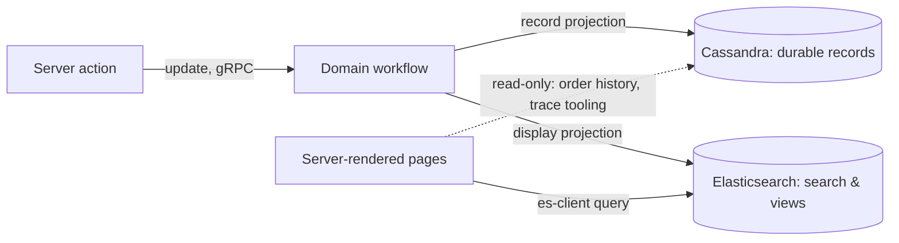

# Data Architecture for Scale

There is no relational database in this application's data path, and that is a scalability
decision, not a stylistic one. Authoritative entity state lives in Temporal workflows; **both
data stores are projections of it**, written only by workflow activities — Cassandra for durable
records, Elasticsearch for display-shaped views — and the Next.js app's access to both is
read-only. This guide explains the two projections, the single-writer rule, and the seam between
them.

## Why not a relational database

Relational databases are where commerce systems usually go to die under load: shared tables that
every request funnels through, row locks, hot rows, connection-pool contention, and a vertical
scaling story. This architecture eliminates that contention **by construction** rather than by
tuning:

- **In-flight entity state lives in workflows** — isolated per entity, coordinated by Temporal,
  never fought over by concurrent requests.
- **Durable records go to Cassandra, partitioned per entity, with no relational joins** — and
  since each entity is owned by exactly one workflow, a partition effectively has a single
  writer. No shared table every request funnels through, no row two writers contend for.
- **The application only reads** — display traffic lands on Elasticsearch; where the app reads
  Cassandra directly (order history, the Order Trace tool), that access is read-only, so it can
  never contend with a business-logic write.

The trade is explicit: no ad-hoc joins, no cross-entity transactions. Both are routed through
workflows instead — a saga is a workflow, not a distributed transaction.

## The workflow is the entity

A cart is not a row that three services race over; it is a workflow whose in-memory context _is_
the cart, durably backed by Temporal's event history. Cassandra holds **records** (orders placed,
transitions taken, stock levels), never **coordination state**. Nothing reads Cassandra to decide
what a cart may do next — the workflow already knows.

This is also why there is no separate event store: the deciders' `decide → facts → evolve` shape
([ADR-0009](adr/0009-chassaing-decider-transfer-pilot.md)) gives event sourcing's reasoning style, but the
facts are transient — folded into state in the same call. Temporal's history is the only durable
log ([ADR-0003](adr/0003-prepare-decide-finalize-state-machines.md)), and it comes with replay,
retention, and tooling already built.

## Cassandra: the durable-record projection

[schema.cql](../cassandra/schema.cql) partitions per entity: `orders` by `order_id`, lookups by
`customer_email` or `confirmation_number` as their own denormalized tables, product variants
clustered under `product_id`. Writes happen only from workflow activities — request handlers never
write Cassandra directly.

**The sharp exception is inventory**, the one place contention can't be isolated per entity: many
carts contend for the same SKU. That lands on a Cassandra **lightweight transaction**
([inventory-command-repository.ts](../src/temporal/inventory/db/inventory-command-repository.ts)):

```sql
UPDATE ... SET reserved_stock = ? WHERE ... IF reserved_stock = ?
```

a compare-and-set on the per-SKU counter with a reserve → confirm → release lifecycle — no row
locks, and losers of the race get a clean `applied = false` rather than a deadlock. The
[Developer Guide § Domain Workflows](developer-guide.md#domain-workflows) walks the lifecycle end
to end.

**The lineage, named:** Cassandra plays the role Datastore played on Google App Engine — a store
whose query model _disallows queries that won't scale_ (partition-key access only; cost tracks the
result set, not the table). And as with Datastore's entity-group transactions, the simple
transactional capability (LWT) reintroduces a small serialized hot spot exactly where it's used —
residual contention that is handled by convention rather than machinery. Those conventions are
encoded where this repo's contributors actually read them:
[`.agent/rules.md` § Cassandra Conventions](../.agent/rules.md).

## CQRS: two projections, one writer

Elasticsearch holds the display projections — catalog search, order lookups, inventory views, 11
domain indices in all — kept in sync by workflow activities. Cassandra's records are a projection
too, written the same way. **Only workflows write either store; the application only reads** —
mostly Elasticsearch, plus direct read-only Cassandra access where the records themselves are the
product (order status history, the Order Trace tool's transition audit).



Projection writes are **workflow-mediated and non-blocking**: the
[non-blocking projection pattern](developer-guide.md#non-blocking-projection-pattern) keeps
Elasticsearch latency off the update hot path, and Temporal's retries make the projection pipeline
durable without any queue infrastructure of its own.

### Dirty-flag batching (demo-scoped)

The inventory singleton's projection loop batches with a dirty-flag sweep
([inventory/workflows.ts](../src/temporal/inventory/workflows.ts)):

```ts
await condition(() => dirtySkus.size > 0, CONSISTENCY_SWEEP_INTERVAL);
```

Wake when there's work _or_ when the sweep interval passes — event-driven and time-driven behavior
in one expression, so five rapid cart additions become one Elasticsearch write.

**Scope this honestly:** the mechanism is purpose-built for this demo's reservation functionality,
and the singleton it lives in is the design's known bottleneck — a single workflow funneling all
SKU updates won't scale past demo traffic (see the
[Developer Guide's inventory limitations](developer-guide.md#domain-workflows)). Treat it as a
neat expression of Temporal's `condition`, not a projection architecture to lift.

## Elasticsearch as the app's query API

A consequence of CQRS worth making explicit, because it deletes a whole tier: **the web
application reads Elasticsearch directly.** Next.js server code queries projections through
[es-client.ts](../src/lib/es-client.ts) — faceted catalog search, order history, admin views —
with no BFF service, no API gateway, and no cache layer to invalidate in front of it. The
projection _is_ the cache, kept warm by the workflows that own the data. Read scaling is
Elasticsearch scaling, which is a solved problem you can buy.

## The correlation join key

There are no relational joins in either store, so cross-projection joining happens on a shared
key: the **correlationId**, a journey UUID minted at cart creation
([ADR-0011](adr/0011-workflow-id-and-correlation-tagging.md)). Every order-flow projection
carries it — `orders`, `carts`, `reservations`, `fulfiller_orders`, `fulfillments`, `shipments`,
and `communications` docs in Elasticsearch — and on the Cassandra side the `inventory_history`
journal is _partitioned_ by it, while write-side reservation rows and `customer_communications`
rows store it as a column. One value threads a shopper's entire journey through both stores; the
Order Trace tool and the admin explorer's correlationId search are just reads over that key.

`customer_communications` is worth calling out as a projection source: the Cassandra table
(`((order_id), sent_at, seq)`) is the source of truth for every email sent, written through the
`sendEmail()` choke point, and the `communications` ES index is a rebuildable projection of it.

## Rebuildability: the reindex matrix

Not every ES index can be rebuilt, and the differences are load-bearing for `/api/dev/reindex`:

| Class                                   | Indices                                                                                                                           | On reindex                                                                                              |
| --------------------------------------- | --------------------------------------------------------------------------------------------------------------------------------- | ------------------------------------------------------------------------------------------------------- |
| **Rebuildable from Cassandra**          | `products`, `collections`, `fulfillers`, `inventory`, `customers`, `orders`, `fulfiller_orders`, `reservations`, `communications` | Delete, recreate, bulk-repopulate from the source tables                                                |
| **Source-less (workflow-written only)** | `carts`, `fulfillments`, `shipments`                                                                                              | Recreated **empty** — live workflows repopulate them as they flush                                      |
| **Never reindex**                       | `system_errors`                                                                                                                   | `NEVER_REINDEX` in `src/lib/es-index-mappings.ts`; the reindex API refuses — the index is the only copy |

The same distinction applies on the Cassandra side: the `inventory_history` journal and
`workflow_state_transitions` are append-only audit records with no upstream source — losing them
loses history, which is why both carry TTLs rather than truncation jobs.

## Consistency model

Two different guarantees, each used where it's the right one:

- **Read-your-writes where the user is waiting.** Interactive mutations go through workflow
  updates (`executeUpdateWithStart`), which return the validated new state in the same round
  trip — the UI never renders from a stale projection after its own write.
- **Eventual consistency where nobody is waiting.** Projections lag their workflows by the flush
  interval; search results, admin dashboards, and order lists tolerate that by design. The
  transition-recording audit trail ([ADR-0010](adr/0010-async-transition-recording-projection.md))
  is likewise deferred + batched + retried — durable, but off the hot path.

The boundary is the interaction model: _updates when a caller needs an answer, projections when
nobody's waiting_ — the same rule that governs updates vs. signals.
