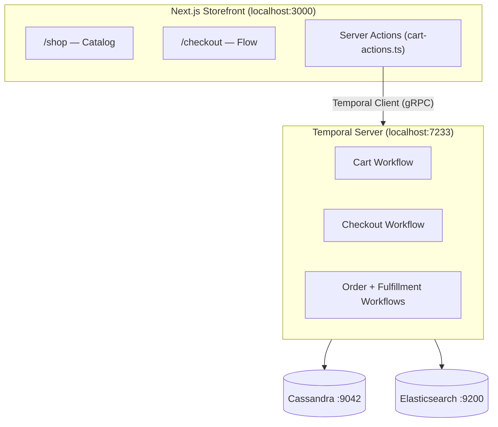
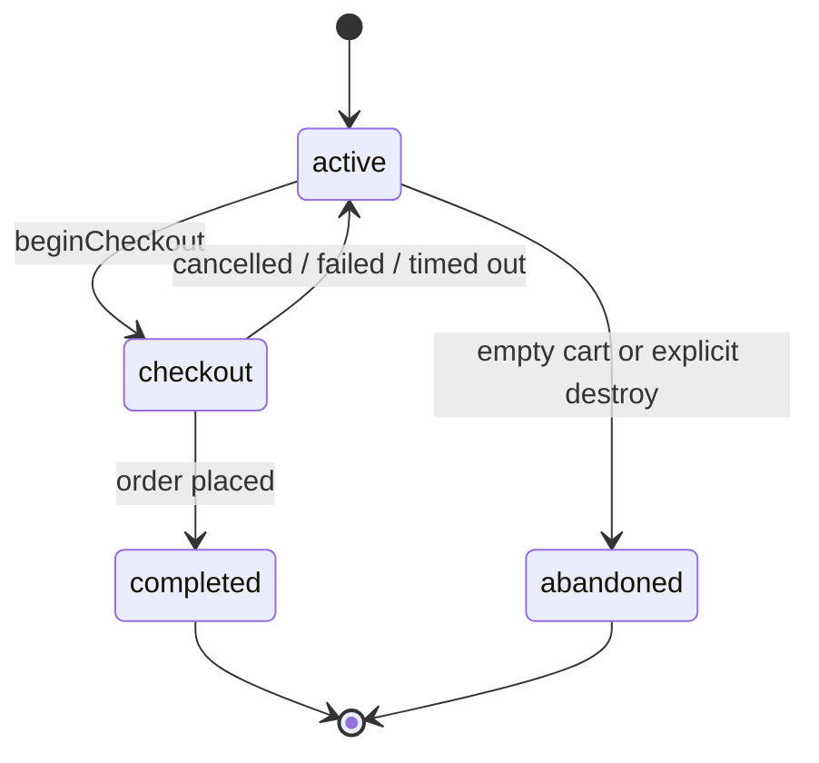
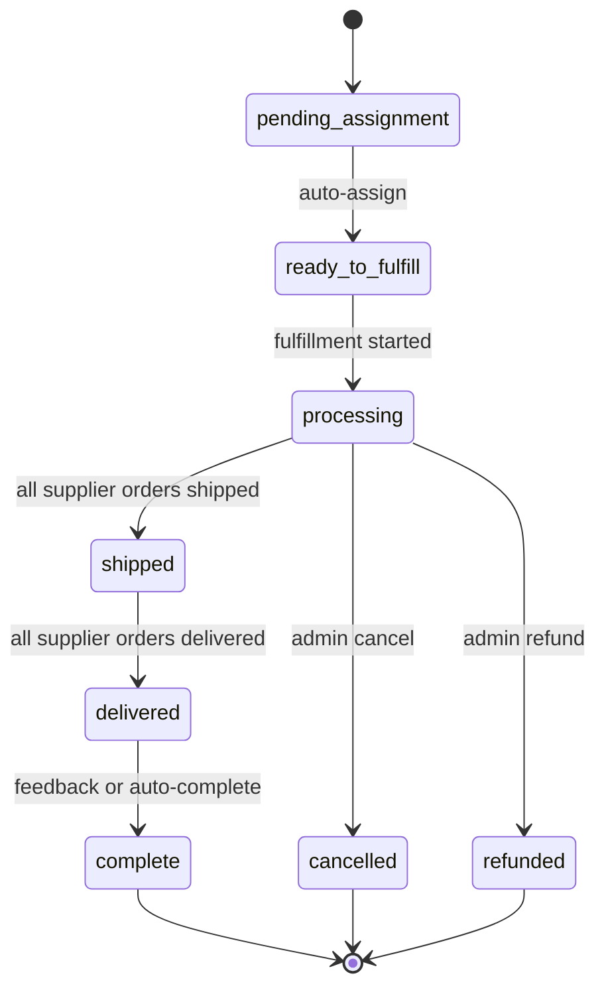

# Developer Guide

A comprehensive guide for developers working on the Temporal Commerce Demo — an end-to-end e-commerce application that demonstrates Temporal durable execution patterns across six domain workflows.

---

## Table of Contents

- [Architecture Overview](#architecture-overview)
- [Local Development Setup](#local-development-setup)
- [Project Structure](#project-structure)
- [Domain Workflows](#domain-workflows)
- [Data Layer](#data-layer)
- [Next.js Application Layer](#nextjs-application-layer)
- [Temporal Patterns & Conventions](#temporal-patterns--conventions)
- [Code Organization Patterns](#code-organization-patterns)
- [Feature Flags](#feature-flags)
- [Seeding & Data Pipeline](#seeding--data-pipeline)
- [Diagnostics & Debugging](#diagnostics--debugging)
- [Cloud Deployment](#cloud-deployment)
- [Environment Variables Reference](#environment-variables-reference)

---

## Architecture Overview



### Infrastructure Components

| Service | Port | Purpose |
| --- | --- | --- |
| **Cassandra** | 9042 | Primary data store (catalog, orders, inventory) |
| **Elasticsearch** | 9200 | Search + read-side projections (all 11 domain indices) |
| **Temporal Server** | 7233 | Workflow orchestration engine |
| **Temporal UI** | 8233 | Workflow visualization and debugging |
| **Temporal PostgreSQL** | 5432 | Temporal's internal persistence |
| **Temporal Elasticsearch** | 9201 | Temporal's internal visibility (separate from app ES) |

### Request Flow

1. **Storefront** → User browses products (Elasticsearch), adds to cart (Temporal)
2. **Server Actions** → Next.js server actions call the Temporal client
3. **Temporal Client** → Creates/queries/updates workflows via gRPC
4. **Workflows** → Execute business logic deterministically in the sandbox
5. **Activities** → Perform side effects (Cassandra writes, ES indexing, emails)
6. **Projections** → Write-side mutations emit projection syncs to Elasticsearch

---

## Local Development Setup

### Prerequisites

- **Node.js** ≥ 20
- **Docker Desktop** (for Cassandra, Elasticsearch, Temporal)
- **npm** (included with Node.js)

### First-Time Setup

```bash
# 1. Install dependencies
npm install

# 2. Start infrastructure + initialize schema
npm run init

# 3. Start the application (in one terminal)
npm run start:all

# 4. Seed demo data (in another terminal)
npm run seed

# 5. Browse
#    Storefront  → http://localhost:3000/shop
#    Admin       → http://localhost:3000/admin
#    Temporal UI → http://localhost:8233
```

### Daily Development

```bash
# Start infrastructure (Docker)
npm run infra:start

# Start storefront + workers together
npm run start:all

# Or start them separately for independent debugging:
npm run dev              # Next.js storefront only
npm run temporal:worker  # Temporal workers only (with pino-pretty)
```

### Full Reset

```bash
npm run infra:clean   # Stop + wipe all Docker volumes
npm run init          # Re-create schema
npm run seed          # Re-populate data (after npm run start:all)
```

### NPM Scripts

| Script | Description |
| --- | --- |
| `npm run infra:start` | Start infrastructure (Cassandra, ES, Temporal) |
| `npm run init` | Full init: infrastructure + Cassandra schema |
| `npm run start:all` | Start storefront + Temporal workers |
| `npm run stop:all` | Stop application processes |
| `npm run temporal:worker` | Start Temporal workers only |
| `npm run seed` | Populate demo catalog data |
| `npm run infra:stop` | Stop infrastructure containers |
| `npm run infra:clean` | Stop + wipe all data volumes |
| `npm run infra:ps` | List running infrastructure containers |

---

## Project Structure

```text
temporal-commerce-demo/
├── cassandra/                  # CQL schema definitions
│   └── schema.cql             # All keyspace, UDTs, and tables
├── sample-data/
│   └── catalog.json           # Printify-imported product catalog (~8.2 MB)
├── scripts/
│   └── seed.ts                # API-driven seed orchestrator
├── src/
│   ├── app/
│   │   ├── api/
│   │   │   ├── admin/         # Admin management APIs (feature flags)
│   │   │   ├── dev/           # Developer tools (ES init, reindex)
│   │   │   ├── health/        # Health check endpoint
│   │   │   ├── product/       # Product lookup API
│   │   │   ├── search/        # Product search API
│   │   │   ├── seed-cassandra/# Catalog seeding endpoint
│   │   │   └── seed-inventory/# Inventory seeding endpoint
│   │   ├── admin/             # Admin dashboard
│   │   │   ├── orders/        # Order management pages
│   │   │   ├── inventory/     # Inventory monitoring
│   │   │   ├── carts/         # Active cart monitoring
│   │   │   ├── search/        # Elasticsearch explorer (all 11 indices)
│   │   │   ├── admin-order-actions.ts
│   │   │   ├── admin-inventory-actions.ts
│   │   │   ├── admin-cart-actions.ts
│   │   │   └── admin-search-actions.ts
│   │   ├── shop/              # Customer-facing storefront
│   │       ├── cart-actions.ts # Server Actions for cart/checkout
│   │       ├── order-actions.ts # Server Actions for order lookup
│   │       ├── checkout/      # Multi-step checkout flow
│   │       │   ├── shipping/
│   │       │   ├── payment/
│   │       │   ├── review/
│   │       │   └── confirmation/
│   │       ├── collection/[id]/
│   │       ├── orders/        # Order lookup by email
│   │       └── product/[productId]/
│   │       └── page.tsx       # Catalog landing page
│   ├── components/            # Shared UI components
│   │   ├── AccountDropdown.tsx # Shopper sign-in/out dropdown
│   │   ├── CartDrawer.tsx
│   │   ├── CartChangedBanner.tsx
│   │   ├── CheckoutProgress.tsx
│   │   └── ShopNavBar.tsx
│   ├── context/
│   │   ├── CartContext.tsx     # Client-side cart state
│   │   └── ShopperContext.tsx  # Client-side shopper session (cookie-based)
│   ├── lib/                   # Shared infrastructure clients
│   │   ├── cassandra-client.ts
│   │   ├── es-client.ts
│   │   ├── es-index-mappings.ts
│   │   ├── temporal-client.ts
│   │   ├── feature-flags.ts
│   │   ├── email-service.ts
│   │   └── logger.ts          # Pino logger factory
│   └── temporal/              # All Temporal domain code
│       ├── contracts/         # Shared type definitions & constants
│       │   ├── cart.ts        # Cart types + signal/update definitions
│       │   ├── checkout.ts
│       │   ├── oms.ts
│       │   ├── fulfillment.ts
│       │   ├── inventory.ts
│       │   ├── identity.ts
│       │   ├── catalog.ts
│       │   ├── suppliers.ts
│       │   ├── elasticsearch.ts  # All ES document types
│       │   ├── constants.ts      # Task queues, workflow types, ID builders
│       │   ├── product-type.ts
│       │   └── plugin-registry.ts
│       ├── cart/              # Cart domain
│       ├── checkout/          # Checkout domain
│       ├── oms/               # Order Management System
│       ├── fulfillment/       # Fulfillment simulation
│       ├── inventory/         # CQRS inventory
│       ├── identity/          # Users, shoppers, API tokens, feature flags
│       └── worker.ts          # Unified worker launcher
├── docker-compose.yml         # Local infrastructure (6 containers)
├── Makefile                   # Development orchestration
└── .env.example               # Environment variable template
```

---

## Domain Workflows

The application is organized into six Temporal workflow domains, each with its own task queue, worker module, and dedicated contracts.

### Cart Workflow

**Task Queue:** `cart-queue`
**Workflow ID:** `cart-{cartId}`
**Lifetime:** Long-running (up to 30 days, with idle timeout)

The cart workflow manages shopping cart state as a durable entity. It is the **parent** of the checkout workflow.

**Key Patterns:**

- **`updateWithStart`** — Lazy cart creation. The first `addItemToCart` update creates the workflow if it doesn't exist, using `workflowIdConflictPolicy: 'USE_EXISTING'`.
- **Query/Update Handlers** — Cart state is read via queries (`getCart`, `getCheckoutState`) and mutated via updates (`addItemToCartUpdate`, `updateQuantityUpdate`, `removeItemUpdate`).
- **Parent-Child Checkout** — `beginCheckoutUpdate` starts a checkout child workflow with `ABANDON` parent close policy, so the checkout survives even if the cart is destroyed.
- **`continueAsNew`** — After 100 updates, the cart workflow calls `continueAsNew` to prevent unbounded history growth, preserving full cart state across executions.
- **Non-blocking Projection Sync** — A `projectionDirty` flag is set by mutation handlers. The main loop flushes projections to Elasticsearch between iterations.
- **Inventory Reservation** — Each add/update/remove triggers inventory reserve/release via activities.

**State Machine:**



### Checkout Workflow

**Task Queue:** `checkout-queue`
**Workflow ID:** `checkout-{uuid}` (not tied to cart ID — allows re-entry)
**Lifetime:** Up to 1 hour, then auto-expires

The checkout workflow orchestrates the multi-step checkout process as a child of the cart workflow.

**Key Patterns:**

- **Step-based State Machine** — `validating → shipping → payment → review → processing → complete`
- **Inventory Reservation Renewal** — At checkout start, existing cart reservations are renewed with a fresh TTL.
- **Update Handlers with Guards** — Each update validates the current step before proceeding (e.g., `setShippingUpdate` requires step ∈ `{shipping, payment, review}`).
- **Back Navigation** — Users can go back: setting shipping from the payment/review step is allowed, which recalculates costs.
- **Parent Signaling** — On completion, the checkout workflow signals the parent cart workflow with a `CheckoutWorkflowResult` via `checkoutCompletedSignal`.
- **Retarget Parent** — When carts merge during sign-in, the checkout's parent reference is updated via `retargetParentUpdate`.

### Order Management (OMS) Workflow

**Task Queue:** `oms-queue`
**Workflow ID:** `order-{orderId}`
**Lifetime:** Up to 365 days (long-lived for order lifecycle tracking)

The OMS workflow manages the complete order lifecycle from placement through delivery.

**Key Patterns:**

- **Auto-Assignment** — Resolves supplier assignments via a plugin registry (`resolveSupplierAssignments`). Currently supports `simulated` and `printify-dynamic` suppliers.
- **Activity-Driven Fulfillment** — Starts fulfillment as a standalone workflow via an activity (`startFulfillmentWorkflow`), rather than as a child workflow. This decouples the OMS from fulfillment execution.
- **Signal-Driven Status Updates** — The fulfillment workflow signals the OMS with `fulfillmentStatusSignal` as supplier orders progress through shipped → delivered.
- **Status Aggregation** — Order-level status is derived from the aggregate of all supplier order statuses.
- **Non-blocking ES Projections** — Uses the same dirty-flag pattern as the cart workflow to batch projection flushes.

**Status Flow:**



### Fulfillment Workflow

**Task Queue:** `fulfillment-queue`
**Workflow ID:** `fulfillment-{orderId}`
**Lifetime:** Until all supplier orders reach terminal state

Manages the fulfillment lifecycle for all supplier orders in a single order.

**Key Patterns:**

- **Multi-Supplier Strategy Routing** — Routes to `runSimulatedFulfillment` or `runDynamicFulfillment` based on `supplierType`.
- **Simulated Fulfillment** — Timer-based simulation with configurable delays via workflow memo (`processingDelayMs`, `shippingDelayMs`, `deliveryDelayMs`). Defaults to 60 seconds per phase.
- **Manual Fulfillment Mode** — When `MANUAL_FULFILLMENT` feature flag is enabled, the simulated strategy waits for explicit signals to advance through shipped → delivered.
- **Inventory Lifecycle** — Transfers reservations to suppliers at start. Fulfills inventory on delivery, releases on rejection/cancellation.
- **OMS Signaling** — Signals the parent OMS workflow with `FulfillmentStatusUpdate` on each status transition.
- **Polling + Signal Hybrid** — For dynamic suppliers (Printify), uses periodic polling combined with inbound signals to track order status.

### Inventory Service Workflow

**Task Queue:** `inventory-queue`
**Workflow ID:** `inventory-service` (singleton)
**Lifetime:** Indefinite (long-running service, `continueAsNew` after 100 signals)

A CQRS inventory management system with separate write-side and read-side projections.

**Key Patterns:**

- **Signal-Driven Targeted Projections** — Write-side code signals `inventoryChanged` with affected `blankSkus`. The workflow batches dirty SKUs and runs targeted projections.
- **Periodic Consistency Sweep** — Every 5 minutes, if no signals arrive, runs a full CQRS projection sweep including reservation TTL expiration.
- **Write/Read Table Separation** — Write tables (`inventory_stock_w`, `inventory_reservations_w`) are source-of-truth. Read tables (`inventory_stock_summary`, `inventory_stock_by_supplier`) are projections.
- **`continueAsNew`** — After 100 signals, preserves pending dirty SKUs and resets the signal counter.

### Identity Workflows

**Task Queue:** `identity-queue`

The identity domain provides email-based shopper authentication and address persistence. This is a password-less, demo-focused system — shoppers sign in with just an email address, and accounts are auto-created on first login.

**Shopper Authentication Flow:**

1. Shopper enters email in the `AccountDropdown` or during checkout
2. `POST /api/auth/shopper/login` checks for existing account → auto-creates if not found
3. A `shopperId` cookie is set for session persistence (30-day TTL)
4. On subsequent visits, `GET /api/auth/shopper/me` restores the session from the cookie

**Address Persistence:**

- Shipping addresses entered during checkout are saved to the `shopper_shipping_addresses` table
- On return visits, the checkout shipping form is pre-populated with the shopper's saved default address
- Guest shoppers who complete checkout are automatically promoted to members using the email from their shipping address

**Auth API Routes:**

| Route | Method | Purpose |
| --- | --- | --- |
| `/api/auth/shopper/login` | POST | Email-only sign-in (auto-creates account) |
| `/api/auth/shopper/logout` | POST | Clear session cookie |
| `/api/auth/shopper/me` | GET | Return current shopper profile + default address |
| `/api/auth/shopper/address` | GET/POST | Retrieve or save shopper shipping addresses |

**Workflow Operations:**

- Feature flag CRUD (`upsertFeatureFlagWorkflow`, `deleteFeatureFlagWorkflow`)
- User CRUD (`createUserWorkflow`, `updateUserNameWorkflow`, etc.)
- Shopper management (`createShopperWorkflow`, `updateShopperProfileWorkflow`)
- API token lifecycle with audit logging (`createApiTokenWorkflow`, `revokeApiTokenWorkflow`)

---

## Data Layer

### Cassandra (Write Side)

The Cassandra schema is defined in `cassandra/schema.cql` and uses the `catalog` keyspace.

**Design Principles:**

- **Single-store demo** — No `store_id` partition keys (unlike the multi-tenant `nightheron-platform`).
- **Denormalized query tables** — `products_by_collection`, `variants_by_product`, `orders_by_customer`, `orders_by_confirmation` duplicate data for efficient partition-key lookups.
- **User Defined Types (UDTs)** — `option_selection`, `shipping_address`, `payment_method`, `order_item`, `order_assignment`, `supplier_order`, etc. provide structured data within rows.
- **CQRS Write Tables** — Inventory uses `_w` suffix for write-side tables (`inventory_stock_w`, `inventory_reservations_w`).

**Key Tables:**

| Table | Partition Key | Purpose |
| --- | --- | --- |
| `products` | `id` | Product catalog (primary lookup) |
| `products_by_collection` | `collection_id` | Products within a collection |
| `variants` | `id` | Variant details (primary lookup) |
| `variants_by_product` | `product_id` | Variants for a product |
| `orders` | `order_id` | Order details |
| `orders_by_customer` | `customer_email` | Customer order history |
| `shoppers` | `email` | Shopper accounts (email-only auth) |
| `shopper_shipping_addresses` | `user_id` | Saved shipping addresses |
| `inventory_stock_w` | `blank_sku, supplier_id` | Write-side stock levels |
| `inventory_reservations_w` | `reservation_id` | Active inventory reservations |

### Elasticsearch (Read Side)

Elasticsearch serves as the read-side projection store and powers product search with faceted filtering.

**Indices:**

| Index | Document Type | Purpose |
| --- | --- | --- |
| `products` | `ProductDocument` | Product search with nested variants and options |
| `collections` | `CollectionDocument` | Collection browsing |
| `orders` | `OrderDocument` | Order search and admin views |
| `customers` | `CustomerDocument` | Customer search |
| `suppliers` | `SupplierDocument` | Supplier search |
| `inventory` | `InventoryDocument` | Inventory read-side views |
| `supplier_orders` | `SupplierOrderDocument` | Supplier order tracking |
| `carts` | `CartDocument` | Active cart visibility |
| `reservations` | `ReservationDocument` | Reservation tracking |
| `fulfillments` | `FulfillmentDocument` | Fulfillment workflow state |
| `shipments` | `ShipmentDocument` | Shipment tracking |

All ES document types are defined in `src/temporal/contracts/elasticsearch.ts`.

---

## Next.js Application Layer

### Route Organization

Routes follow the established convention:

| Prefix | Purpose | Examples |
| --- | --- | --- |
| `/shop` | Customer-facing storefront | Product browsing, cart, checkout, order lookup |
| `/admin` | Business management | Order management, feature flags |
| `/api/auth/*` | Shopper authentication | Login, logout, session, address |
| `/api/admin/*` | Admin management APIs | Feature flag CRUD |
| `/api/dev/*` | Developer tools | ES index init, reindex |
| `/api/search` | Product search | Elasticsearch-backed search |
| `/api/product` | Product lookup | Cassandra-backed detail fetch |

### Server Actions

Cart and checkout operations use Next.js Server Actions (`'use server'`) in `cart-actions.ts`. This provides the bridge between the React UI and the Temporal workflow layer.

**Key Pattern — `executeCartUpdate` Wrapper:**

```typescript
async function executeCartUpdate<TReturn, TArgs extends any[]>(
  cartId: string,
  updateDef: any,
  args: TArgs,
  options: { createIfMissing?: boolean } = {}
): Promise<TReturn | null> {
  // Uses updateWithStart for lazy creation
  // Handles WorkflowNotFoundError gracefully
  // Returns null for terminal workflows (redemptive clearing)
}
```

This unified wrapper:

1. Uses `updateWithStart` with `workflowIdConflictPolicy: 'USE_EXISTING'` for lazy cart creation
2. Catches `WorkflowNotFoundError` and `AcceptedUpdateCompletedWorkflow` for graceful degradation
3. Returns `null` instead of throwing when workflows are terminal

### Client-Side State

`CartContext.tsx` provides React context for cart state management. It polls the cart workflow state and provides actions that call Server Actions.

`ShopperContext.tsx` provides React context for shopper session management. It reads the current session from `/api/auth/shopper/me` on mount and exposes `signIn`, `signOut`, and `refreshSession` actions. The session is persisted via an `httpOnly` cookie.

The `AccountDropdown` component in the navbar uses `ShopperContext` to show sign-in/sign-out controls. When signed in, the shopper's email is displayed. During checkout, the shipping form auto-populates from the shopper's saved default address.

---

## Temporal Patterns & Conventions

### Task Queues

All task queue and workflow type constants are centralized in `src/temporal/contracts/constants.ts`:

```typescript
export const CART_TASK_QUEUE = 'cart-queue';
export const CHECKOUT_TASK_QUEUE = 'checkout-queue';
export const OMS_TASK_QUEUE = 'oms-queue';
export const FULFILLMENT_TASK_QUEUE = 'fulfillment-queue';
export const INVENTORY_TASK_QUEUE = 'inventory-queue';
export const IDENTITY_TASK_QUEUE = 'identity-queue';
```

### Workflow ID Convention

```typescript
// Convention: {domain}-{entityId}
buildWorkflowId('cart', 'cart-123')       // → 'cart-cart-123'
buildWorkflowId('fulfillment', 'ord-1')   // → 'fulfillment-ord-1'
buildWorkflowId('inventory', 'SKU-001')   // → 'inventory-SKU-001'
```

### Unified Worker

All six domain workers run in a single process via `src/temporal/worker.ts`. They share one `NativeConnection` for efficiency:

```typescript
await Promise.all([
  cartWorker(connection),
  checkoutWorker(connection),
  fulfillmentWorker(connection),
  identityWorker(connection),
  inventoryWorker(connection),
  omsWorker(connection),
]);
```

Each domain's `worker.ts` creates its own Temporal `Worker` with the appropriate task queue and workflow/activity registrations.

### Determinism Rules

Workflows execute in Temporal's deterministic sandbox. The following rules are enforced:

- **No I/O in workflows** — All network, filesystem, and database access must happen in activities.
- **No `Date.now()` for state** — Use Temporal's deterministic time via `new Date().toISOString()` (which is sandbox-safe).
- **Synchronous predicates** — `condition()` predicates must be synchronous functions.
- **`allHandlersFinished`** — Always `await condition(allHandlersFinished)` before workflow exit or `continueAsNew`.
- **No dynamic imports** — All imports must be static (resolved at bundle time).

### Non-Blocking Projection Pattern

Workflows use a dirty-flag pattern to batch Elasticsearch projections:

```typescript
let projectionDirty = false;

// In update/signal handlers:
projectionDirty = true;

// In main loop:
while (!isComplete) {
  await condition(() => isComplete || projectionDirty, timeout);
  if (projectionDirty) {
    projectionDirty = false;
    await indexToElasticsearch(currentState);
  }
}
```

This prevents every mutation handler from doing its own blocking ES write.

### Continue-as-New

Long-running workflows track their update/signal count and call `continueAsNew` after a threshold (typically 100) to prevent unbounded history growth:

```typescript
if (updateCount >= CONTINUE_AS_NEW_THRESHOLD) {
  await condition(allHandlersFinished);
  await continueAsNew<typeof myWorkflow>({
    // Preserve all necessary state
    ...restoredState,
    updateCount: 0  // Reset counter
  });
}
```

---

## Code Organization Patterns

### Two-File Activity Pattern

Each domain separates activity contracts from implementations:

| File | Purpose |
| --- | --- |
| `activities.ts` | Activity function signatures (imported by workflows) |
| `activities-impl.ts` | Activity implementations with real I/O (registered with workers) |

Workflows import from `activities.ts`, which contains only the proxy signatures. Workers register from `activities-impl.ts`, which contains the actual database calls, API calls, etc.

### Definitions File Pattern

Signal, query, and update definitions are centralized in a `definitions.ts` file per domain:

```typescript
// src/temporal/cart/definitions.ts
export const addItemToCartUpdate = defineUpdate<CartDetails, [AddItemSignal]>('addItemToCartUpdate');
export const getCartQuery = defineQuery<CartDetails>('getCart');
export const checkoutCompletedSignal = defineSignal<[CheckoutCompletedPayload]>('checkoutCompleted');
```

Workflows re-export these definitions for worker registration compatibility.

### Document Builder Pattern

Domains that project to Elasticsearch have a `document-builder.ts` file that transforms internal state to ES document types:

```typescript
// src/temporal/oms/document-builder.ts
export function buildOrderDocument(order, state, customerEmail): OrderDocument { ... }
export function buildSupplierOrderDocument(supplierOrder): SupplierOrderDocument { ... }
```

### Contracts Directory

`src/temporal/contracts/` is the shared type boundary. All cross-domain type references go through this barrel:

```typescript
import { Cart, Checkout, OMS, Constants } from '@/temporal/contracts';
```

The contracts directory is safe to import in **both** Next.js server code and Temporal workflow code, with one exception: the `defineQuery`/`defineSignal`/`defineUpdate` calls import from `@temporalio/workflow`, so they must be bundled by the Temporal worker, not Next.js.

---

## Feature Flags

Feature flags are stored as a JSON file at `.data/feature-flags.json`:

```typescript
const DEFAULTS: FeatureFlags = {
  MANUAL_FULFILLMENT: false,   // Wait for explicit signals vs. auto-simulate
  DATA_FLOW_LOGGING: false,    // Verbose data transformation logging
};
```

**`MANUAL_FULFILLMENT`** — When enabled, simulated fulfillment workflows wait for manual signals to advance through `in_production → shipped → delivered` instead of auto-simulating with timers. Useful for live demos where you want to control the pace.

**`DATA_FLOW_LOGGING`** — Enables structured `[DataFlow]` log entries that trace data transformations at key lifecycle boundaries (e.g., `CartItem[] → Order`, `Order → FulfillmentOrderRequest`).

Feature flags are managed via the admin API at `/api/admin/feature-flags`.

---

## Seeding & Data Pipeline

### Seed Script

The seed script (`scripts/seed.ts`) orchestrates data population via API calls to the running Next.js app:

```bash
npm run seed                            # Uses localhost:3000
npx tsx scripts/seed.ts https://app.example.com  # Target a remote deployment
```

**Seed Pipeline:**

1. `POST /api/dev/init/es-indices` — Create ES index mappings for all 11 indices
2. `POST /api/seed-cassandra` — Load `sample-data/catalog.json` into Cassandra
3. `POST /api/seed-inventory` — Seed inventory stock for all variants
4. `POST /api/dev/reindex` (`{index: "all"}`) — Sync all Cassandra-backed data to Elasticsearch

### Catalog Source

The `sample-data/catalog.json` file is exported from the Night Heron Platform via its Printify Catalog Sync and export tooling. It contains 266 products, 10,600 variants, and 57 collections with product images hosted on Google Cloud Storage.

---

## Diagnostics & Debugging

### Temporal UI

The Temporal UI at `http://localhost:8233` is the primary debugging tool. Use it to:

- View all running/completed/failed workflows
- Inspect workflow state via queries
- View event history (signals, updates, activities)
- Send signals to running workflows (e.g., fulfillment status updates)

### Logs

Workers use `pino` for structured logging. Run with `pino-pretty` for human-readable output:

```bash
npm run temporal:worker  # Automatically uses pino-pretty in dev
```

Key log namespaces:

- `[OMS]` — Order management workflow events
- `[DataFlow]` — Data transformation tracing (when `DATA_FLOW_LOGGING` is enabled)
- `worker` — Worker lifecycle events

### Docker Container Logs

```bash
docker-compose logs -f cassandra
docker-compose logs -f temporal
docker-compose logs -f elasticsearch
```

### Common Debugging Scenarios

| Symptom | Investigation |
| --- | --- |
| "Workflow not found" in UI | Check if the cart cookie was cleared or the workflow timed out |
| Items added but search empty | Check that ES indices exist (`/api/dev/init/es-indices`) and products are indexed |
| Checkout stuck on "processing" | Check the checkout workflow in Temporal UI for failed activities |
| Fulfillment not advancing | Check `MANUAL_FULFILLMENT` feature flag; if enabled, send manual signals |
| Inventory reservation errors | Check the inventory service workflow is running (`inventory-service` in Temporal UI) |
| Worker crash on startup | Check Temporal server is healthy: `npm run infra:ps` |

### Port Conflicts

| Port | Service | Check |
| --- | --- | --- |
| 3000 | Next.js | `lsof -i :3000` |
| 7233 | Temporal | `docker ps` |
| 8233 | Temporal UI | `docker ps` |
| 9042 | Cassandra | `lsof -i :9042` |
| 9200 | Elasticsearch | `lsof -i :9200` |
| 5432 | Temporal PostgreSQL | `docker ps` |

---

## Cloud Deployment

For deploying to Temporal Cloud + Google Cloud, see [cloud-deployment.md](cloud-deployment.md).

Key deployment targets:

- **Next.js App** → Google Cloud Run (serverless, scales to zero)
- **Temporal Workers** → Google Cloud Run (always-on, `--min-instances 1`)
- **Cassandra** → DataStax Astra DB
- **Elasticsearch** → Elastic Cloud

The unified worker process runs all six domain workers in a single container, sharing one mTLS connection to Temporal Cloud.

---

## Environment Variables Reference

| Variable | Required | Default | Description |
| --- | --- | --- | --- |
| `TEMPORAL_ADDRESS` | Yes | `localhost:7233` | Temporal server address |
| `TEMPORAL_NAMESPACE` | Yes | `default` | Temporal namespace |
| `TEMPORAL_TLS_CERT` | Cloud only | — | Base64-encoded mTLS client cert |
| `TEMPORAL_TLS_KEY` | Cloud only | — | Base64-encoded mTLS client key |
| `CASSANDRA_CONTACT_POINTS` | Yes | `localhost:9042` | Cassandra contact points (comma-separated) |
| `CASSANDRA_KEYSPACE` | Yes | `catalog` | Cassandra keyspace name |
| `CASSANDRA_DC` | No | `dc1` | Cassandra data center name |
| `CASSANDRA_USE_TLS` | Cloud only | `false` | Enable TLS for Cassandra |
| `CASSANDRA_SECURE_BUNDLE_PATH` | Astra only | — | Path to Astra secure connect bundle |
| `CASSANDRA_USERNAME` | Cloud only | — | Cassandra authentication username |
| `CASSANDRA_PASSWORD` | Cloud only | — | Cassandra authentication password |
| `ELASTICSEARCH_URL` | Yes | `http://localhost:9200` | Elasticsearch endpoint |
| `ELASTICSEARCH_API_KEY` | Cloud only | — | Elasticsearch API key |
| `NEXT_PUBLIC_APP_URL` | Yes | `http://localhost:3000` | Public application URL |

Copy `.env.example` to `.env.local` for local development. Default values are configured for the Docker Compose environment.
