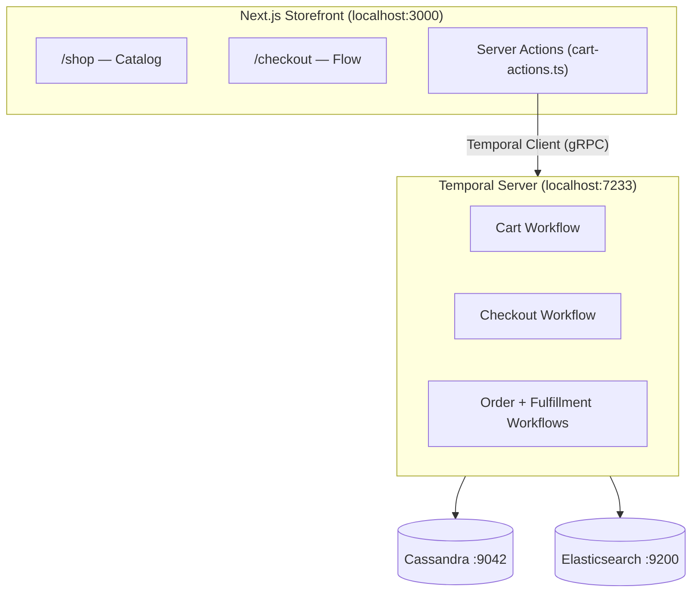
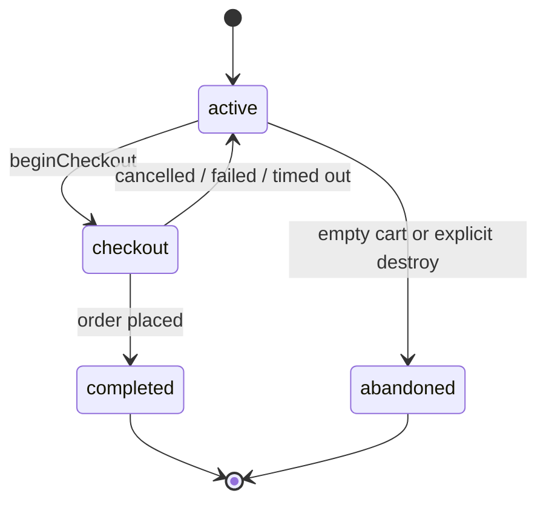
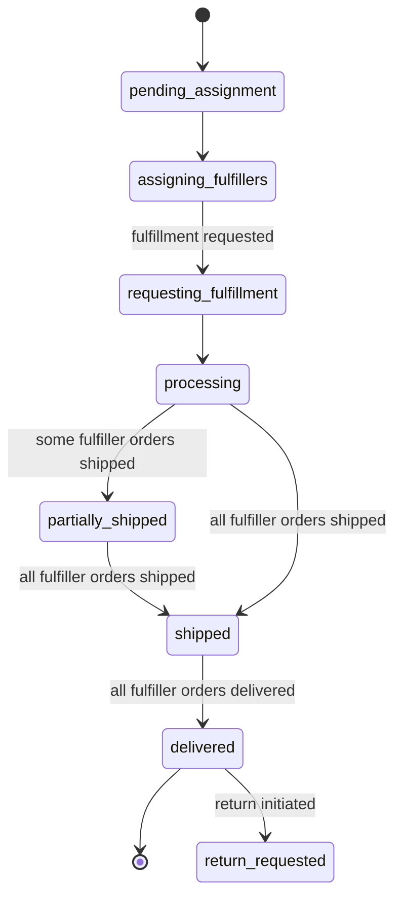

# Developer Guide

A comprehensive guide for developers working on the Temporal Commerce Demo — an end-to-end e-commerce application that demonstrates Temporal durable execution patterns across six domain workflows.

> _This document was drafted with AI assistance._

---

## Table of Contents

- [Architecture Overview](#architecture-overview)
- [Local Development Setup](#local-development-setup)
- [Project Structure](#project-structure)
- [Domain Workflows](#domain-workflows)
  - [Pay-after-expiry (issue #34)](#pay-after-expiry-issue-34)
- [Data Layer](#data-layer)
  - [Customer communications](#customer-communications)
- [Next.js Application Layer](#nextjs-application-layer)
- [Temporal Patterns & Conventions](#temporal-patterns--conventions)
- [Code Organization Patterns](#code-organization-patterns)
- [Extending the Demo](#extending-the-demo)
- [Feature Flags](#feature-flags)
- [Seeding & Data Pipeline](#seeding--data-pipeline)
- [Diagnostics & Debugging](#diagnostics--debugging)
- [Deployment Options](#deployment-options)
- [Environment Variables Reference](#environment-variables-reference)

---

## Architecture Overview


```mermaid
graph TB
    subgraph storefront["Next.js Storefront (localhost:3000)"]
        shop["/shop — Catalog"]
        checkout["/checkout — Flow"]
        actions["Server Actions (cart-actions.ts)"]
    end

    actions -->|"Temporal Client (gRPC)"| temporal

    subgraph temporal["Temporal Server (localhost:7233)"]
        cartWF["Cart Workflow"]
        checkoutWF["Checkout Workflow"]
        orderWF["Order + Fulfillment Workflows"]
    end

    temporal --> cassandra[("Cassandra :9042")]
    temporal --> elasticsearch[("Elasticsearch :9200")]
```

### Infrastructure Components

| Service                    | Port | Purpose                                               |
| -------------------------- | ---- | ----------------------------------------------------- |
| **Cassandra**              | 9042 | Primary data store (catalog, orders, inventory)       |
| **Elasticsearch**          | 9200 | Search + read-side projections (13 indices defined)   |
| **Temporal Server**        | 7233 | Workflow orchestration engine                         |
| **Temporal UI**            | 8233 | Workflow visualization and debugging                  |
| **Temporal PostgreSQL**    | 5432 | Temporal's internal persistence                       |
| **Temporal Elasticsearch** | 9201 | Temporal's internal visibility (separate from app ES) |

**Observability (opt-in — set `OTEL_ENABLED=true` or run `npm run infra:up:obs`):**

| Service        | Port  | Purpose                                 |
| -------------- | ----- | --------------------------------------- |
| **Jaeger**     | 16686 | Distributed tracing UI + OTLP collector |
| **Prometheus** | 9090  | Metrics scraping                        |
| **Grafana**    | 3200  | Metrics dashboards (admin/admin)        |

### Request Flow

1. **Storefront** → User browses products (Elasticsearch), adds to cart (Temporal)
2. **Server Actions** → Next.js server actions call the Temporal client
3. **Temporal Client** → Creates/queries/updates workflows via gRPC
4. **Workflows** → Execute business logic deterministically in the sandbox
5. **Activities** → Perform side effects (Cassandra writes, ES indexing, emails)
6. **Projections** → Write-side mutations emit projection syncs to Elasticsearch

---

## Local Development Setup

### Prerequisites

- **Node.js** ≥ 22
- **Docker Desktop** (for Cassandra, Elasticsearch, Temporal)
- **npm** (included with Node.js)

### First-Time Setup

```bash
# 1. Install dependencies
npm install

# 2. Start infrastructure + initialize schema
npm run dev:init

# 3. Start the application (in one terminal)
npm run dev:up

# 4. Browse
#    Storefront  → http://localhost:3000/shop
#    Admin       → http://localhost:3000/admin
#    Temporal UI → http://localhost:8233
```

### Daily Development

```bash
# Start infrastructure + app in one command
npm run dev:start-all

# Check health and status of all services
npm run dev:status

# Or start them separately for independent debugging:
npm run infra:up        # Start Docker infrastructure only
npm run dev:up          # Start storefront + Temporal workers only
```

### Full Reset

```bash
npm run dev:init         # Nuclear reset: wipe databases, recreate schema, start app, and seed catalog
```

### NPM Scripts

| Script                        | Category       | Description                                                           |
| ----------------------------- | -------------- | --------------------------------------------------------------------- |
| `npm run dev:start-all`       | Developer      | Start infrastructure (Docker) + storefront + workers                  |
| `npm run dev:stop-all`        | Developer      | Stop everything (storefront, workers + infrastructure)                |
| `npm run dev:up`              | Developer      | Start storefront app (Next.js) + Temporal workers                     |
| `npm run dev:down`            | Developer      | Stop storefront app and Temporal worker processes                     |
| `npm run dev:init`            | Developer      | Full reset: wipe volumes ➔ start containers ➔ seed catalog ➔ stop app |
| `npm run dev:status`          | Developer      | Check status of all backend databases, services, and apps             |
| `npm run dev:storefront`      | Application    | Start storefront app only                                             |
| `npm run dev:worker`          | Application    | Start Temporal workers only                                           |
| `npm run dev:seed`            | Database       | Populate catalog and inventory data manually                          |
| `npm run db:init`             | Database       | Create Cassandra keyspace and tables                                  |
| `npm run db:verify`           | Database       | Verify Cassandra schema consistency                                   |
| `npm run infra:up`            | Infrastructure | Start Docker infrastructure containers and verify health              |
| `npm run infra:up:obs`        | Infrastructure | Start infrastructure + observability (Jaeger, Prometheus, Grafana)    |
| `npm run infra:down`          | Infrastructure | Stop infrastructure containers                                        |
| `npm run infra:clean`         | Infrastructure | Stop containers and wipe all persistent volumes                       |
| `npm run infra:ps`            | Infrastructure | List running infrastructure containers                                |
| `npm run infra:ready`         | Infrastructure | Ensure Docker Desktop is running (starts it if not)                   |
| `npm run dev`                 | Application    | Start the Next.js app directly (what `dev:storefront` wraps)          |
| `npm run build`               | Quality        | Production Next.js build                                              |
| `npm run start`               | Application    | Serve the production build                                            |
| `npm run typecheck`           | Quality        | TypeScript type checking (`tsc --noEmit`)                             |
| `npm run lint`                | Quality        | ESLint over the codebase                                              |
| `npm test`                    | Quality        | Run the Vitest suite once                                             |
| `npm run test:watch`          | Quality        | Vitest in watch mode                                                  |
| `npm run coverage`            | Quality        | Vitest with coverage report                                           |
| `npm run format`              | Quality        | Prettier write over `src/` and `scripts/`                             |
| `npm run format:check`        | Quality        | Prettier check (CI gate)                                              |
| `npm run docs:diagrams`       | Docs           | Regenerate the state-machine diagram reference from source            |
| `npm run docs:diagrams:check` | Docs           | Fail if generated diagrams are stale (CI gate)                        |
| `npm run dev:validate`        | Developer      | End-to-end system validation script                                   |
| `npm run dev:logs`            | Developer      | Tail today's per-process log files                                    |
| `npm run workers-wait`        | Developer      | Block until Temporal workers are polling                              |
| `npm run smoke:standalone`    | Developer      | Smoke-test the standalone-activity path                               |

---

## Project Structure

```text
temporal-commerce-demo/
├── cassandra/                  # CQL schema definitions
│   └── schema.cql             # All keyspace, UDTs, and tables
├── sample-data/
│   └── catalog.json           # Product catalog data (~8.2 MB)
├── scripts/
│   └── seed.ts                # API-driven seed orchestrator
├── src/
│   ├── app/
│   │   ├── api/
│   │   │   ├── admin/         # Admin management APIs (feature flags)
│   │   │   ├── dev/           # Developer tools (ES init, reindex)
│   │   │   ├── health/        # Health check endpoint
│   │   │   ├── product/       # Product lookup API
│   │   │   ├── search/        # Product search API
│   │   │   ├── seed-cassandra/# Catalog seeding endpoint
│   │   │   └── seed-inventory/# Inventory seeding endpoint
│   │   ├── admin/             # Admin dashboard
│   │   │   ├── orders/        # Order management pages
│   │   │   ├── inventory/     # Inventory monitoring
│   │   │   ├── carts/         # Active cart monitoring
│   │   │   ├── search/        # Elasticsearch explorer (12 searchable indices)
│   │   │   ├── admin-order-actions.ts
│   │   │   ├── admin-inventory-actions.ts
│   │   │   ├── admin-cart-actions.ts
│   │   │   └── admin-search-actions.ts
│   │   ├── dev/               # Developer tool pages (order-trace, logs, system-errors)
│   │   ├── shop/              # Customer-facing storefront
│   │       ├── cart-actions.ts # Server Actions for cart/checkout
│   │       ├── order-actions.ts # Server Actions for order lookup
│   │       ├── checkout/      # Multi-step checkout flow
│   │       │   ├── shipping/
│   │       │   ├── payment/
│   │       │   ├── review/
│   │       │   └── confirmation/
│   │       ├── collection/[id]/
│   │       ├── orders/        # Order lookup by email
│   │       └── product/[productId]/
│   │       └── page.tsx       # Catalog landing page
│   ├── components/            # Shared UI components
│   │   ├── AccountDropdown.tsx # Shopper sign-in/out dropdown
│   │   ├── CartDrawer.tsx
│   │   ├── CartChangedBanner.tsx
│   │   ├── CheckoutProgress.tsx
│   │   └── ShopNavBar.tsx
│   ├── context/
│   │   ├── CartContext.tsx     # Client-side cart state
│   │   └── ShopperContext.tsx  # Client-side shopper session (cookie-based)
│   ├── lib/                   # Shared infrastructure clients
│   │   ├── cassandra-client.ts
│   │   ├── es-client.ts
│   │   ├── es-index-mappings.ts
│   │   ├── temporal-client.ts
│   │   ├── feature-flags.ts
│   │   ├── email-service.ts
│   │   └── logger.ts          # Pino logger — stdout + per-process file + ES error index
│   └── temporal/              # All Temporal domain code
│       ├── contracts/         # Shared type definitions & constants
│       │   ├── cart.ts        # Cart types + signal/update definitions
│       │   ├── checkout.ts
│       │   ├── oms.ts
│       │   ├── fulfillment.ts
│       │   ├── inventory.ts
│       │   ├── identity.ts
│       │   ├── catalog.ts
│       │   ├── fulfillers.ts
│       │   ├── elasticsearch.ts  # All ES document types
│       │   ├── constants.ts      # Task queues, workflow types, ID builders
│       │   ├── product-type.ts
│       │   └── plugin-registry.ts
│       ├── framework/         # Declarative state-machine driver + interceptors
│       ├── transition-recorder/ # Async state-transition audit recording
│       ├── projection-completion/ # Lifecycle stamping of ES docs at workflow close
│       ├── cart/              # Cart domain
│       ├── checkout/          # Checkout domain
│       ├── oms/               # Order Management System
│       ├── fulfillment/       # Fulfillment simulation
│       ├── inventory/         # CQRS inventory
│       ├── identity/          # Users, shoppers, API tokens, feature flags
│       └── worker.ts          # Unified worker launcher
├── docker-compose.yml         # Core infrastructure (6 long-running containers + 4 bootstrap sidecars)
├── docker-compose.observability.yml  # Opt-in: Jaeger, Prometheus, Grafana
└── .env.example               # Environment variable template
```

---

## Domain Workflows

The application is organized into six Temporal workflow domains, each with its own task queue, worker module, and dedicated contracts.

> **Auto-generated diagrams:** the [State Machine Reference](reference/state-machine-diagrams.md)
> holds a Mermaid diagram + per-state trigger table for every machine below, plus the
> cross-domain orchestration graph — regenerated from source by `npm run docs:diagrams`
> and enforced fresh in CI (`npm run docs:diagrams:check`).

### Cart Workflow

**Task Queue:** `cart-queue`
**Workflow ID:** `demo.cart.{cartId}`
**Lifetime:** Long-running (up to 30 days, with idle timeout)

The cart workflow manages shopping shopping cart state as a durable entity using the declarative `runStateMachine` framework. It is the **parent** of the checkout workflow.

**Key Patterns:**

- **Declarative State Machine** — Managed via `runStateMachine` to process events like adding/removing items or updating quantities, maintaining strict consistency.
- **`updateWithStart`** — Lazy cart creation. The first `cartUpdate` (an `addItem` event) creates the workflow if it doesn't exist, using `workflowIdConflictPolicy: 'USE_EXISTING'`.
- **FIFO Update Queue** — Handled by the state machine driver to process cart updates sequentially, avoiding write race conditions.
- **Parent-Child Checkout** — a `beginCheckout` event through `cartUpdate` starts a checkout child workflow with `REQUEST_CANCEL` parent close policy — if the cart workflow closes, the in-flight checkout receives a cancellation request and releases its inventory reservations instead of holding them as an orphan.
- **`continueAsNew`** — After 100 updates, the cart workflow calls `continueAsNew` to prevent unbounded history growth, preserving full cart state across executions.
- **Non-blocking Projection Sync** — A `projectionDirty` flag is set by mutation handlers. The main loop flushes projections to Elasticsearch between iterations.
- **Inventory Reservation** — Each add/update/remove triggers inventory reserve/release via activities (see [Inventory Reservations](#inventory-reservations)).

**State Machine:**


```mermaid
stateDiagram-v2
    [*] --> active
    active --> checkout : beginCheckout
    checkout --> completed : order placed
    checkout --> active : cancelled / failed / timed out
    active --> abandoned : empty cart or explicit destroy
    completed --> [*]
    abandoned --> [*]
```

### Checkout Workflow

**Task Queue:** `checkout-queue`
**Workflow ID:** `demo.checkout.{uuid}` (not tied to cart ID — allows re-entry)
**Lifetime:** Up to 1 hour, then auto-expires

The checkout workflow orchestrates the multi-step checkout process as a child of the cart workflow, utilizing the declarative `runStateMachine` framework to manage transitions between steps.

**Key Patterns:**

- **Declarative State Machine** — Uses the `runStateMachine` framework driven by state definitions (`validating → collecting → complete`). The UI steps (shipping → payment → review) are _derived_ from which prerequisites are satisfied, not tracked as machine states; order processing runs inline within the `collecting` state's `submitOrder` handler.
- **Inventory Reservation Renewal** — At checkout start, existing cart reservations are renewed **in place** with a fresh TTL (`renewAllForCheckout`) — there is no release/re-reserve window in which a concurrent cart could steal the stock. Quantity changes become in-place counter deltas; items whose hold has gone missing (e.g. swept by TTL expiry) log a warning and are reserved fresh.
- **Update Handlers as Events** — Custom update handlers map incoming signals/arguments (e.g. `setShippingUpdate`, `submitOrderUpdate`) to state machine events which trigger deterministic transitions.
- **Back Navigation** — Users can go back: setting shipping from the payment/review step is allowed, which recalculates costs.
- **Parent Signaling** — On completion, the checkout workflow signals the parent cart workflow with a `CheckoutWorkflowResult` via `checkoutCompletedSignal`.
- **Retarget Parent** — When carts merge during sign-in, the checkout's parent reference is updated via `retargetParentUpdate`.

### Order Management (OMS) Workflow

**Task Queue:** `oms-queue`
**Workflow ID:** `demo.order.{orderId}`
**Lifetime:** Up to 365 days (long-lived for order lifecycle tracking)

The OMS workflow manages the complete order lifecycle from placement through delivery.

**Key Patterns:**

- **Auto-Assignment** — Resolves fulfiller assignments via a plugin registry (`resolveFulfillerAssignments`). Currently all items are assigned to the `simulated` fulfiller.
- **Decoupled Fulfillment** — Starts fulfillment with `startChild` under `parentClosePolicy: 'ABANDON'`: the child runs on its own lifecycle and survives OMS closure, while the parent link stays visible in the Temporal UI. (Contrast checkout → OMS, which spawns via an activity because the order must not be a child at all.)
- **Signal-Driven Status Updates** — The fulfillment workflow signals the OMS with `fulfillmentStatusSignal` as fulfiller orders progress through shipped → delivered.
- **Status Aggregation** — Order-level status is derived from the aggregate of all fulfiller order statuses.
- **Non-blocking ES Projections** — Uses the same dirty-flag pattern as the cart workflow to batch projection flushes.

**Status Flow:**

The happy path, condensed (cancel/refund/return branches omitted — `cancelled`, `refunded`, `returned`, and `complete` are terminal outcomes, not named states):


```mermaid
stateDiagram-v2
    [*] --> pending_assignment
    pending_assignment --> assigning_fulfillers
    assigning_fulfillers --> requesting_fulfillment : fulfillment requested
    requesting_fulfillment --> processing
    processing --> partially_shipped : some fulfiller orders shipped
    partially_shipped --> shipped : all fulfiller orders shipped
    processing --> shipped : all fulfiller orders shipped
    shipped --> delivered : all fulfiller orders delivered
    delivered --> [*]
    delivered --> return_requested : return initiated
```

The full machine — every state, trigger, and terminal outcome — is auto-generated from source in the [State Machine Reference § OMS](reference/state-machine-diagrams.md#oms--oms_states).

### Fulfillment Workflow

**Task Queue:** `fulfillment-queue`
**Workflow ID:** `demo.fulfillment.{orderId}`
**Lifetime:** Until all fulfiller orders reach terminal state

Manages the fulfillment lifecycle for all fulfiller orders in a single order using the declarative `runStateMachine` framework.

**Key Patterns:**

- **State Machine Orchestration** — Managed using the `runStateMachine` driver to transition orders through fulfillment stages (`processing`, `shipped`, `delivered`, etc.).
- **Simulated Strategy** — Executes the simulated fulfillment strategy for each fulfiller order using the state machine driver.
- **Simulated Fulfillment** — Timer-based simulation with configurable delays via workflow memo (`processingDelayMs`, `shippingDelayMs`, `deliveryDelayMs`). Defaults to 15 seconds per phase.
- **Manual Fulfillment Mode** — When `MANUAL_FULFILLMENT` feature flag is enabled, the simulated strategy waits for explicit signals to advance through shipped → delivered.
- **Partial Shipments Auto-Complete (by design)** — `partially_shipped` fulfiller orders ride the same simulation timer to auto-delivery so the demo keeps moving; enable `MANUAL_FULFILLMENT` to hold partials and drive the remaining updates manually.
- **Inventory Lifecycle** — Transfers reservations to fulfillers at start. Fulfills inventory on delivery, releases on rejection/cancellation.
- **OMS Signaling** — Signals the parent OMS workflow with `FulfillmentStatusUpdate` on each status transition.

### Inventory Service Workflow

**Task Queue:** `inventory-queue`
**Workflow ID:** `demo.inventory.service` (singleton)
**Lifetime:** Indefinite (long-running service, `continueAsNew` after 100 signals)

A CQRS inventory management system with separate write-side and read-side projections.

**Key Patterns:**

- **Signal-Driven Targeted Projections** — Write-side code signals `inventoryChanged` with affected `blankSkus`. The workflow batches dirty SKUs and runs targeted projections.
- **Periodic Consistency Sweep** — Every 5 minutes, if no signals arrive, runs a full CQRS projection sweep including reservation TTL expiration.
- **Write/Read Table Separation** — Write tables (`inventory_stock_w`, `inventory_reservations_w`) are source-of-truth. Read tables (`inventory_stock_summary`, `inventory_stock_by_fulfiller`) are projections.
- **`continueAsNew`** — After 100 signals, preserves pending dirty SKUs and resets the signal counter.

### Inventory Reservations

Stock reservations are the write-side mechanism that prevents oversell. They are the one part of inventory that is **not** a Temporal workflow: the `demo.inventory.service` workflow above only projects and expires. The reserve / confirm / release mutations live in a plain repository, `InventoryCommandRepository` (`src/temporal/inventory/db/inventory-command-repository.ts`), and other domains call it **directly from their own activities**. This is the one sanctioned cross-domain data call in the codebase — `src/temporal/cart/activities-impl.ts` and `src/temporal/checkout/activities-impl.ts` both `import { InventoryCommandRepository }` rather than starting an inventory workflow.

**Source of truth is Cassandra, not workflow state:**

- `inventory_stock_w` — PK `(blank_sku, fulfiller_id)`; holds `total_stock`, `reserved_stock`, `ordered_stock`.
- `inventory_reservations_w` — PK `reservation_id`; holds `cart_id`, `blank_sku`, `quantity`, `status`, `expires_at`.
- `inventory_reservations_by_cart_w` — PK `(cart_id, reservation_id)`; the by-cart lookup used to release or confirm a whole cart's holds.

**Available stock is computed, never stored:** `available = Σ(total_stock − reserved_stock)` across a SKU's fulfiller rows, with `UNLIMITED_STOCK = -1` treated as infinite. The materialized `available_stock` on the read side is a projection of that formula.

**Lifecycle.** A reservation moves `TEMPORARY → CONFIRMED → FULFILLED`, or exits early via `RELEASED` / `CANCELLED` — and a `RELEASED` hold can be brought back via `resurrect` (see [Pay-after-expiry](#pay-after-expiry-issue-34)):

| Operation | Repo method                     | Effect                                                                                                                                                                                                | Triggered by                                                                              |
| --------- | ------------------------------- | ----------------------------------------------------------------------------------------------------------------------------------------------------------------------------------------------------- | ----------------------------------------------------------------------------------------- |
| Reserve   | `reserve` / `reserveAll`        | LWT-bump `reserved_stock`; insert `TEMPORARY` rows                                                                                                                                                    | cart add/update item (`reserveCartItem`)                                                  |
| Renew     | `renewAllForCheckout`           | extend `expires_at` in place; adjust counters for quantity changes; reserve fresh (with a warning) only when a hold is missing                                                                        | checkout start (`renewReservationsForCheckout`)                                           |
| Resurrect | `resurrect`                     | re-acquire a `RELEASED` hold: availability re-checked, CAS-guarded counter bump, back to `TEMPORARY` with a fresh TTL; returns `ResurrectOutcome` (`active` / `resurrected` / `unavailable`)          | confirm phase 1 when a hold expired at the payment step                                   |
| Confirm   | `confirm`                       | `status = CONFIRMED`, `expires_at = null` (no longer expirable); returns `ConfirmOutcome` (`confirmed` / `already-confirmed` / `lost` / `missing`) so callers can tell a secured hold from a lost one | checkout after payment succeeds (`confirmReservations`, two-phase resurrect-then-confirm) |
| Release   | `release` / `releaseAllForCart` | decrement `reserved_stock`; `status = RELEASED`                                                                                                                                                       | cart remove/cancel; checkout cancel/timeout; TTL sweep                                    |
| Cancel    | `cancel`                        | decrement from the assigned fulfiller; `status = CANCELLED`                                                                                                                                           | order cancelled post-confirm (fulfillment)                                                |
| Fulfill   | `fulfill`                       | decrement **both** `total_stock` and `reserved_stock`; `status = FULFILLED`                                                                                                                           | fulfillment on delivery                                                                   |
| Transfer  | `transferToFulfiller`           | assign `fulfiller_id` for routing                                                                                                                                                                     | fulfillment start                                                                         |
| Expire    | `expireReservations`            | release `TEMPORARY` rows past `expires_at`                                                                                                                                                            | inventory singleton's 5-minute sweep                                                      |

**Oversell safety is a Cassandra lightweight transaction (LWT)**, not workflow serialization. `reserve()` reads current availability, then commits the new `reserved_stock` with a compare-and-set guard:

```cql
UPDATE inventory_stock_w SET reserved_stock = ?
WHERE blank_sku = ? AND fulfiller_id = ?
IF reserved_stock = ?          -- fails if another writer moved it first
```

If `[applied]` comes back false, the reserve returns `{ success: false }` and the caller treats the item as unavailable. When availability is tight, `reserve()` first runs an **inline expiry sweep**: `TEMPORARY` reservations already past their `expires_at` are released oldest-first (FIFO) until enough stock frees up — live holds are never preempted.

**Expiry runs on two independent clocks.** A reservation carries a 15-minute TTL in `expires_at`, swept by the inventory singleton every 5 minutes (`CONSISTENCY_SWEEP_INTERVAL`). That is separate from the cart workflow's 30-day and the checkout's 1-hour timeouts — so a long-idle cart's holds are reclaimed by the sweep (or by a contending reserve's inline expiry sweep) well before the cart itself is abandoned. `confirm()` sets `expires_at = null`, so a paid reservation never expires.

**Known simplifications (kept honest for a demo).** The availability read spans a SKU's fulfiller rows and selects one fulfiller _before_ the single-row LWT, so only the `reserved_stock` bump is atomic — `reserve()` has no retry loop on a failed LWT, and fulfiller selection is not strictly serializable. That is adequate for a single-node demo; a production system would add bounded retries on the reserve path and firmer per-SKU routing. (Two hardening pieces do exist: `resurrect()` retries its counter CAS on contention, and the inventory singleton's sweep runs a drift reconciler — `reconcileStockCounters` recomputes `reserved_stock` from live reservation rows and journals any correction.) One artifact hints at an earlier design and should not be taken as the live path: the single-item `renewReservation()` exists but is unused (checkout renews in bulk via `renewAllForCheckout`). Reserves do **not** flow through a workflow update.

#### Pay-after-expiry (issue #34)

The one place the two expiry clocks used to bite: a shopper parks at the payment step past the 15-minute reservation TTL. The expiry sweep RELEASEs the hold — journaled under the reservation row's stored journey key — while the checkout workflow is still alive and the shopper eventually clicks submit. Fixed in [PR #35](https://github.com/night-heron-software/temporal-commerce-demo/pull/35) (issue #34), live-verified 2026-07-25:

1. **Two-phase confirm.** After payment succeeds, `confirmReservations` first `resurrect()`s every hold (phase 1): live holds pass through; `RELEASED` holds are re-acquired — availability re-checked, CAS-guarded counter bump — back to `TEMPORARY` with a fresh TTL, so a later failure strands nothing (every live hold is still TTL-bound, never a half-confirmed set). Only when all holds are live does phase 2 `confirm()` them.
2. **Stock gone → clean failure.** If any item comes back `unavailable`, nothing is confirmed: the checkout calls the mock `refundPayment` and the submit fails **before** `createOrder` — no order ever exists for stock that isn't held.
3. **Physical-accounting backstop.** `fulfill()` decrements `total_stock` even when the row's status is `RELEASED` — physical goods leave the warehouse regardless of what the reservation ledger thinks, so the counters can't drift from reality even if a released hold somehow reaches fulfillment.

Related: `transferToFulfiller` skips rows already in a terminal state rather than resurrecting them.

### Inventory Service — Limitations & Production Gaps

The inventory service is the least production-ready domain in the demo — by design, since it exists to demonstrate the CQRS and reservation patterns, not to be a real inventory system. The gaps below are substantial and would each be real work to close:

- **Single-worker projection.** Projection and TTL expiry run in one singleton workflow (`demo.inventory.service`) on a single worker. Production needs the projector sharded across workers — e.g. partition SKUs across multiple projection workflows — so it scales horizontally like the other domains. (The reserve path already fans out across workers via the Cassandra LWT; the singleton projector is the bottleneck.)
- **One inventory style, seeded once.** Stock supports a single inventory-management style and is seeded at startup (`npm run dev:init`). A real system needs configurable inventory models and live stock ingestion, not a one-time seed.
- **No multi-fulfiller ingestion.** There is no path to take ongoing stock updates from different fulfillers, nor to model different inventory behavior per kind of product. The schema keys stock by `(blank_sku, fulfiller_id)`, but nothing feeds or updates those rows after the initial seed.
- **No sense of time.** Availability is a point-in-time `total − reserved`. The service cannot represent inbound stock, lead times, replenishment schedules, or anticipated future availability — inventory has no temporal dimension at all.
- **No sourcing logic.** When the same product is available from multiple sources or locations, `reserve()` simply picks a fulfiller row. There is no sourcing/allocation strategy — cost, proximity, split shipments, per-source capacity — and building one is a significant piece of future work.

### Identity Workflows

**Task Queue:** `identity-queue`

The identity domain provides email-based shopper authentication and address persistence. This is a password-less, demo-focused system — shoppers sign in with just an email address, and accounts are auto-created on first login.

**Shopper Authentication Flow:**

1. Shopper enters email in the `AccountDropdown` or during checkout
2. `POST /api/auth/shopper/login` checks for existing account → auto-creates if not found
3. A `shopperId` cookie is set for session persistence (30-day TTL)
4. On subsequent visits, `GET /api/auth/shopper/me` restores the session from the cookie

**Address Persistence:**

- Shipping addresses entered during checkout are saved to the `shopper_shipping_addresses` table
- On return visits, the checkout shipping form is pre-populated with the shopper's saved default address
- Guest shoppers who complete checkout are automatically promoted to members using the email from their shipping address

**Auth API Routes:**

| Route                       | Method   | Purpose                                          |
| --------------------------- | -------- | ------------------------------------------------ |
| `/api/auth/shopper/login`   | POST     | Email-only sign-in (auto-creates account)        |
| `/api/auth/shopper/logout`  | POST     | Clear session cookie                             |
| `/api/auth/shopper/me`      | GET      | Return current shopper profile + default address |
| `/api/auth/shopper/address` | GET/POST | Retrieve or save shopper shipping addresses      |

**Workflow Operations:**

- Feature flag CRUD (`upsertFeatureFlagWorkflow`, `deleteFeatureFlagWorkflow`)
- User CRUD (`createUserWorkflow`, `updateUserNameWorkflow`, etc.)
- Shopper management (`createShopperWorkflow`, `updateShopperProfileWorkflow`)
- API token lifecycle with audit logging (`createApiTokenWorkflow`, `revokeApiTokenWorkflow`)

---

## Data Layer

### Cassandra (Write Side)

The Cassandra schema is defined in `cassandra/schema.cql` and uses the `catalog` keyspace.

**Design Principles:**

- **Single-store demo** — No `store_id` partition keys (unlike the multi-tenant `nightheron-platform`).
- **Denormalized query tables** — `products_by_collection`, `variants_by_product`, `orders_by_customer`, `orders_by_confirmation` duplicate data for efficient partition-key lookups.
- **User Defined Types (UDTs)** — `option_selection`, `shipping_address`, `payment_method`, `order_item`, `order_assignment`, `fulfiller_order`, etc. provide structured data within rows.
- **CQRS Write Tables** — Inventory uses `_w` suffix for write-side tables (`inventory_stock_w`, `inventory_reservations_w`).

**Key Tables:**

| Table                        | Partition Key             | Purpose                            |
| ---------------------------- | ------------------------- | ---------------------------------- |
| `products`                   | `id`                      | Product catalog (primary lookup)   |
| `products_by_collection`     | `collection_id`           | Products within a collection       |
| `variants`                   | `id`                      | Variant details (primary lookup)   |
| `variants_by_product`        | `product_id`              | Variants for a product             |
| `orders`                     | `order_id`                | Order details                      |
| `orders_by_customer`         | `customer_email`          | Customer order history             |
| `shoppers`                   | `email`                   | Shopper accounts (email-only auth) |
| `shopper_shipping_addresses` | `user_id`                 | Saved shipping addresses           |
| `inventory_stock_w`          | `blank_sku, fulfiller_id` | Write-side stock levels            |
| `inventory_reservations_w`   | `reservation_id`          | Active inventory reservations      |

### Elasticsearch (Read Side)

Elasticsearch serves as the read-side projection store and powers product search with faceted filtering.

**Indices:**

| Index              | Document Type            | Purpose                                             |
| ------------------ | ------------------------ | --------------------------------------------------- |
| `products`         | `ProductDocument`        | Product search with nested variants and options     |
| `collections`      | `CollectionDocument`     | Collection browsing                                 |
| `orders`           | `OrderDocument`          | Order search and admin views                        |
| `customers`        | `CustomerDocument`       | Customer search                                     |
| `fulfillers`       | `FulfillerDocument`      | Fulfiller search                                    |
| `inventory`        | `InventoryDocument`      | Inventory read-side views                           |
| `fulfiller_orders` | `FulfillerOrderDocument` | Fulfiller order tracking                            |
| `carts`            | `CartDocument`           | Active cart visibility                              |
| `reservations`     | `ReservationDocument`    | Reservation tracking                                |
| `fulfillments`     | `FulfillmentDocument`    | Fulfillment workflow state                          |
| `shipments`        | `ShipmentDocument`       | Shipment tracking                                   |
| `communications`   | `CommunicationDocument`  | Customer emails (searchable audit of every send)    |
| `system_errors`    | (log line)               | Server-side error/fatal log lines (never reindexed) |

13 indices are defined in `src/lib/es-index-mappings.ts`; the first 12 are searchable in
the admin Elasticsearch explorer (`ALL_INDICES`), while `system_errors` has its own
viewer at `/dev/system-errors`. All ES document types are defined in
`src/temporal/contracts/elasticsearch.ts`. Order-flow documents (`orders`, `carts`,
`reservations`, `fulfiller_orders`, `fulfillments`, `shipments`, `communications`) carry
the journey `correlationId` as their cross-projection join key.

### Customer communications

Customer-facing emails are persisted domain objects, not just log lines (see
[`specs/order-communications.md`](../specs/order-communications.md) for the full spec):

- **Source of truth** — the `customer_communications` Cassandra table, partitioned
  `((order_id), sent_at, seq)`, so one partition read returns an order's full
  communication history in send order.
- **Choke point** — `sendEmail()` in `src/lib/email-service.ts` is the single send
  surface; it persists every send to Cassandra plus a write-through doc in the
  `communications` ES index. Persistence is best-effort and **never fails the send**.
- **Search** — the `communications` index is searchable in the admin explorer by
  `orderId`, `correlationId`, recipient email, subject, and body; `orders` docs also
  carry nested communication summaries.
- **Surfaces** — the order-trace Communications section, the
  `/admin/orders/[orderId]` Communications card, and the `/shop/orders` "Emails about
  this order" panel.
- **Rebuildable** — the ES index is reindexable from Cassandra via `/api/dev/reindex`.

---

## Next.js Application Layer

### Route Organization

Routes follow the established convention:

| Prefix         | Purpose                    | Examples                                                                                                                 |
| -------------- | -------------------------- | ------------------------------------------------------------------------------------------------------------------------ |
| `/shop`        | Customer-facing storefront | Product browsing, cart, checkout, order lookup                                                                           |
| `/admin`       | Business management        | Order management, feature flags                                                                                          |
| `/api/auth/*`  | Shopper authentication     | Login, logout, session, address                                                                                          |
| `/api/admin/*` | Admin management APIs      | Feature flag CRUD                                                                                                        |
| `/api/dev/*`   | Developer tools            | ES index init, reindex, log viewer (`/dev/logs`), system errors (`/dev/system-errors`), order trace (`/dev/order-trace`) |
| `/api/search`  | Product search             | Elasticsearch-backed search                                                                                              |
| `/api/product` | Product lookup             | Cassandra-backed detail fetch                                                                                            |

### Server Actions

Cart and checkout operations use Next.js Server Actions (`'use server'`) in `cart-actions.ts`. This provides the bridge between the React UI and the Temporal workflow layer.

**Key Pattern — `executeCartUpdate` Wrapper:**

```typescript
async function executeCartUpdate<TReturn, TArgs extends any[]>(
  cartId: string,
  updateDef: any,
  args: TArgs,
  options: { createIfMissing?: boolean } = {},
): Promise<TReturn | null> {
  // Uses updateWithStart for lazy creation
  // Handles WorkflowNotFoundError gracefully
  // Returns null for terminal workflows (redemptive clearing)
}
```

This unified wrapper:

1. Uses `updateWithStart` with `workflowIdConflictPolicy: 'USE_EXISTING'` for lazy cart creation
2. Catches `WorkflowNotFoundError` and `AcceptedUpdateCompletedWorkflow` for graceful degradation
3. Returns `null` instead of throwing when workflows are terminal

### Client-Side State

`CartContext.tsx` provides React context for cart state management. It polls the cart workflow state and provides actions that call Server Actions.

`ShopperContext.tsx` provides React context for shopper session management. It reads the current session from `/api/auth/shopper/me` on mount and exposes `signIn`, `signOut`, and `refreshSession` actions. The session is persisted via an `httpOnly` cookie.

The `AccountDropdown` component in the navbar uses `ShopperContext` to show sign-in/sign-out controls. When signed in, the shopper's email is displayed. During checkout, the shipping form auto-populates from the shopper's saved default address.

---

## Temporal Patterns & Conventions

### Task Queues

All task queue and workflow type constants are centralized in `src/temporal/contracts/constants.ts`:

```typescript
export const CART_TASK_QUEUE = 'cart-queue';
export const CHECKOUT_TASK_QUEUE = 'checkout-queue';
export const OMS_TASK_QUEUE = 'oms-queue';
export const FULFILLMENT_TASK_QUEUE = 'fulfillment-queue';
export const INVENTORY_TASK_QUEUE = 'inventory-queue';
export const IDENTITY_TASK_QUEUE = 'identity-queue';
```

### Workflow IDs & Correlation Tagging

Workflow IDs are parseable, dot-delimited `{storeId}.{domain}.{entityId}` strings
(storeId is the fixed `demo` tenant). Build them with the helpers in
`src/temporal/contracts/constants.ts` — never inline (enforced by lint):

```typescript
// Convention: {storeId}.{domain}.{entityId}
buildWorkflowId(DEMO_STORE_ID, 'cart', cartId); // → 'demo.cart.<uuid>'
buildWorkflowId(DEMO_STORE_ID, 'order', orderId); // → 'demo.order.<uuid>'
buildWorkflowId(DEMO_STORE_ID, 'inventory', 'service'); // → 'demo.inventory.service'

// At workflow STARTS, spread buildWorkflowStartOptions() so the correlation
// Search Attributes (CorrelationId, StoreId, Domain, OrderId, CartId) + memo are set:
await client.workflow.start('orderWorkflow', {
  ...buildWorkflowStartOptions({
    storeId: DEMO_STORE_ID,
    domain: 'order',
    entityId: orderId,
    correlationId, // REQUIRED — the journey UUID, threaded from the cart
    orderId,
    cartId,
  }),
  taskQueue: OMS_TASK_QUEUE,
  args: [input],
});
```

The `correlationId` is a **dedicated journey UUID minted at cart creation** — it is _not_
the cartId (the cartId identifies one entity in the journey; the correlationId identifies
the journey itself). The field is required on `BuildWorkflowStartOptionsInput` so no
caller silently falls back; correlation-less singletons (the inventory service workflow)
opt out by passing `undefined` explicitly.

With these tags, one Temporal visibility query — `CorrelationId = '<correlationId>'` —
returns the entire cart → checkout → order → fulfillment → fulfiller-order journey. The
Search Attributes are registered on the namespace by
`scripts/register-search-attributes.sh` (run automatically from `infra-start.sh`).

**Ambient activity correlation.** Activities never pass the correlationId around by hand.
The worker's outbound interceptor (`src/temporal/framework/correlation-header.ts` +
`interceptors.ts`) stamps a correlation header on every activity invocation from the
workflow's own `CorrelationId` Search Attribute; the activity-inbound interceptor decodes
it and seeds an `AsyncLocalStorage` context (`src/lib/correlation-context.ts`), so any
code running inside an activity can call `currentCorrelationId()`. A pino mixin stamps
the ambient value onto every activity log line, and all order-flow projections join on
it — `orders`, `carts`, `reservations`, `fulfiller_orders`, `fulfillments`, `shipments`,
and `communications` ES docs all carry `correlationId`, and the inventory journal is
partitioned by it.

### State-Transition Recording & Order Trace

Every state-machine transition is recorded asynchronously to the Cassandra
`workflow_state_transitions` table (from/to state, trigger, full context snapshot,
prepare/finalize activity captures) by the framework's transition recorder — off the
workflow hot path, with a 90-day TTL. The **order-trace dev tool** at
[`/dev/order-trace`](http://localhost:3000/dev/order-trace) (API:
`GET /api/dev/order-trace?orderId=…|confirmation=…|email=…`) assembles the full
cross-domain journey from the CorrelationId visibility query plus those persisted
transitions, presented in two tabs: **State Machines** (a windowed Gantt timeline with
pan/zoom controls, per-workflow transition timelines, the inventory journal, and a
**Communications** section listing every email sent about the order) and **Status
History** (the Cassandra audit trail). Transitional states advanced by the framework
carry an `automatic` trigger badge (recorded as trigger kind `'automatic'`, distinct from
`'timeout'`). The journey's correlationId is surfaced on the trace header. Raw Temporal
execution history is not rendered in the tool — each workflow row deep-links to the
Temporal Web UI for that.

### Unified Worker

All six domain workers run in a single process via `src/temporal/worker.ts`. They share one `NativeConnection` for efficiency:

```typescript
await Promise.all([
  cartWorker(connection),
  checkoutWorker(connection),
  fulfillmentWorker(connection),
  identityWorker(connection),
  inventoryWorker(connection),
  omsWorker(connection),
]);
```

Each domain's `worker.ts` creates its own Temporal `Worker` with the appropriate task queue and workflow/activity registrations.

### Determinism Rules

Workflows execute in Temporal's deterministic sandbox. The following rules are enforced:

- **No I/O in workflows** — All network, filesystem, and database access must happen in activities.
- **No `Date.now()` for state** — Use Temporal's deterministic time via `new Date().toISOString()` (which is sandbox-safe).
- **Synchronous predicates** — `condition()` predicates must be synchronous functions.
- **`allHandlersFinished`** — Always `await condition(allHandlersFinished)` before workflow exit or `continueAsNew`.
- **No dynamic imports** — All imports must be static (resolved at bundle time).

### Non-Blocking Projection Pattern

Workflows use a dirty-flag pattern to batch Elasticsearch projections:

```typescript
let projectionDirty = false;

// In update/signal handlers:
projectionDirty = true;

// In main loop:
while (!isComplete) {
  await condition(() => isComplete || projectionDirty, timeout);
  if (projectionDirty) {
    projectionDirty = false;
    await indexToElasticsearch(currentState);
  }
}
```

This prevents every mutation handler from doing its own blocking ES write.

### Continue-as-New

Long-running workflows track their update/signal count and call `continueAsNew` after a threshold (typically 100) to prevent unbounded history growth:

```typescript
if (updateCount >= CONTINUE_AS_NEW_THRESHOLD) {
  await condition(allHandlersFinished);
  await continueAsNew<typeof myWorkflow>({
    // Preserve all necessary state
    ...restoredState,
    updateCount: 0, // Reset counter
  });
}
```

### Declarative State Machine Pattern (`runStateMachine`)

A core architectural pattern introduced in `temporal-commerce-demo` (covering Cart, Checkout, and Fulfillment domains) is the custom, generic state machine framework located at `src/temporal/framework/`.

Instead of writing custom event loops, signal handlers, and nested `if/else` checks for state transitions, workflows declare:

1. A **Context type** representing the workflow's state/data.
2. A list of **States** and their transition behavior.
3. A set of **Update/Signal definitions** mapped to internal transition events.

The driver (`runStateMachine`) handles:

- **FIFO Queueing**: Incoming updates and signals are queued and processed sequentially. This eliminates race conditions and ensures state transitions run in a strict, predictable order.
- **Unified Query/Update handling**: Exposes consistent methods for storefront UI updates and API calls.
- **Lifecycle hooks**: `onStart`, `onTransition`, `onCancellation`, and `onTerminal` to orchestrate side-effects like inventory reservation releases or analytics tracking.

Example structure of a state configuration:

```typescript
export const CHECKOUT_STATES: Record<
  CheckoutStateName,
  StateConfig<CheckoutInput, CheckoutContext, CheckoutState | void>
> = {
  validating: {
    fn: async (ctx, input) => {
      // Validate inventory, run activities
      return { next: 'shipping', context: updatedCtx };
    },
  },
  // ...
};
```

---

## Code Organization Patterns

### Two-File Activity Pattern

Each domain separates activity contracts from implementations:

| File                 | Purpose                                                          |
| -------------------- | ---------------------------------------------------------------- |
| `activities.ts`      | Activity function signatures (imported by workflows)             |
| `activities-impl.ts` | Activity implementations with real I/O (registered with workers) |

Workflows import from `activities.ts`, which contains only the proxy signatures. Workers register from `activities-impl.ts`, which contains the actual database calls, API calls, etc.

### Definitions File Pattern

Signal, query, and update definitions are centralized in a `definitions.ts` file per domain:

```typescript
// src/temporal/contracts/cart.ts — single source of truth
export const cartUpdate = defineUpdate<CartUpdateResponse, [CartEvent]>('cartUpdate');
export const getCartQuery = defineQuery<CartDetails>('getCart');
export const checkoutCompletedSignal =
  defineSignal<[CheckoutCompletedPayload]>('checkoutCompleted');
```

Each domain's `definitions.ts` re-exports these from the contracts file for worker registration compatibility. Note the cart exposes one consolidated `cartUpdate` taking a discriminated `CartEvent` (`{ type: 'addItem', … }`, `{ type: 'beginCheckout' }`, …) rather than one update per operation; checkout, by contrast, defines per-command updates (`setShippingUpdate`, `submitOrderUpdate`).

### Document Builder Pattern

Domains that project to Elasticsearch have a `document-builder.ts` file that transforms internal state to ES document types:

```typescript
// src/temporal/oms/document-builder.ts
export function buildOrderDocument(order, state, customerEmail): OrderDocument { ... }
export function buildFulfillerOrderDocument(fulfillerOrder): FulfillerOrderDocument { ... }
```

### Contracts Directory

`src/temporal/contracts/` is the shared type boundary. All cross-domain type references go through this barrel:

```typescript
import { Cart, Checkout, OMS, Constants } from '@/temporal/contracts';
```

The contracts directory is safe to import in **both** Next.js server code and Temporal workflow code, with one exception: the `defineQuery`/`defineSignal`/`defineUpdate` calls import from `@temporalio/workflow`, so they must be bundled by the Temporal worker, not Next.js.

---

## Extending the Demo

The three recipes a contributor actually needs, end to end. Model everything on
`src/temporal/cart/` — the fullest example of every file the pattern expects.

### Adding a new domain

1. **Contracts first** — add the domain to `WORKFLOW_DOMAINS` in
   `src/temporal/contracts/constants.ts`, plus a task-queue constant and any cross-domain payload
   types.
2. **Pure core** — in `src/temporal/<domain>/states.ts` (the machine is co-located in one file):
   `decide(command, context) → events`, `evolve(context, event) → context`
   ([ADR-0009](adr/0009-chassaing-decider-transfer-pilot.md)), assembled from one exported
   `CommandBlock` per command. No clock, no randomness, no I/O — time arrives via
   `meta.timestamp` (lint-enforced). **A co-located `<domain>-decider.test.ts` is required,
   not optional.**
3. **State registry** — `states.ts`: each state declares exactly the commands it handles (an
   undeclared command is rejected — that's the point); handlers are prepare → decide → evolve
   ([ADR-0003](adr/0003-prepare-decide-evolve-state-machines.md)); timeouts live in the same
   declaration.
4. **Workflow shell + activities** — `workflows.ts` runs `runStateMachine`; activities use the
   two-file pattern (`activities.ts` contract / `activities-impl.ts` implementation);
   `definitions.ts` re-exports queries/signals/updates from the contracts file. Every workflow
   start spreads `buildWorkflowStartOptions()`
   ([ADR-0011](adr/0011-workflow-id-and-correlation-tagging.md)). Spread
   `transitionRecorderActivities` into the worker so every transition is recorded
   ([ADR-0010](adr/0010-async-transition-recording-projection.md)).
5. **Worker registration** — add `<domain>/worker.ts` and register it in the unified launcher
   (`src/temporal/worker.ts`) alongside the other domains.
6. **Regenerate + verify** — `npm run docs:diagrams` (CI fails stale diagrams;
   `state-graph.test.ts` asserts reachability and no dead ends), then
   `npm run typecheck && npm run lint && npm test`.

### Adding a state or command to an existing machine

1. Add the command to the state's entry in `states.ts`, or add the new state to the registry with
   its timeout.
2. Add the fact to the decider: a `decide` branch that emits it, an `evolve` case that folds it.
3. Extend the co-located decider test (required) and, if routing changed, the states test.
4. `npm run docs:diagrams` — commit the regenerated diagrams with the change.
5. Workers don't hot-reload workflow code — restart them before manual verification
   (`.agent/workflows/demo-temporal-worker-changes.md`).

### Adding an activity

1. Declare the signature in the domain's `activities.ts` (contract half); implement in
   `activities-impl.ts` — I/O belongs here, never in the decider.
2. Register it in the domain worker's activity map; call it from `prepare`/`finalize`/hooks.
3. If it writes a projection, follow the non-blocking projection pattern
   ([Temporal Patterns & Conventions](#temporal-patterns--conventions)).

---

## Feature Flags

Feature flags are stored as a JSON file at `.data/feature-flags.json`:

```typescript
const DEFAULTS: FeatureFlags = {
  MANUAL_FULFILLMENT: false, // Wait for explicit signals vs. auto-simulate
  DATA_FLOW_LOGGING: false, // Verbose data transformation logging
};
```

**`MANUAL_FULFILLMENT`** — When enabled, simulated fulfillment workflows wait for manual signals to advance through `in_production → shipped → delivered` instead of auto-simulating with timers. Useful for live demos where you want to control the pace.

**`DATA_FLOW_LOGGING`** — Enables structured `[DataFlow]` log entries that trace data transformations at key lifecycle boundaries (e.g., `CartItem[] → Order`, `Order → FulfillmentOrderRequest`).

Feature flags are managed via the admin API at `/api/admin/feature-flags`.

---

## Seeding & Data Pipeline

### Seed Script

The seed script (`scripts/seed.ts`) orchestrates data population via API calls to the running Next.js app:

```bash
npm run dev:seed                        # Uses localhost:3000
npx tsx scripts/seed.ts https://app.example.com  # Target a remote deployment
```

**Seed Pipeline:**

1. `POST /api/dev/init/es-indices` — Create ES index mappings for all 13 indices
2. `POST /api/seed-cassandra` — Load `sample-data/catalog.json` into Cassandra
3. `POST /api/seed-inventory` — Seed inventory stock for all variants
4. `POST /api/dev/reindex` (`{index: "all"}`) — Sync all Cassandra-backed data to Elasticsearch

### Catalog Source

The `sample-data/catalog.json` file is exported from the Night Heron Platform via its catalog export tooling. It contains 260 products, 10,411 variants, and 52 collections with product images hosted on Google Cloud Storage.

---

## Diagnostics & Debugging

### Temporal UI

The Temporal UI at `http://localhost:8233` is the primary debugging tool. Use it to:

- View all running/completed/failed workflows
- Inspect workflow state via queries
- View event history (signals, updates, activities)
- Send signals to running workflows (e.g., fulfillment status updates)

### Logs

The storefront and the workers share one `pino` logger (`src/lib/logger.ts`), fanned out to three
destinations via `pino.multistream`:

| Stream | Destination                         | Notes                                                  |
| ------ | ----------------------------------- | ------------------------------------------------------ |
| stdout | terminal                            | `pino-pretty` colorized in dev, raw JSON in production |
| file   | `logs/demo-<service>-<date>.log`    | Always on. Raw JSON, one file per process              |
| errors | `system_errors` Elasticsearch index | `level >= 50` only, fire-and-forget                    |

Because `npm run dev:up` runs both processes from the repo root, each one tags its own file via
`LOG_SERVICE`, set inline by the npm scripts — `demo-web-<date>.log` and
`demo-workers-<date>.log`. Files older than `LOG_RETENTION_DAYS` (default 7) are pruned when a
process writes its first line.

```bash
npm run dev:worker  # pino-pretty in dev; also writes logs/demo-workers-<date>.log
npm run dev:logs    # tail today's log files from every process
```

Temporal's own Core runtime logs are bridged into the same logger by `Runtime.install` in
`src/temporal/worker.ts`, so workflow-side `log.*` calls land in all three streams too.
A pino mixin stamps the ambient `correlationId` (seeded by the worker's activity-inbound
interceptor, see [Workflow IDs & Correlation Tagging](#workflow-ids--correlation-tagging))
onto every log line written from inside an activity.

Key log namespaces (the `component` binding):

- `[OMS]` — Order management workflow events
- `[DataFlow]` — Data transformation tracing (when `DATA_FLOW_LOGGING` is enabled)
- `worker` — Worker lifecycle events

#### System Logs viewer

The file stream has its own browser UI at **`/dev/logs`** (API: `GET /api/dev/logs`). It reads
the on-disk `logs/demo-<service>-<date>.log` files directly — no Elasticsearch involved — and
supports filtering by level, service (derived from the filename, e.g. `web`, `workers`), a
`since` time window, and free-text search, with paging. Lines that carry `taskQueue` /
`workflowType` bindings (Temporal worker and workflow logs) show those as tags on the row.

#### System Errors viewer

Error and fatal lines are queryable at **`/dev/system-errors`** — filter by level, free-text
message, and time window; expand a row for the stack trace and structured context. The index is
created by the first error logged, so an empty view on a healthy system is expected.

The index is reserved for **genuine server-side failures**: API routes log 5xx responses at
`error` (which forwards to `system_errors`), while expected client errors — 4xx validation
failures, not-found lookups, terminal-workflow rejections — log at `warn` and stay out of it.

`system_errors` is the one index that must **never** be reindexed (`NEVER_REINDEX` in
`src/lib/es-index-mappings.ts`): a delete-and-recreate would destroy the only copy, so
`/api/dev/reindex` refuses to touch it. (It is not alone in lacking a Cassandra source —
`carts`, `fulfillments`, and `shipments` are source-less too and are recreated empty on
reindex — but only `system_errors` is guarded against reindexing entirely.) Use the viewer's
**Clear all** button to empty it instead.

#### Inventory history

Every inventory mutation — reserve, failed reserve, renew, resurrect, confirm, release, cancel,
fulfill, transfer, drift correction — is journaled at mutation time to the append-only
`inventory_history` Cassandra table, partitioned by `correlation_id` — the journey UUID
(ADR-0011; `__platform__` for correlation-less ops like drift corrections) — with the same
90-day TTL as `workflow_state_transitions`. System actors (the expiry sweep, a contending
reserve's inline sweep) journal under the reservation row's **stored** journey key
(`rowJournalKey`: the row's `correlation_id`, falling back to `cart_id` for legacy rows), never
an ambient one — so a release performed on the system's behalf still lands in the owning
journey's partition. The read path is `getHistoryByCorrelation`; the order-trace tool merges
the correlation and legacy cart-id partitions read-side so pre-migration journeys still
render. Unlike the read tables the journal is not rebuildable: expiry sweeps, failed reserves
and drift corrections leave no other operation-level record. The
journal is surfaced in the order-trace tool at
[`/dev/order-trace`](http://localhost:3000/dev/order-trace) (State Machines tab → Inventory
section), where each row's actor badge links back to the workflow that performed the operation.

### Docker Container Logs

```bash
docker compose logs -f cassandra
docker compose logs -f temporal
docker compose logs -f elasticsearch
# Observability (only when OTEL_ENABLED=true):
docker compose -f docker-compose.yml -f docker-compose.observability.yml logs -f jaeger
```

### Common Debugging Scenarios

| Symptom                        | Investigation                                                                             |
| ------------------------------ | ----------------------------------------------------------------------------------------- |
| "Workflow not found" in UI     | Check if the cart cookie was cleared or the workflow timed out                            |
| Items added but search empty   | Check that ES indices exist (`/api/dev/init/es-indices`) and products are indexed         |
| Checkout stuck on "processing" | Check the checkout workflow in Temporal UI for failed activities                          |
| Fulfillment not advancing      | Check `MANUAL_FULFILLMENT` feature flag; if enabled, send manual signals                  |
| Inventory reservation errors   | Check the inventory service workflow is running (`demo.inventory.service` in Temporal UI) |
| Worker crash on startup        | Check Temporal server is healthy: `npm run infra:ps`                                      |

### Port Conflicts

| Port  | Service                    | Check           |
| ----- | -------------------------- | --------------- |
| 3000  | Next.js                    | `lsof -i :3000` |
| 7233  | Temporal                   | `docker ps`     |
| 8233  | Temporal UI                | `docker ps`     |
| 9042  | Cassandra                  | `lsof -i :9042` |
| 9200  | Elasticsearch              | `lsof -i :9200` |
| 9201  | Temporal Elasticsearch     | `docker ps`     |
| 5432  | Temporal PostgreSQL        | `docker ps`     |
| 9464  | Temporal server metrics    | `docker ps`     |
| 9466  | Worker SDK metrics         | `lsof -i :9466` |
| 16686 | Jaeger (observability)     | `docker ps`     |
| 9090  | Prometheus (observability) | `docker ps`     |
| 3200  | Grafana (observability)    | `docker ps`     |

---

## Deployment Options

The supported, tested environment is local Docker Compose. Hosted deployment is exploratory — see
[cloud-deployment.md](cloud-deployment.md) for the option survey, which states a bias toward
serverless push workers and against Kubernetes.

The four independently-hostable pieces:

- **Next.js App** → any container host or serverless platform; request-shaped, scales to zero
- **Temporal Workers** → the contested piece. Long-poll consumers can't scale to zero, so today
  this means an always-on container; [Temporal Serverless Workers](https://docs.temporal.io/serverless-workers)
  is the preferred direction but is pre-release and AWS Lambda-only
- **Cassandra** → managed (e.g. DataStax Astra DB)
- **Elasticsearch** → managed (e.g. Elastic Cloud)

The unified worker process runs all six domain workers in a single container, sharing one connection
to the Temporal service. Because task queues are per-domain, splitting or relocating workers is a
deployment change, not a code change.

---

## Environment Variables Reference

| Variable                                | Required   | Default                 | Description                                                                  |
| --------------------------------------- | ---------- | ----------------------- | ---------------------------------------------------------------------------- |
| `TEMPORAL_ADDRESS`                      | Yes        | `localhost:7233`        | Temporal server address                                                      |
| `TEMPORAL_NAMESPACE`                    | Yes        | `default`               | Temporal namespace                                                           |
| `TEMPORAL_TLS_CERT`                     | Cloud only | —                       | Base64-encoded mTLS client cert                                              |
| `TEMPORAL_TLS_KEY`                      | Cloud only | —                       | Base64-encoded mTLS client key                                               |
| `CASSANDRA_CONTACT_POINTS`              | Yes        | `localhost:9042`        | Cassandra contact points (comma-separated)                                   |
| `CASSANDRA_KEYSPACE`                    | Yes        | `catalog`               | Cassandra keyspace name                                                      |
| `CASSANDRA_DC`                          | No         | `dc1`                   | Cassandra data center name                                                   |
| `CASSANDRA_USE_TLS`                     | Cloud only | `false`                 | Enable TLS for Cassandra                                                     |
| `CASSANDRA_SECURE_BUNDLE_PATH`          | Astra only | —                       | Path to Astra secure connect bundle                                          |
| `CASSANDRA_USERNAME`                    | Cloud only | —                       | Cassandra authentication username                                            |
| `CASSANDRA_PASSWORD`                    | Cloud only | —                       | Cassandra authentication password                                            |
| `ELASTICSEARCH_URL`                     | Yes        | `http://localhost:9200` | Elasticsearch endpoint                                                       |
| `ELASTICSEARCH_API_KEY`                 | Cloud only | —                       | Elasticsearch API key                                                        |
| `NEXT_PUBLIC_APP_URL`                   | Yes        | `http://localhost:3000` | Public application URL                                                       |
| `NEXT_PUBLIC_CHECKOUT_READY_TIMEOUT_MS` | No         | `30000`                 | How long the checkout page waits for the checkout workflow before erroring   |
| `TEMPORAL_UI_URL`                       | No         | `http://localhost:8233` | Temporal UI base URL used for links in the Order Trace tool                  |
| `LOG_LEVEL`                             | No         | `debug` (dev) / `info`  | Pino log level                                                               |
| `LOG_DIR`                               | No         | `logs`                  | Directory for per-process JSON log files (gitignored)                        |
| `LOG_SERVICE`                           | No         | `app`                   | Log filename tag — set inline by the npm scripts (`web`/`workers`/`scripts`) |
| `LOG_RETENTION_DAYS`                    | No         | `7`                     | Log files older than this are pruned on first write                          |
| `LOG_ES_ERRORS`                         | No         | `true`                  | Set `false` to stop forwarding errors to the `system_errors` index           |
| `OTEL_ENABLED`                          | No         | `false`                 | Enable OpenTelemetry tracing (requires observability stack)                  |
| `OTEL_EXPORTER_OTLP_ENDPOINT`           | No         | `http://localhost:4318` | OTLP HTTP endpoint for trace export                                          |

Copy `.env.example` to `.env.local` for local development. Default values are configured for the Docker Compose environment.
