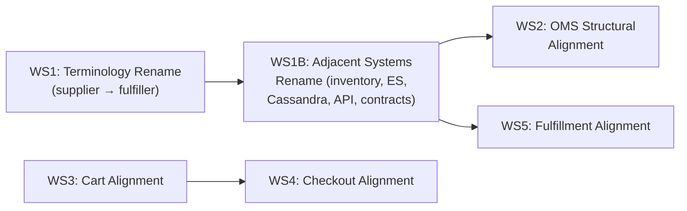

# Align temporal-commerce-demo Workflows with nightheron-mono

Bring the demo's 6 shared-domain workflows structurally closer to their mono counterparts without adding new domains, new features, or multi-tenant infrastructure.

## Scope Boundary

> [!IMPORTANT]
> **In scope:** Structural alignment, terminology normalization, state-graph topology, decider patterns, and hook signatures that have diverged.
>
> **Out of scope (scope expansion):** Adding `catalog`, `accounting`, transfer/replenishment state machines, user invite signal-driven workflow, API token lifecycle, `storeId` multi-tenancy plumbing, `zeroMoney()` monetary types, Twisp integration, Stripe payment capture, and the `@nightheron/contracts` package extraction.

---

## Open Questions

> [!NOTE]
> **Decisions (2026-07-04):** Q1 = **(A)** full state graph (return/refund update handlers included so
> `return_requested` and the shipping states are reachable; accounting/Twisp finalize actions and
> payment-capture activities excluded). Q2 = **(A)** rename only, keep the simple timer chain.
> Additionally: the demo **keeps** its deterministic `flushCart(cart, at)` — mono aligns to the demo
> here instead (tracked as nightheron-mono TODO #24), so WS3's "simplify onTransition / drop `at`"
> bullet is dropped.

> [!IMPORTANT]
> **Q1: OMS state graph expansion.** The mono OMS has 9 states (`pending_assignment` → `assigning_fulfillers` → `requesting_fulfillment` → `ready_to_fulfill` → `processing` → `partially_shipped` → `shipped` → `delivered` → `return_requested`) plus 5 terminals. The demo has 1 state (`processing`) with inline `onStart` orchestration. Adopting the mono's multi-state graph gives the demo a richer order lifecycle (partial shipments, returns), but is a **significant** expansion of the state machine. Do you want:
>
> - **(A) Full state graph** — adopt all 9 states + terminals (minus accounting finalize actions). The demo would gain `partially_shipped`, `shipped`, `return_requested`, and the transitional states.
> - **(B) Minimal structural alignment** — keep 1 waiting state but refactor the decider shell, `finalize` pattern, and terminology to match mono. The state graph stays simple.
>
> **Q2: Fulfiller child workflow expansion.** The mono `fulfiller-workflows.ts` (536 lines) is 2.6× the demo `supplier-workflows.ts` (205 lines). The extra complexity is a multi-state machine with `received` → `validating` → `submitting` → `in_production` → `shipped` states, routed through a **strategy-descriptor pattern** (`dynamic-polling`, `simulated-auto`, `simulated-manual`, `custom-workflow`) rather than literal external supplier API calls — so "adopt the mono state graph" is more about a routing abstraction than real integration work. Note also that mono keeps state definitions inline in `fulfiller-workflows.ts` / its decider rather than in a separate states file — there is no mono `fulfiller-states.ts` to mirror. Do you want:
>
> - **(A) Rename only** — rename `supplier-*` → `fulfiller-*` throughout, keep the current simple state graph. (The demo's existing `supplier-states.ts` is renamed to `fulfiller-states.ts` under WS1 regardless — this is unrelated to mono's own file layout.)
> - **(B) Adopt the mono state graph** — bring over the full fulfiller child state machine (would need expanding `fulfiller-decider.ts`, not adding a mono-mirrored `fulfiller-states.ts`, since mono doesn't structure it that way).

---

## Proposed Changes

### Work Stream 1: Cross-cutting Terminology Rename (`supplier` → `fulfiller`)

This is the highest-impact, lowest-risk change. Every shared domain uses the old "supplier" vocabulary that mono has already rebranded to "fulfiller."

#### Files affected (rename pass)

| File | Changes |
|---|---|
| `src/temporal/oms/types.ts` | `SupplierOrder` → `FulfillerOrder`, `supplierOrders` → `fulfillerOrders`, `supplierOrderId` → `fulfillerOrderId`, `supplierId` → `fulfillerId`, `supplierName` → `fulfillerName`, `SupplierOrderStatus` → `FulfillerOrderStatus`, `SupplierOrderItem` → `FulfillerOrderItem`, `SupplierOrderHistoryEntry` → `FulfillerOrderHistoryEntry` |
| `src/temporal/oms/oms-decider.ts` | All `supplier*` references → `fulfiller*` |
| `src/temporal/oms/document-builder.ts` | `buildSupplierOrderDocument` → `buildFulfillerOrderDocument` |
| `src/temporal/oms/activities.ts` | `indexSupplierOrder` → `indexFulfillerOrder`, `resolveSupplierAssignments` → `resolveFulfillerAssignments` |
| `src/temporal/oms/activities-impl.ts` | Implementation of renamed activities |
| `src/temporal/oms/workflows.ts` | All `supplier*` → `fulfiller*` |
| `src/temporal/oms/states.ts` | All `supplier*` → `fulfiller*` |
| `src/temporal/fulfillment/supplier-workflows.ts` | **Rename file** → `fulfiller-workflows.ts`, rename `supplierOrderWorkflow` → `fulfillerOrderWorkflow`, `childSupplierStatusSignal` → `childFulfillerStatusSignal` |
| `src/temporal/fulfillment/supplier-decider.ts` | **Rename file** → `fulfiller-decider.ts` |
| `src/temporal/fulfillment/supplier-decider.test.ts` | **Rename file** → `fulfiller-decider.test.ts` |
| `src/temporal/fulfillment/supplier-states.ts` | **Rename file** → `fulfiller-states.ts` |
| `src/temporal/fulfillment/workflows.ts` | `supplier*` → `fulfiller*` imports and references |
| `src/temporal/fulfillment/types.ts` | `FulfillmentSupplierOrder*` → `FulfillmentFulfillerOrder*`, `SupplierStatusUpdate` → `FulfillerStatusUpdate` |
| `src/temporal/fulfillment/definitions.ts` | `supplierStatusSignal` → `fulfillerStatusSignal` |
| `src/temporal/fulfillment/activities.ts` | **Not previously listed.** `submitSupplierOrder` → `submitFulfillerOrder`, `Suppliers.SupplierOrderInput/Result` → `Fulfillers.FulfillerOrderInput/Result`, `supplierId` param → `fulfillerId` |
| `src/temporal/fulfillment/activities-impl.ts` | **Not previously listed.** Implementation of the above renamed activity |
| `src/temporal/fulfillment/document-builder.ts` | **Not previously listed** (distinct from `oms/document-builder.ts`, already listed above). `supplierOrderCount`/`state.supplierOrders` → `fulfillerOrderCount`/`state.fulfillerOrders` |
| `src/temporal/fulfillment/fulfillment-decider.ts` | **Not previously listed** (this is the *parent* fulfillment decider — distinct from the child `supplier-decider.ts` already listed). `FulfillmentSupplierOrderState` → `FulfillmentFulfillerOrderState`, `SupplierOrderReported` event → `FulfillerOrderReported` |
| `src/temporal/fulfillment/states.ts` | Comment reference to "supplier-order" only — update wording |
| `src/temporal/checkout/activities-impl.ts` | Comment reference to "supplier" only — update wording |
| `src/temporal/contracts/fulfillment.ts` | `FulfillmentSupplierOrderInput` → `FulfillmentFulfillerOrderInput` |
| `src/temporal/contracts/oms.ts` | `SupplierOrderStatus` → `FulfillerOrderStatus` |
| Test files | All `supplier*` → `fulfiller*` in test data and assertions: `oms-decider.test.ts`, `oms-workflow.test.ts`, `supplier-decider.test.ts` → `fulfiller-decider.test.ts`, `state-graph.test.ts`, and (newly identified) `fulfillment-decider.test.ts`, `fulfillment-workflow.test.ts` |

#### Work Stream 1B: Adjacent Systems Rename

A repo-wide sweep for "supplier" surfaces ~20 files **outside** `src/temporal/{oms,fulfillment}` that the table above doesn't cover — these are load-bearing (queries, index mappings, schema) not cosmetic, so skipping them would leave the rename half-done and break the ES/inventory read paths.

| Category | Files | Notes |
|---|---|---|
| Inventory system | `src/temporal/inventory/activities-impl.ts`, `src/temporal/inventory/db/inventory-command-repository.ts` (+`.test.ts`), `src/temporal/inventory/db/inventory-query-repository.ts` | Largest category (~150 occurrences) — `supplier_id`/`supplier_name`/`supplierId` in stock and reservation queries. |
| Elasticsearch | `src/lib/es-index-mappings.ts`, `src/temporal/contracts/elasticsearch.ts` | Defines the `supplier-orders` index mapping and `SupplierOrderDocument` type. **ES indices can't be renamed in place** — this requires deleting and recreating the `fulfiller-orders` index via the existing `/api/dev/reindex` endpoint, not a find/replace. |
| Cassandra schema | `cassandra/schema.cql` | UDTs `supplier_order`, `supplier_order_item`, `supplier_order_history_entry`, plus standalone `suppliers` and `supplier_locations` tables (master data for the same fulfiller entities — in scope, not optional). |
| API routes / server actions | `src/app/api/dev/reindex/route.ts`, `src/app/api/seed-inventory/route.ts`, `src/app/admin/admin-inventory-actions.ts`, `src/app/admin/orders/[orderId]/page.tsx`, `src/app/admin/search/page.tsx`, `src/app/admin/admin-search-actions.ts`, `src/app/dev/order-trace/trace-service.ts`, `src/app/admin/inventory/page.tsx` | |
| Contracts | `src/temporal/contracts/suppliers.ts` (whole domain type file → rename to `fulfillers.ts`), `src/temporal/contracts/index.ts` (`export * as Suppliers` → `export * as Fulfillers`), `src/temporal/contracts/product-type.ts`, `src/temporal/contracts/inventory.ts` | |
| Scripts / misc UI | `scripts/verify-checkout.ts`, `src/app/shop/product/[productId]/ShopVariantSelector.tsx`, `src/app/api/search/route.ts` | |

> [!IMPORTANT]
> **Destructive schema change.** Renaming the Cassandra UDTs/tables and rebuilding the `fulfiller-orders` ES index both invalidate existing local dev data — there is no live migration path for either. This is not optional once WS1B lands; it's the reason the Manual Verification section below starts with a full `/demo-initialize` nuclear reset rather than an incremental check. Reuse the existing `/api/dev/reindex` endpoint for the ES rebuild instead of writing new reindex logic.

> [!NOTE]
> **Intentionally excluded: prose docs.** `README.md`, `docs/{demo-instructions,developer-guide,presentation-script,project-description,temporal-lessons-learned}.md`, and `.agent/{rules.md,workflows/demo-e2e-test.md,workflows/demo-verify-cassandra-schema.md}` all still say "supplier" (3–16 occurrences each). This plan is scoped to workflow code structural alignment, not a documentation consistency pass — those files need their own follow-up edit once the code rename lands. `docs/reference/state-machine-diagrams.md` is the one exception: it's auto-generated by `npm run docs:diagrams` (see Verification Plan below) and will pick up the new names for free.

---

### Work Stream 2: OMS Workflow Structural Alignment

#### `src/temporal/oms/workflows.ts`

**Adopt from mono:**

- Remove the wrapper context type `OmsWorkflowContext` — mono passes `OrderState` directly as the state-machine context (no `{ customerEmail, state }` wrapper)
- Move `customerEmail` onto the `Order` type (or onto `OrderState`) so the workflow function takes the same shape
- Add `restoredState` / `continueAsNew` serialization (mono has this, demo doesn't)
- Add `deriveDisplayStatus` usage in `onContextUpdate` (mono syncs `state.status` from the driver)
- Add `formatError` to update handlers (mono propagates errors with `{ ...state, error: err }`)
- Remove inline `triggerFulfillment()` helper — mono moved this to the state machine's `requesting_fulfillment` transitional state (but depending on Q1, the demo might keep this in `onStart`)
- Remove `indexCustomer` call (mono doesn't have this in OMS; it's a separate concern)

**Skip (scope expansion):**

- `refundOrderUpdate`, `requestReturnUpdate`, `confirmReturnUpdate`, `denyReturnUpdate` — these are new mono features
- `recordPaymentCapture`, `recordRefund`, `recordFulfillmentCost`, `indexFinancialSummary` — Twisp accounting integration
- `storeId` parameter threading

#### `src/temporal/oms/states.ts`

**Adopt from mono (structural patterns):**

- Adopt the `OmsFinalize` discriminated union pattern (replace the ad-hoc `StatusFinalize` interface)
- Adopt shared transition entries (`cancelOrderEntry`, `updateStatusEntry`) factored out of the single `processing` state
- Adopt the `apply()` helper pattern (single-line `decide → evolve`) vs the current `applyWithFacts()` that returns `{ context, facts }`
- Adopt `nextForStatus()` pure mapper (replace `routeForStatus()`)

**Conditional (depends on Q1):**

- If **(A)**: Add `pending_assignment`, `assigning_fulfillers`, `requesting_fulfillment`, `ready_to_fulfill`, `partially_shipped`, `shipped`, `delivered`, `return_requested` states (minus accounting `finalize` actions)
- If **(B)**: Keep single `processing` state but refactor its internals to match mono's patterns

#### `src/temporal/oms/oms-decider.ts`

- Rename the demo's existing `copyState()` helper → `copyOrderState` to match mono's naming (the demo already deep-copies before mutation — this is a rename, not new functionality; verify behavior still matches mono's version)
- Adopt `aggregateShippingState` helper from mono (used by the fulfillment signal handler — this one genuinely doesn't exist in the demo yet)
- Rename `OmsStateName` → `OrderStateName` to match mono

#### `src/temporal/oms/types.ts`

- Rename `OmsStateName` → `OrderStateName`, `OmsWorkflowContext` → remove (use `OrderState` directly)
- Add `updatedAt`, `deliveredAt` fields to `OrderState` (mono has these)
- Add optional `OrderAssignment.sku?` field (mono has this as optional, not required)

---

### Work Stream 3: Cart Workflow Alignment

#### `src/temporal/cart/workflows.ts`

**Adopt from mono:**

- Add the `recomputeSignal` + `ITEM_EDIT_EVENTS` pattern (§7.5 checkout nudge). The mono cart signals the checkout child when items change during checkout. The demo currently lacks this.
- Replace `CheckoutWorkflowResult` with `CartInboundSignal` as the signal type parameter. Mono's version is a 3-way discriminated union — `{ kind: 'completed', result }` | `{ kind: 'submitStarted' }` | `{ kind: 'submitAborted' }` — not just the `'completed'` case; `submitStarted`/`submitAborted` are presumably what toggle the new `submitting` field below.
- Remove the legacy `string` input overload (`input: CartWorkflowInput | string` → `input: CartWorkflowInput`). Mono removed this.
- Remove `legacyStateName` / `currentState` field from `CartWorkflowInput`. Mono replaced this with `submitting`.
- Add `submitting` field — mono has this on `CartWorkflowContext` (not confirmed on `CartWorkflowInput`); verify which type it belongs on during implementation, since Input (start-time params) and Context (evolving state) have different lifecycles.
- Simplify `onTransition` callback signature — mono doesn't pass `at` parameter (uses `new Date().toISOString()` directly). The demo's `flushCart(cart, at)` becomes `flushCart(cart)`.
- Add the outbound `recomputeSignal` send in `onTransition` when `isItemEdit && to === 'checkout'`.

**Skip (scope expansion):**

- `storeId` field on `CartWorkflowInput` and `flushCart()` — multi-tenancy
- `zeroMoney('USD')` monetary type — would require adding the contracts money type

#### `src/temporal/cart/types.ts`

- Add `CartInboundSignal` type (3-way discriminated union: `completed` / `submitStarted` / `submitAborted`)
- Add `submitting` to `CartWorkflowContext`
- Remove `CheckoutWorkflowResult` if it's been replaced by `CartInboundSignal`

---

### Work Stream 4: Checkout Workflow Alignment

#### `src/temporal/checkout/workflows.ts`

**Adopt from mono:**

- Add `recomputeSignal` (inbound signal from cart when items change during checkout)
- Add `deriveStep()` helper function — the mono derives the UI step from prerequisites (`shipping` → `payment` → `review`) rather than having the state machine track it
- Add `RecomputeSignal` type (new, alongside the existing signal types — it does **not** replace `SetShippingSignal`/`SetPaymentSignal`/`RetargetParentSignal`; mono keeps all of these as separate types. `RecomputeSignal` only carries `{ cartVersion }` for the cart-item-change nudge)
- Add `cartInboundSignal` import from states (the checkout signals the cart parent with a discriminated signal)
- Pass `recomputeSignal` as the 4th argument to `runStateMachine()` (mono does this; demo doesn't)
- Remove shared `stateFormatters` — mono inlines `formatError`/`formatResponse` per handler (more explicit)
- Update `signalParent()` to use `cartInboundSignal` instead of the raw `checkoutCompletedSignal` (mono wraps the result in `{ kind: 'completed', result }`)
- Initialize `items: []` and `totalPrice: 0` (mono seeds cart contents empty; they're refreshed via `queryCart` at `validating`)

**Skip (scope expansion):**

- `storeId` field
- `zeroMoney(input.currency)` monetary types
- `reviewedCartVersion` field on `submitOrder` event (cart-version reconciliation)

#### `src/temporal/checkout/types.ts`

- Add `RecomputeSignal` type (new — keep `SetShippingSignal`, `SetPaymentSignal`, `RetargetParentSignal` as-is; mono does not consolidate them)

#### `src/temporal/checkout/states.ts`

- Add `cartInboundSignal` export (used by the checkout workflow to signal the parent cart)

---

### Work Stream 5: Fulfillment Workflow Alignment

#### `src/temporal/fulfillment/workflows.ts`

**Adopt from mono:**

- Replace `mapToSupplierOrderStatus` with `mapToFulfillerOrderStatus`, and replace the `null` return with a `throw`. **Note:** this is this project's own "no silent fallbacks" convention, not something copied from mono — mono's own analogous status handling (OMS's `applyFulfillment`) actually silently ignores unmapped fulfiller statuses rather than throwing.
- Remove `fulfillInventoryReservations` activity import (mono doesn't have this in fulfillment)
- Add `FulfillmentOrderStatus` type import (mono has this)

**Skip (scope expansion):**

- `storeId` parameter threading
- Real supplier API integration
- Multi-supplier state machine expansion (depends on Q2)

---

## Dependency Order



- **WS1** (core rename) must come first — it touches every domain and establishes the vocabulary
- **WS1B** (adjacent systems rename) follows WS1 and must land before WS2/WS5, since OMS and fulfillment activities read/write the inventory, Elasticsearch, and Cassandra surfaces WS1B renames
- **WS2** (OMS) depends on WS1B
- **WS3** (cart) and **WS4** (checkout) are tightly coupled (the recompute nudge protocol spans both)
- **WS5** (fulfillment) depends on WS1B
- WS3/WS4 and WS2/WS5 are independent of each other

## Verification Plan

### Automated Tests

```bash
# After each work stream:
npm run build          # TypeScript compilation (catches type renames)
npm run test           # Vitest unit tests (decider + state tests)
```

### Manual Verification

After all work streams:

1. `/demo-initialize` — full nuclear reset to verify seeding with renamed types/tables
2. Browser walkthrough: add to cart → checkout → place order → verify order trace
3. Verify Elasticsearch indices (`fulfiller-orders` vs old `supplier-orders`)
4. Verify Temporal UI shows correct workflow names and signal names

### State Machine Diagrams

```bash
npm run docs:diagrams  # Regenerate state-machine-diagrams.md with new state names
```
