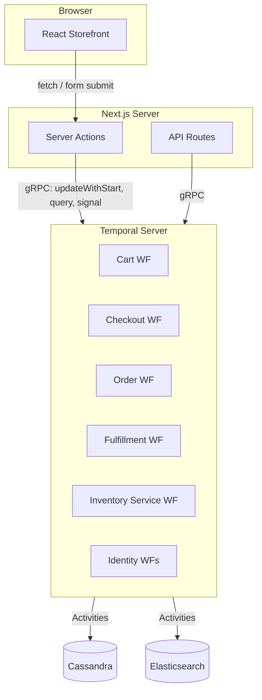
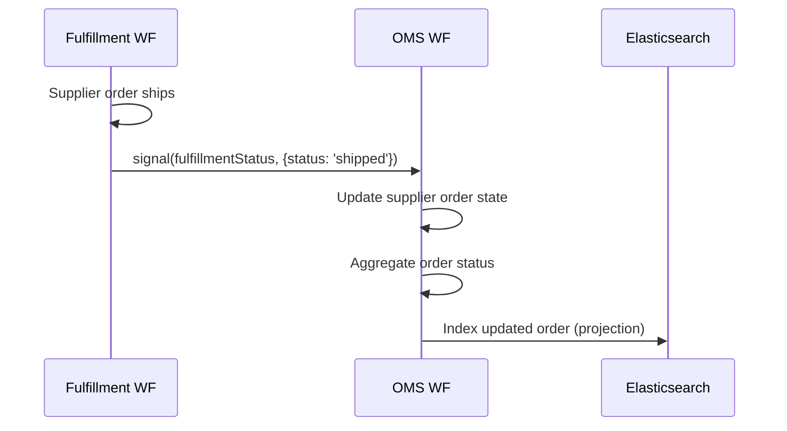

# Temporal Commerce Demo — Presentation Script

A walkthrough script for demonstrating how Temporal durable execution powers a full-stack e-commerce application. This script is organized into modular sections that can be combined or delivered independently.

**Estimated total duration:** 30–40 minutes (with live demo)
**Audience:** Developers evaluating Temporal, conference attendees, or technical stakeholders

---

## Opening — The Problem with E-Commerce State

**Duration:** 3–4 minutes

> Every e-commerce system is, at its core, a distributed state machine. A shopping cart lives in one service, payment processing in another, inventory in a third, and fulfillment in a fourth. The traditional approach is to wire these together with REST calls, message queues, cron jobs, and prayer.
>
> What happens when the payment gateway times out after the user clicked "Place Order"? Did the charge go through? Do we reserve the inventory or release it? What email do we send? Every one of these failure modes requires custom retry logic, dead-letter queues, and reconciliation scripts.
>
> Temporal eliminates this entire category of problems by making workflows durable. The business logic itself becomes the source of truth — not a database row that you hope stays in sync with three other services.
>
> This demo is a full e-commerce application — catalog, cart, checkout, orders, fulfillment, and inventory — where every state transition is a Temporal workflow. Let's walk through it.

---

## Section 1 — Architecture Overview

**Duration:** 3–4 minutes

### Talking Points

- Single Next.js application with six Temporal workflow domains
- Each domain has its own task queue and worker module, but they all run in a single worker process sharing one gRPC connection
- Cassandra for durable persistence, Elasticsearch for search and read-side projections
- The Next.js server actions layer is the bridge between the browser and the Temporal cluster — every cart mutation is a Temporal workflow update

### Architecture Diagram



> **Key insight:** The Temporal client in our Next.js server actions is the *only* integration point. There are no message queues, no event buses, no webhook endpoints between domains. Workflows communicate via signals and child workflow relationships.

---

## Section 2 — Cart as a Durable Entity

**Duration:** 5–7 minutes

### Cart Talking Points

The cart is the best entry point because everyone understands shopping carts, and it demonstrates the most Temporal patterns in a single workflow.

### Pattern 1: `updateWithStart` — Lazy Entity Creation

> The first "Add to Cart" click needs to create the cart workflow if it doesn't exist, or update the existing one. With traditional systems, this requires a check-then-create race condition or upsert semantics. Temporal's `updateWithStart` makes this atomic.

**Show code:** `cart-actions.ts` — `executeCartUpdate`

```typescript
// Use updateWithStart to lazily create the workflow
const startOp = new WithStartWorkflowOperation('cartWorkflow', {
  workflowId: `cart-${cartId}`,
  args: [{ cartId }],
  taskQueue: 'cart-queue',
  workflowIdConflictPolicy: 'USE_EXISTING',  // ← idempotent
});
return await client.workflow.executeUpdateWithStart(updateDef, {
  startWorkflowOperation: startOp,
  args: args
});
```

> This is a single atomic operation. If the workflow exists, it routes the update to it. If it doesn't, it starts the workflow and delivers the update. No race conditions. No "cart not found" errors on the first click.

### Pattern 2: Queries and Updates — Workflow as a Live Entity

> The cart workflow isn't just storing state — it's a live, queryable entity. The React UI reads cart state via Temporal queries, and every mutation is a Temporal update with a synchronous return value.

```typescript
// Reading cart state — zero database calls
const cart = await handle.query(getCartQuery);

// Mutating cart state — returns updated cart synchronously
const updatedCart = await handle.executeUpdate(addItemToCartUpdate, {
  args: [{ variantId, quantity, price }]
});
```

> This replaces your entire cart API layer. No REST endpoints, no database reads, no cache invalidation. The workflow IS the cart.

### Pattern 3: `continueAsNew` — Infinite Entity Lifetime

> A shopping cart could receive hundreds of updates over days or weeks. Temporal event histories grow with each operation, so we use `continueAsNew` after 100 updates to start a fresh execution while preserving the full cart state.

```typescript
const incrementUpdateCount = async () => {
  updateCount++;
  if (updateCount >= CONTINUE_AS_NEW_THRESHOLD) {
    await condition(allHandlersFinished);       // ← drain handlers first
    await continueAsNew<typeof cartWorkflow>({
      cartId,
      initialCart: cart,                        // ← full state preserved
      createdAt: cart.createdAt,
      updateCount: 0                            // ← reset counter
    });
  }
};
```

> The critical detail: we `await condition(allHandlersFinished)` before continuing as new. This ensures any in-flight update handlers complete before the workflow restarts. Without this, you'd lose in-progress mutations.

### Live Demo: Cart Operations

1. Open storefront → add an item → show the cart workflow appearing in Temporal UI
2. Add more items → show the event history growing with each update
3. Query the workflow → show live state matches what the UI displays
4. Point out: zero database reads for cart state — it's all in the workflow

---

## Section 3 — Checkout Orchestration

**Duration:** 5–7 minutes

### Checkout Talking Points

Checkout is where Temporal really shines — it's a multi-step, long-running process with timeouts, cancellations, and cross-workflow coordination.

### Pattern 4: Parent-Child Workflow with ABANDON Policy

> When the user clicks "Checkout", the cart workflow starts a checkout child workflow. We use the `ABANDON` parent close policy, which means the checkout survives even if the cart is destroyed (e.g., the user clears cookies and creates a new cart).

```typescript
await startChild('checkoutWorkflow', {
  workflowId: checkoutWorkflowId,
  taskQueue: 'checkout-queue',
  parentClosePolicy: ParentClosePolicy.PARENT_CLOSE_POLICY_ABANDON,
  args: [{
    cartId: cart.cartId,
    parentCartWorkflowId,
    items: cart.items,
    // ... snapshot of cart state at checkout time
  }],
  workflowExecutionTimeout: '2 hours'
});
```

> The checkout workflow receives a snapshot of the cart at checkout time. This is intentional — the cart items are frozen for the duration of checkout. If the user modifies their cart during checkout, we detect the version mismatch and prompt them.

### Pattern 5: Step-Based State Machine with Update Guards

> The checkout workflow is a state machine: `shipping → payment → review → processing → complete`. Each step is advanced by a Temporal update, and each update validates the current step before proceeding.

```typescript
setHandler(setShippingUpdate, async (input) => {
  await condition(() => state.step !== 'validating');   // ← wait for init
  const allowedSteps = ['shipping', 'payment', 'review'];
  if (!allowedSteps.includes(state.step)) {
    return { ...state, error: `Cannot set shipping from step: ${state.step}` };
  }
  // ... calculate shipping, tax, create payment intent
  state.step = 'payment';
  return state;
});
```

> Notice the guard: shipping can be set from `shipping`, `payment`, or `review`. This enables back-navigation — the user can return to the shipping step from payment or review and the workflow recalculates costs correctly. Try implementing that with a saga.

### Pattern 6: Timeout-Based Reservation Management

> The checkout workflow has a 1-hour timeout. When checkout starts, we renew all inventory reservations with a fresh TTL. If the checkout times out or is cancelled, we release them. If it succeeds, we confirm them.

```typescript
// Wait for order completion or cancellation (1 hour timeout)
const completedBeforeTimeout = await condition(
  () => orderComplete || checkoutCancelled,
  '1 hour'
);

// If checkout times out or is cancelled, release reservations
if (!orderComplete && reservations.length > 0) {
  await releaseReservations(reservations);
}
```

> This is the kind of cleanup logic that's almost impossible to get right with message queues. What if the consumer crashes after the timeout but before the release? With Temporal, the workflow is durable — it will run the release regardless.

### Pattern 7: Cross-Workflow Signaling

> When checkout completes, it signals the parent cart workflow with the result. The cart workflow is waiting for this signal in its main loop.

```typescript
// Checkout workflow → signals parent cart
const parentHandle = getExternalWorkflowHandle(parentCartWorkflowId);
await parentHandle.signal(checkoutCompletedSignal, result);

// Cart workflow → waiting for signal
await condition(
  () => checkoutResult !== null || orderComplete || shouldExit,
  '1 hour'
);
```

> This is coordination without coupling. The checkout workflow doesn't import the cart workflow's code — it just sends a signal by workflow ID. They can be deployed and versioned independently.

### Live Demo: Checkout Flow

1. Click "Checkout" → show the checkout child workflow appear in Temporal UI
2. Walk through shipping → payment → review
3. Show the checkout workflow's state via query in Temporal UI
4. Submit order → show the signal from checkout to cart
5. Show the cart workflow transitioning to `completed`

---

## Section 4 — Order Lifecycle and Decoupled Fulfillment

**Duration:** 5–7 minutes

### Order and Fulfillment Talking Points

### Pattern 8: Activity-Driven Workflow Spawning

> When the order workflow needs to start fulfillment, it does so via an activity — not `startChild`. This fully decouples the OMS from fulfillment. The fulfillment workflow is a standalone workflow that signals back to the OMS.

```typescript
// OMS workflow triggers fulfillment via activity
await startFulfillmentWorkflow(fulfillmentInput);

// Later, fulfillment signals OMS with status updates
setHandler(fulfillmentStatusSignal, async (update) => {
  const supplierOrder = state.supplierOrders.find(
    so => so.supplierOrderId === update.supplierOrderId
  );
  supplierOrder.status = update.status;
  // ... propagate to order-level status
});
```

> Why not use a child workflow? Because the fulfillment workflow may outlive the current OMS execution if the OMS needs to `continueAsNew`. With activity-based spawning, the fulfillment workflow is truly independent — it runs on its own task queue, has its own lifecycle, and communicates only via signals.

### Pattern 9: Multi-Supplier Strategy Routing

> The fulfillment workflow receives pre-decided supplier orders and routes each one to the appropriate strategy based on `supplierType`.

```typescript
for (const supplierOrder of state.supplierOrders) {
  if (supplierOrder.supplierType === 'simulated') {
    await runSimulatedFulfillment(state, supplierOrder, request, syncProjections);
  } else if (supplierOrder.supplierType === 'printify-dynamic') {
    await runDynamicFulfillment(state, supplierOrder, request, syncProjections);
  }
}
```

> The simulated strategy uses `wf.sleep()` timers to simulate processing, shipping, and delivery delays. The dynamic strategy submits to a real supplier API and uses a polling + signal hybrid to track status. Same workflow, different execution strategies.

### Pattern 10: Signal-Driven Status Propagation

> Status flows upward through the system via signals:



> Each fulfillment status change signals the OMS, which aggregates across all supplier orders to derive the order-level status. When all supplier orders are shipped, the order is shipped. When all are delivered, the order is delivered. This aggregation happens deterministically inside the workflow.

### Live Demo: Order Processing

1. Show the order workflow in Temporal UI after checkout
2. Show the fulfillment workflow running alongside it
3. Watch the simulated fulfillment advance through: `in_production → shipped → delivered`
4. Show signals flowing from fulfillment to OMS in the event history
5. Show the order status updating in the admin panel in real-time

---

## Section 5 — CQRS Inventory with Temporal

**Duration:** 4–5 minutes

### Inventory Talking Points

### Pattern 11: Workflow as an Event Processor

> The inventory service is a single long-running workflow that acts as a CQRS event processor. Write-side mutations (reserve, release, transfer) happen in activities. The inventory service workflow is signaled with changed SKUs and runs targeted read-side projections.

```typescript
export async function inventoryServiceWorkflow(input?: InventoryServiceInput) {
  const dirtySkus = new Set<string>(input?.pendingSkus ?? []);

  setHandler(inventoryChangedSignal, ({ blankSkus }) => {
    for (const sku of blankSkus) dirtySkus.add(sku);
    signalCount++;
  });

  while (true) {
    // Wait for signals OR periodic sweep (whichever comes first)
    await condition(() => dirtySkus.size > 0, '5m');

    if (dirtySkus.size > 0) {
      const skus = Array.from(dirtySkus);
      dirtySkus.clear();
      await projectStockForSkus(skus);          // Write → Read projection
      await projectReservationsForSkus(skus);
      await syncInventoryToESForSkus(skus);      // Read → Elasticsearch
    } else {
      // Periodic full consistency sweep
      await expireReservations();
      await projectStockSummaries();
      await syncInventoryToES();
    }

    // ContinueAsNew after 100 signals
    if (signalCount >= 100) {
      await condition(allHandlersFinished);
      await continueAsNew<typeof inventoryServiceWorkflow>({
        signalCount: 0,
        pendingSkus: Array.from(dirtySkus),     // ← preserve in-flight
      });
    }
  }
}
```

> This replaces an entire message queue consumer + cron job infrastructure. The `condition()` with a 5-minute timeout gives us both event-driven and time-driven behavior in a single construct. The signal batches dirty SKUs so rapid-fire mutations result in a single projection pass, not one per mutation.
>
> The `continueAsNew` preserves any dirty SKUs that accumulated during the threshold check. Nothing is lost.

---

## Section 6 — The Unified Worker

**Duration:** 2–3 minutes

### Worker Talking Points

### Pattern 12: Shared Connection, Isolated Domains

> All six domain workers run in a single Node.js process, sharing one gRPC connection to Temporal. Each domain has its own task queue, workflow registrations, and activity implementations.

```typescript
async function run() {
  const connection = await NativeConnection.connect({ address: TEMPORAL_ADDRESS, tls });

  await Promise.all([
    cartWorker(connection),        // cart-queue
    checkoutWorker(connection),    // checkout-queue
    fulfillmentWorker(connection), // fulfillment-queue
    identityWorker(connection),    // identity-queue
    inventoryWorker(connection),   // inventory-queue
    omsWorker(connection),         // oms-queue
  ]);
}
```

> In production, you could split these into separate deployments for independent scaling — the fulfillment worker might need more resources than the identity worker. But for a demo and for small deployments, a single process is simpler and cheaper.
>
> The task queue isolation means a slow fulfillment activity can't block cart operations. Each domain processes work independently even though they share a connection.

---

## Section 7 — Non-Blocking Projection Pattern

**Duration:** 2–3 minutes

### Projection Talking Points

### Pattern 13: Dirty-Flag Projection Batching

> Multiple workflows need to sync state to Elasticsearch for search and admin views. But doing an ES write inside every update handler would be blocking and wasteful. Instead, we use a dirty-flag pattern.

```typescript
let projectionDirty = false;

// In update/signal handlers — just set the flag
function syncProjections(): void {
  projectionDirty = true;
}

// In the main loop — flush between iterations
while (!isComplete) {
  await condition(() => isComplete || projectionDirty, timeout);
  if (projectionDirty) {
    projectionDirty = false;
    await indexToElasticsearch(currentState);
  }
}
```

> If five items are added to a cart in rapid succession, we get one ES write — not five. The main loop batches all pending mutations into a single projection flush. This is the Temporal equivalent of database write coalescing.

---

## Section 8 — Error Handling Philosophy

**Duration:** 2–3 minutes

### Error Handling Talking Points

> Our error handling follows a principle we call **Redemptive State Recovery**. When a workflow operation fails, we don't crash the workflow or show an error page. We return the system to the last known good state and let the user try again.

```typescript
// Server Action wrapper — never throws for terminal workflows
try {
  return await handle.executeUpdate(updateDef, { args });
} catch (e) {
  if (error?.name === 'WorkflowNotFoundError' ||
      error?.cause?.type === 'AcceptedUpdateCompletedWorkflow') {
    return null;  // ← graceful degradation, not a crash
  }
  throw e;        // ← only re-throw unexpected errors
}
```

> In the checkout workflow, if payment fails, we don't fail the workflow — we return to the payment step with an error message. If the checkout times out, we release reservations and return the cart to `active`. The user's cart items are never lost.
>
> This is dramatically simpler than building compensating transactions. The workflow remembers everything, so recovery is just a state transition.

---

## Closing — What We Didn't Build

**Duration:** 2–3 minutes

> Let's talk about what's *not* in this codebase:
>
> - **No message queue** — no Kafka, no RabbitMQ, no SQS. Workflow signals replace all async messaging.
> - **No cron jobs** — the inventory service workflow replaces the "run every 5 minutes" cron with `condition(() => dirty, '5m')`.
> - **No dead-letter queues** — Temporal's retry policies and activity timeouts handle all transient failures.
> - **No saga orchestrator** — the checkout workflow IS the saga. Steps, compensations, and timeouts are just workflow code.
> - **No distributed transaction coordinator** — `updateWithStart` gives us atomic create-or-update. `allHandlersFinished` gives us graceful shutdown.
> - **No webhook reconciliation** — fulfillment status is tracked via polling + signals in a durable loop that never loses state.
>
> All of this infrastructure — the queues, the crons, the sagas, the reconciliation — is replaced by Temporal workflows. The business logic is the infrastructure.
>
> The full source code is available at **github.com/night-heron-software/temporal-commerce-demo**.
>
> Questions?

---

## Appendix: Live Demo Checklist

### Pre-Demo Setup

```bash
npm run infra:up && npm run db:init  # Start infrastructure + schema
npm run dev:up                       # Start Next.js + workers
npm run dev:seed                     # Populate catalog
```

### Demo URLs

| Resource | URL |
| --- | --- |
| Storefront | `http://localhost:3000/shop` |
| Admin Panel | `http://localhost:3000/admin` |
| Temporal UI | `http://localhost:8233` |

### Recommended Demo Flow

1. **Browse catalog** → show products loaded from Elasticsearch
2. **Add to cart** → show `cart-{id}` workflow appear in Temporal UI
3. **Add more items** → show update events accumulating in history
4. **Begin checkout** → show child `checkout-{uuid}` workflow spawn
5. **Enter shipping** → show the `setShippingUpdate` in event history
6. **Enter payment** → show step transition to `review`
7. **Submit order** → show:
   - Checkout signals cart with `checkoutCompleted`
   - `order-{id}` workflow starts
   - `fulfillment-{id}` workflow starts
   - Cart workflow completes
8. **Watch fulfillment** → show simulated timers advancing through `in_production → shipped → delivered`
9. **Show admin panel** → order status updating in real-time via ES projections
10. **Show Elasticsearch Explorer** (`/admin/search`) → search for the order ID to show cross-index projections (orders, supplier_orders, fulfillments, customers, inventory)
11. **Show Temporal UI** → full event history, queryable state, signal flow

### Feature Flag Demo Options

- **`MANUAL_FULFILLMENT=true`** — Pause fulfillment at each stage, manually advance via Temporal UI signals. Good for pacing the demo.
- **`DATA_FLOW_LOGGING=true`** — Show structured data transformation logs in the worker terminal.

### Failure Scenarios to Demonstrate

| Scenario | How to Trigger | What Happens |
| --- | --- | --- |
| Cart survives server restart | Kill and restart workers mid-cart | Cart state is durable — query returns same items |
| Checkout timeout | Wait 1 hour (or shorten timeout) | Reservations released, cart returns to `active` |
| Payment failure | Use a mock failure token | Checkout returns to `payment` step with error |
| Worker crash during fulfillment | Kill worker mid-fulfillment | Worker restarts, fulfillment resumes from last activity |
