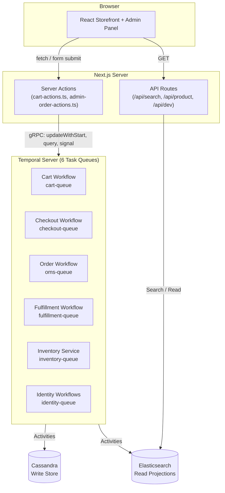
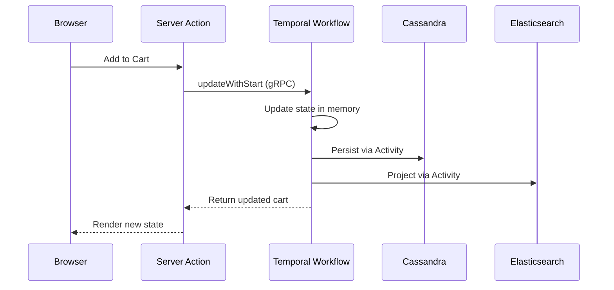
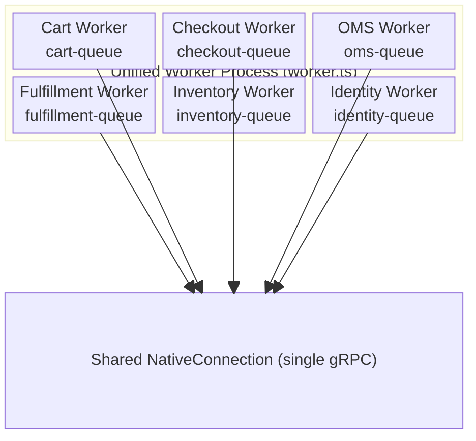

# Temporal Commerce Demo — Project Description

A full-stack e-commerce application built entirely on [Temporal](https://temporal.io) durable execution. Every state transition — from adding an item to a cart through order fulfillment and delivery — is a Temporal workflow. No message queues, no cron jobs, no saga orchestrators. The business logic *is* the infrastructure.

**Stack:** Next.js 15 · Temporal TypeScript SDK · Apache Cassandra · Elasticsearch
**Scale:** 123 source files · ~19,000 LOC · 6 Temporal workflow domains · 266 products · 10,600 variants

---

## Why This Exists

Every e-commerce system is a distributed state machine. A shopping cart lives in one service, payment processing in another, inventory in a third, and fulfillment in a fourth. The traditional approach wires these together with REST calls, message queues, cron jobs, and reconciliation scripts.

This project demonstrates that Temporal eliminates that entire infrastructure layer. The application has:

- **No message queue** — no Kafka, no RabbitMQ, no SQS. Workflow signals replace all async messaging.
- **No cron jobs** — the inventory service workflow replaces "run every 5 minutes" with `condition(() => dirty, '5m')`.
- **No dead-letter queues** — Temporal's retry policies and activity timeouts handle all transient failures.
- **No saga orchestrator** — the checkout workflow *is* the saga. Steps, compensations, and timeouts are just workflow code.
- **No distributed transaction coordinator** — `updateWithStart` gives atomic create-or-update. `allHandlersFinished` gives graceful shutdown.

---

## Architecture



The Next.js server actions layer is the sole bridge between the browser and the Temporal cluster. Every cart mutation is a Temporal workflow update. Every product query hits Elasticsearch read projections that are kept in sync by workflow activities.

---

## Workflow Domains

### Cart — Durable Entity Pattern

The cart is a long-running Temporal workflow that acts as a live, queryable entity. There are no database reads for cart state — the workflow *is* the cart.

| Pattern | Implementation |
| --- | --- |
| **Lazy creation** | `updateWithStart` atomically creates-or-updates the cart workflow on the first "Add to Cart" click |
| **Live state** | React UI reads cart state via Temporal queries; mutations are Temporal updates with synchronous return values |
| **Infinite lifetime** | `continueAsNew` after 100 updates resets the event history while preserving full cart state |
| **Graceful shutdown** | `await condition(allHandlersFinished)` ensures in-flight update handlers complete before `continueAsNew` |
| **Child orchestration** | Checkout is started as a child workflow with `ABANDON` parent close policy |

### Checkout — Multi-Step State Machine

Checkout orchestrates the shipping → payment → review → processing → complete lifecycle. Each step is advanced by a Temporal update with guard validation.

| Pattern | Implementation |
| --- | --- |
| **Step guards** | Each update validates the current step before proceeding — shipping can be set from `shipping`, `payment`, or `review` (enabling back-navigation) |
| **Reservation management** | Inventory reservations are renewed at checkout start, released on timeout/cancellation, confirmed on success |
| **Timeout** | `condition(() => complete, '1 hour')` auto-cancels stale checkouts and releases inventory |
| **Cross-workflow signaling** | Checkout signals the parent cart workflow with the result via `getExternalWorkflowHandle` |
| **Activity-driven spawning** | On order submission, an activity starts the OMS workflow — fully decoupling checkout from order management |

### Order Management (OMS) — Lifecycle Orchestration

The OMS workflow manages an order from placement through delivery. It coordinates supplier assignments, tracks fulfillment status, and maintains audit history.

| Pattern | Implementation |
| --- | --- |
| **Supplier routing** | `resolveSupplierAssignments` activity decides which supplier handles each line item |
| **Decoupled fulfillment** | Fulfillment is started via an activity (not `startChild`), making it a standalone workflow with its own lifecycle |
| **Signal-driven updates** | Fulfillment status flows upward via signals — the OMS aggregates across all supplier orders to derive order-level status |
| **Status projections** | Every status change is indexed to Elasticsearch for real-time admin panel updates |
| **Audit trail** | Every status transition is recorded in the `order_status_history` Cassandra table |

### Fulfillment — Strategy-Based Execution

The fulfillment workflow receives pre-decided supplier orders and executes the appropriate fulfillment strategy for each.

| Pattern | Implementation |
| --- | --- |
| **Automatic mode** | `wf.sleep()` timers simulate processing (15s) → shipping (15s) → delivery (15s) |
| **Manual mode** | Feature flag `MANUAL_FULFILLMENT=true` pauses at each stage, waiting for Temporal signals to advance |
| **Multi-supplier** | Strategy routing by `supplierType` — simulated, Printify dynamic, or custom |
| **Inventory lifecycle** | Reservations are transferred to supplier on start, fulfilled on delivery, released on rejection |
| **Email notifications** | Shipped and delivered emails are sent via activity stubs |

### Inventory — CQRS Event Processor

The inventory service is a single long-running workflow that replaces an entire message queue consumer + cron job infrastructure.

| Pattern | Implementation |
| --- | --- |
| **Signal-driven projections** | Write-side mutations signal the inventory service with changed SKUs; it runs targeted read-side projections |
| **Dirty-flag batching** | Rapid-fire mutations result in a single projection pass, not one per mutation |
| **Dual-trigger** | `condition(() => dirtySkus.size > 0, '5m')` gives both event-driven and time-driven behavior |
| **Lazy start** | `signalWithStart` creates the inventory service on the first inventory mutation |
| **Reservation lifecycle** | Temporary → Confirmed → Fulfilled/Released, with TTL-based expiration |

### Identity — Shopper Authentication and Address Persistence

The identity domain provides email-based shopper authentication and saved shipping addresses. This is a password-less, demo-focused system — shoppers sign in with just an email address, and accounts are auto-created on first login.

| Pattern | Implementation |
| --- | --- |
| **Email-only auth** | No passwords — `POST /api/auth/shopper/login` auto-creates accounts on first login |
| **Cookie sessions** | `shopperId` cookie persists the session across page loads (30-day TTL) |
| **Guest-to-member promotion** | Guest shoppers who complete checkout are automatically promoted to members using the shipping address email |
| **Address pre-fill** | Returning shoppers have their checkout shipping form pre-populated from saved default addresses |
| **Order lookup** | `/shop/orders` page allows signed-in shoppers to view order history with full shipping details |

---

## Data Architecture

### Write Side — Cassandra

Cassandra serves as the durable write store with partition-key isolation:

| Table Family | Purpose |
| --- | --- |
| `products`, `variants`, `collections` | Product catalog |
| `orders`, `orders_by_customer`, `orders_by_confirmation` | Order persistence (3 denormalized views) |
| `order_status_history` | Audit trail (TimeUUID clustering) |
| `inventory_stock`, `inventory_reservations_w` | Inventory state |
| `shoppers` | Shopper accounts (email-keyed, no password) |
| `shopper_shipping_addresses` | Saved shipping addresses (user_id partition) |

### Read Side — Elasticsearch

Elasticsearch serves as the read projection layer with full-text search and faceted filtering:

| Index | Projected By | Consumer |
| --- | --- | --- |
| `products` | Reindex API (bulk) | Storefront search, product detail |
| `collections` | Reindex API (bulk) | Collection navigation |
| `orders` | OMS workflow activities | Admin order list, search |
| `customers` | OMS workflow activities | Admin search |
| `suppliers` | Reindex API (bulk) | Admin search |
| `inventory` | Inventory service workflow | Admin inventory, search |
| `supplier_orders` | OMS workflow activities | Admin order detail, search |
| `carts` | Cart workflow activities | Admin carts, search |
| `reservations` | Cart + checkout activities | Admin search |
| `fulfillments` | Fulfillment workflow activities | Admin search |
| `shipments` | Fulfillment workflow activities | Admin search |

### CQRS Flow



---

## Unified Worker Architecture

All six domain workers run in a single Node.js process, sharing one gRPC connection to Temporal. Each domain has its own task queue, workflow registrations, and activity implementations.



Task queue isolation means a slow fulfillment activity cannot block cart operations. Each domain processes work independently even though they share a connection. In production, these can be split into separate deployments for independent scaling.

---

## Key Temporal Patterns Demonstrated

| # | Pattern | Where Used |
| --- | --- | --- |
| 1 | `updateWithStart` — atomic lazy entity creation | Cart |
| 2 | Query/Update handlers — workflow as live entity | Cart, Checkout, OMS |
| 3 | `continueAsNew` — infinite entity lifetime | Cart, Inventory Service |
| 4 | Parent-child with `ABANDON` policy | Cart → Checkout |
| 5 | Step-based state machine with update guards | Checkout |
| 6 | `condition()` with timeout — reservation TTL | Checkout, Inventory |
| 7 | Cross-workflow signaling via `getExternalWorkflowHandle` | Checkout → Cart, Fulfillment → OMS |
| 8 | Activity-driven workflow spawning (not `startChild`) | OMS → Fulfillment, Checkout → OMS |
| 9 | Multi-supplier strategy routing | Fulfillment |
| 10 | Signal-driven status propagation | Fulfillment → OMS → Elasticsearch |
| 11 | Workflow as CQRS event processor | Inventory Service |
| 12 | Shared connection, isolated task queues | Unified Worker |
| 13 | Dirty-flag projection batching | OMS, Fulfillment |

---

## Error Handling — Redemptive State Recovery

The application follows a principle of **Redemptive State Recovery**: when a workflow operation fails, the system returns to the last known good state instead of crashing.

- **Payment failure** → checkout returns to the payment step with an error message
- **Checkout timeout** → reservations released, cart returns to `active`
- **Terminal workflow** → server action wrapper catches `WorkflowNotFoundError` and returns `null` for graceful UI degradation
- **Worker crash** → Temporal automatically replays the workflow from the last checkpoint; no state is lost

---

## Project Structure

```text
temporal-commerce-demo/
├── cassandra/                  # CQL schema definitions
├── sample-data/                # Product catalog (266 products, 57 collections, 10,600 variants)
├── scripts/                    # Seed orchestrator
├── docs/
│   ├── project-description.md  # This document
│   ├── presentation-script.md  # 30-40 min talk script with code excerpts
│   ├── demo-instructions.md    # 4-5 min live demo walkthrough
│   ├── developer-guide.md      # Local development setup
│   └── cloud-deployment.md     # Production deployment guide
├── src/
│   ├── app/
│   │   ├── api/                # REST endpoints (search, product, seed, reindex)
│   │   ├── admin/              # Admin panel (orders, inventory, carts, search)
│   │   │   ├── orders/         # Order management
│   │   │   ├── inventory/      # Inventory monitoring
│   │   │   ├── carts/          # Active cart monitoring
│   │   │   └── search/         # Elasticsearch explorer (all 11 indices)
│   │   └── shop/               # Storefront (catalog, product, checkout)
│   ├── components/             # Shared UI (NavBar, CartDrawer, AccountDropdown)
│   ├── context/                # React context (CartProvider, ShopperProvider)
│   ├── lib/                    # Shared clients (Cassandra, ES, Temporal)
│   └── temporal/
│       ├── contracts/          # Shared type definitions and constants
│       ├── cart/               # Cart workflow domain
│       ├── checkout/           # Checkout workflow domain
│       ├── oms/                # Order management domain
│       ├── fulfillment/        # Fulfillment simulation domain
│       ├── inventory/          # CQRS inventory domain
│       ├── identity/           # Shopper auth, users, API tokens, feature flags
│       └── worker.ts           # Unified worker launcher
└── docker-compose.yml          # Local infrastructure
```

---

## Quick Start

```bash
npm install          # Install dependencies
make init            # Start Docker infrastructure + Cassandra schema
make app-start       # Start Next.js + Temporal workers
make seed            # Populate 266 products across 57 collections
```

| Resource | URL |
| --- | --- |
| Storefront | [http://localhost:3000/shop](http://localhost:3000/shop) |
| Admin Panel | [http://localhost:3000/admin](http://localhost:3000/admin) |
| Temporal UI | [http://localhost:8233](http://localhost:8233) |

---

## Technology Stack

| Layer | Technology | Purpose |
| --- | --- | --- |
| Frontend | Next.js 15 (App Router), React | Server-rendered storefront and admin panel |
| Server | Next.js Server Actions + API Routes | Bridge between browser and Temporal cluster |
| Orchestration | Temporal TypeScript SDK | Durable workflow execution for all state transitions |
| Write Store | Apache Cassandra | Partition-key-isolated persistence for catalog, orders, inventory |
| Read Store | Elasticsearch | Full-text search, faceted filtering, CQRS read projections |
| Infrastructure | Docker Compose | Local development; compatible with Temporal Cloud + managed databases |

---

## Related Documentation

- [Presentation Script](presentation-script.md) — 30–40 minute talk with code excerpts and live demo instructions
- [Demo Instructions](demo-instructions.md) — Streamlined 4–5 minute live demo walkthrough
- [Developer Guide](developer-guide.md) — Local development setup and debugging
- [Cloud Deployment](cloud-deployment.md) — Production deployment guide
- [Temporal Lessons Learned](temporal-lessons-learned.md) — 25 hard-won lessons from building on Temporal durable execution
