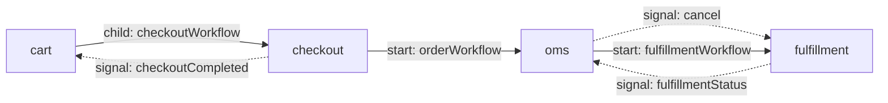
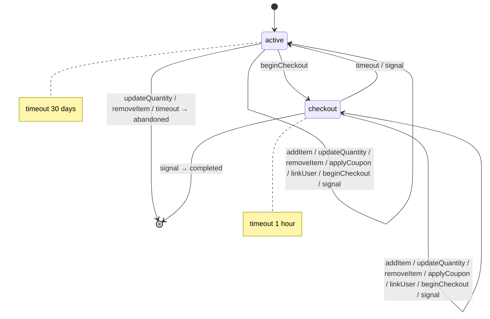
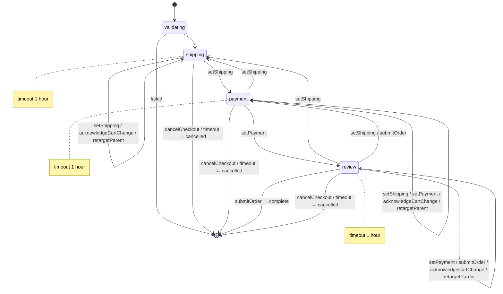
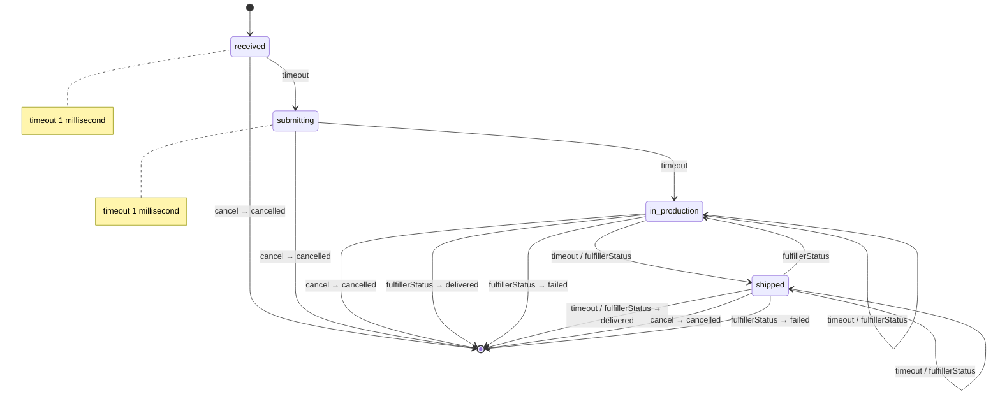
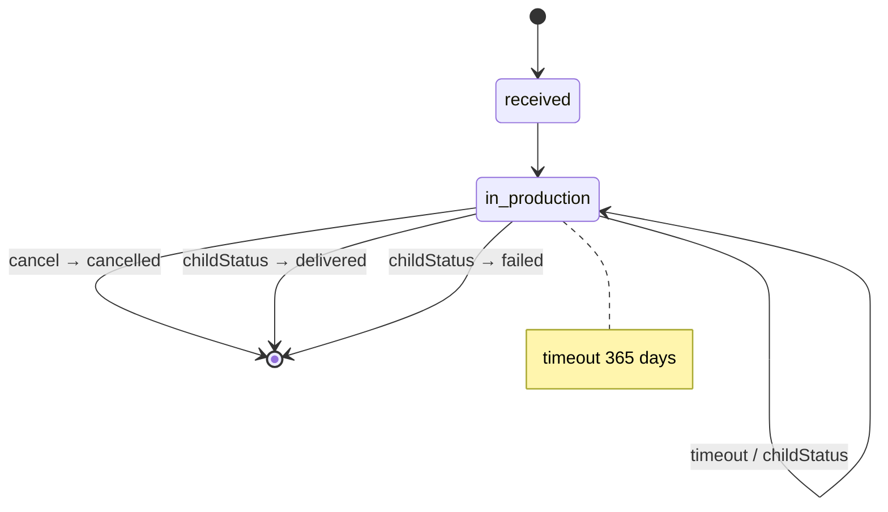
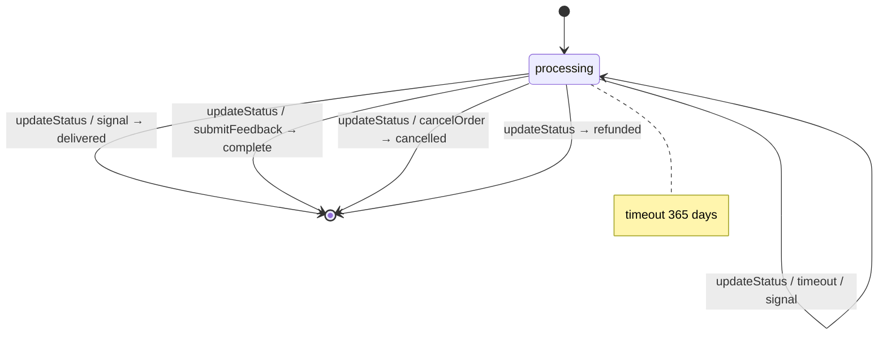
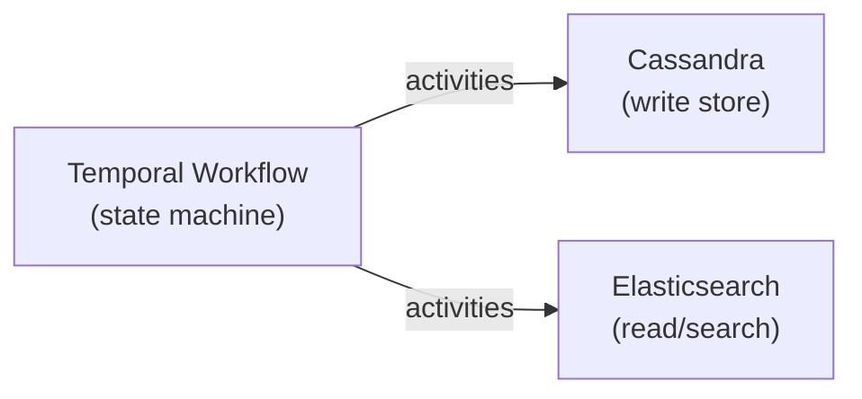

<!-- AUTO-GENERATED by scripts/generate-state-diagrams.mjs
     Run `npm run docs:diagrams` to regenerate. Do not edit manually.
     Prose descriptions are extracted from JSDoc comments in the source files.
     The "Persistence and Projection" section is maintained in the generator script. -->

# State Machine Reference

Reference for every domain state machine in `temporal-commerce-demo`. Regenerated from source by `npm run docs:diagrams`.

> **Trigger kinds** — `update:` (Temporal Update, synchronous), `signal` (fire-and-forget Signal), `timeout` (wall-clock deadline), *(auto)* (transitional state, no input). Self-loops (event processed but state stays the same) are shown as looping arcs on the state. Notes show `prepare:` activities (I/O), `if:` conditions tested in `decide`, and `finalize:` activities (side-effects).

## Cross-Domain Orchestration

How domains coordinate at runtime. Per invariant #1 there are **no** cross-domain workflow imports — domains start each other's workflows by string name (`startChild`, solid arrows) and signal each other through `getExternalWorkflowHandle` (dashed arrows). Generated from source; edge labels are the registered workflow names and signal wire-names.

---

## Cart — `CART_STATES`

Source: [src/temporal/cart/states.ts](../../src/temporal/cart/states.ts)

### State: `active`

| Trigger | Next | Notes |
|---------|------|-------|
| `update: addItem` | `active` | prepare: `releaseCartItem`, `reserveCartItem` · if: `prepared.reserveError` |
| `update: updateQuantity` | `active` | prepare: `releaseCartItem`, `reserveCartItem` · if: `prepared.reserveError`; `context.cart.items.length === 0` |
| `update: updateQuantity` | ⇒ abandoned | prepare: `releaseCartItem`, `reserveCartItem` · if: `prepared.reserveError`; `context.cart.items.length === 0` |
| `update: removeItem` | ⇒ abandoned | prepare: `releaseCartItem` · if: `context.cart.items.length === 0` |
| `update: removeItem` | `active` | prepare: `releaseCartItem` · if: `context.cart.items.length === 0` |
| `update: applyCoupon` | `active` |  |
| `update: linkUser` | `active` |  |
| `update: beginCheckout` | `active` | prepare: `startChild` · if: `prepared.empty` |
| `update: beginCheckout` | `checkout` | prepare: `startChild` · if: `prepared.empty` |
| `timeout` | ⇒ abandoned |  |
| `signal` | `active` |  |

**Timeout:** 30 days

### State: `checkout`

| Trigger | Next | Notes |
|---------|------|-------|
| `update: addItem` | `checkout` |  |
| `update: updateQuantity` | `checkout` |  |
| `update: removeItem` | `checkout` |  |
| `update: applyCoupon` | `checkout` |  |
| `update: linkUser` | `checkout` |  |
| `update: beginCheckout` | `checkout` |  |
| `timeout` | `active` |  |
| `signal` | `checkout` | if: `result.checkoutVersion !== undefined && result.checkoutVersion !== ctx.checkoutVersion`; `context.cart.status === 'completed'` |
| `signal` | ⇒ completed | if: `result.checkoutVersion !== undefined && result.checkoutVersion !== ctx.checkoutVersion`; `context.cart.status === 'completed'` |
| `signal` | `active` | if: `result.checkoutVersion !== undefined && result.checkoutVersion !== ctx.checkoutVersion`; `context.cart.status === 'completed'` |

**Timeout:** 1 hour

---

## Checkout — `CHECKOUT_STATES`

Source: [src/temporal/checkout/states.ts](../../src/temporal/checkout/states.ts)

### State: `validating`

| Trigger | Next | Notes |
|---------|------|-------|
| *(auto)* | `shipping` |  |
| *(auto)* | ⇒ failed |  |

### State: `shipping`

| Trigger | Next | Notes |
|---------|------|-------|
| `update: setShipping` | `shipping` | if: `prepared.paymentIntentError` |
| `update: setShipping` | `payment` | if: `prepared.paymentIntentError` |
| `update: cancelCheckout` | ⇒ cancelled | finalize: `releaseReservations` |
| `update: acknowledgeCartChange` | `shipping` |  |
| `update: retargetParent` | `shipping` |  |
| `timeout` | ⇒ cancelled | finalize: `releaseReservations` |

**Timeout:** 1 hour

### State: `payment`

| Trigger | Next | Notes |
|---------|------|-------|
| `update: setShipping` | `shipping` | if: `prepared.paymentIntentError` |
| `update: setShipping` | `payment` | if: `prepared.paymentIntentError` |
| `update: setPayment` | `payment` | if: `!ctx.state.shippingAddress` |
| `update: setPayment` | `review` | if: `!ctx.state.shippingAddress` |
| `update: cancelCheckout` | ⇒ cancelled | finalize: `releaseReservations` |
| `update: acknowledgeCartChange` | `payment` |  |
| `update: retargetParent` | `payment` |  |
| `timeout` | ⇒ cancelled | finalize: `releaseReservations` |

**Timeout:** 1 hour

### State: `review`

| Trigger | Next | Notes |
|---------|------|-------|
| `update: setShipping` | `shipping` | if: `prepared.paymentIntentError` |
| `update: setShipping` | `payment` | if: `prepared.paymentIntentError` |
| `update: setPayment` | `review` |  |
| `update: submitOrder` | `review` | if: `!prepared.success && prepared.error === 'Shipping and payment required'`; `!prepared.success` |
| `update: submitOrder` | `payment` | if: `!prepared.success && prepared.error === 'Shipping and payment required'`; `!prepared.success` |
| `update: submitOrder` | ⇒ complete | if: `!prepared.success && prepared.error === 'Shipping and payment required'`; `!prepared.success` |
| `update: cancelCheckout` | ⇒ cancelled | finalize: `releaseReservations` |
| `update: acknowledgeCartChange` | `review` |  |
| `update: retargetParent` | `review` |  |
| `timeout` | ⇒ cancelled | finalize: `releaseReservations` |

**Timeout:** 1 hour

---

## Fulfillment — `FULFILLER_ORDER_STATES`

Source: [src/temporal/fulfillment/fulfiller-states.ts](../../src/temporal/fulfillment/fulfiller-states.ts)

The fulfiller-order state registry. `in_production`/`shipped` timeouts are placeholders
here — {@link buildFulfillerOrderStates} overrides them with the memo-driven simulation
delays at workflow start. Exported as a const so the state-diagram generator (static
AST analysis over `*_STATES` registries) can discover the machine.

### State: `received`

received — book-keeping hop; marks the order as submitting.

| Trigger | Next | Notes |
|---------|------|-------|
| `timeout` | `submitting` |  |
| `signal` | ⇒ cancelled | signal kinds: `cancel` |

**Timeout:** 1 millisecond

### State: `submitting`

submitting — submits the order to the (simulated) fulfiller.

| Trigger | Next | Notes |
|---------|------|-------|
| `timeout` | `in_production` | prepare: `submitFulfillerOrder` |
| `signal` | ⇒ cancelled | signal kinds: `cancel` |

**Timeout:** 1 millisecond

### State: `in_production`

in_production — auto-ships on timeout (unless manual mode); accepts fulfiller updates.

| Trigger | Next | Notes |
|---------|------|-------|
| `timeout` | `in_production` | if: `ctx.manualMode` |
| `timeout` | `shipped` | if: `ctx.manualMode` |
| `signal` | ⇒ cancelled | signal kinds: `cancel` |
| `signal` | `shipped` | finalize: `indexNewestShipment` · signal kinds: `fulfillerStatus` |
| `signal` | ⇒ delivered | finalize: `indexNewestShipment` · signal kinds: `fulfillerStatus` |
| `signal` | ⇒ failed | finalize: `indexNewestShipment` · signal kinds: `fulfillerStatus` |
| `signal` | `in_production` | finalize: `indexNewestShipment` · signal kinds: `fulfillerStatus` |

### State: `shipped`

shipped — auto-delivers on timeout (unless manual mode); accepts fulfiller updates.

| Trigger | Next | Notes |
|---------|------|-------|
| `timeout` | `shipped` | if: `ctx.manualMode` |
| `timeout` | ⇒ delivered | if: `ctx.manualMode` |
| `signal` | ⇒ cancelled | signal kinds: `cancel` |
| `signal` | `shipped` | finalize: `indexNewestShipment` · signal kinds: `fulfillerStatus` |
| `signal` | ⇒ delivered | finalize: `indexNewestShipment` · signal kinds: `fulfillerStatus` |
| `signal` | ⇒ failed | finalize: `indexNewestShipment` · signal kinds: `fulfillerStatus` |
| `signal` | `in_production` | finalize: `indexNewestShipment` · signal kinds: `fulfillerStatus` |

---

## Fulfillment — `FULFILLMENT_STATES`

Source: [src/temporal/fulfillment/states.ts](../../src/temporal/fulfillment/states.ts)

### State: `received`

| Trigger | Next | Notes |
|---------|------|-------|
| *(auto)* | `in_production` |  |

### State: `in_production`

| Trigger | Next | Notes |
|---------|------|-------|
| `timeout` | `in_production` |  |
| `signal` | ⇒ cancelled | signal kinds: `cancel` |
| `signal` | ⇒ delivered | if: `context.status === 'delivered'`; `context.status === 'failed'`; `context.status === 'cancelled'` · signal kinds: `childStatus` |
| `signal` | ⇒ failed | if: `context.status === 'delivered'`; `context.status === 'failed'`; `context.status === 'cancelled'` · signal kinds: `childStatus` |
| `signal` | `in_production` | if: `context.status === 'delivered'`; `context.status === 'failed'`; `context.status === 'cancelled'` · signal kinds: `childStatus` |

**Timeout:** 365 days

---

## OMS — `OMS_STATES`

Source: [src/temporal/oms/states.ts](../../src/temporal/oms/states.ts)

### State: `processing`

| Trigger | Next | Notes |
|---------|------|-------|
| `update: updateStatus` | ⇒ delivered | finalize: `insertStatusHistoryEntry`, `updateOrderInDatabase`, `sendOrderStatusEmail`, `signalFulfillmentCancel` |
| `update: updateStatus` | ⇒ complete | finalize: `insertStatusHistoryEntry`, `updateOrderInDatabase`, `sendOrderStatusEmail`, `signalFulfillmentCancel` |
| `update: updateStatus` | ⇒ cancelled | finalize: `insertStatusHistoryEntry`, `updateOrderInDatabase`, `sendOrderStatusEmail`, `signalFulfillmentCancel` |
| `update: updateStatus` | ⇒ refunded | finalize: `insertStatusHistoryEntry`, `updateOrderInDatabase`, `sendOrderStatusEmail`, `signalFulfillmentCancel` |
| `update: updateStatus` | `processing` | finalize: `insertStatusHistoryEntry`, `updateOrderInDatabase`, `sendOrderStatusEmail`, `signalFulfillmentCancel` |
| `update: cancelOrder` | ⇒ cancelled | finalize: `insertStatusHistoryEntry`, `updateOrderInDatabase`, `sendOrderStatusEmail`, `signalFulfillmentCancel` |
| `update: submitFeedback` | ⇒ complete | finalize: `updateOrderInDatabase`, `sendFeedbackThankYouEmail`, `insertStatusHistoryEntry` |
| `timeout` | `processing` |  |
| `signal` | `processing` | if: `facts.length === 0` · finalize: `insertStatusHistoryEntry`, `updateOrderInDatabase` |
| `signal` | ⇒ delivered | if: `facts.length === 0` · finalize: `insertStatusHistoryEntry`, `updateOrderInDatabase` |

**Timeout:** 365 days

---

## Persistence and Projection

State-machine writes propagate to two stores: **Cassandra** (durable write store) and **Elasticsearch** (read/search projections). Both are driven exclusively from activities called in `prepare`/`finalize` phases or driver hooks (`onTransition`/`onTerminal`) — never from `decide`.

### Key Projections

| Domain | Store | Trigger |
|--------|-------|---------|
| **Cart** | ES `carts` | Every transition — `indexCart` from the `onTransition` hook |
| **Checkout** | Cassandra `orders` + ES `orders` | `submitOrder` pipeline — `createOrder`, then OMS startup indexes |
| **OMS** | Cassandra `orders`, `order_status_history` | Startup pipeline + every status change (`updateOrderInDatabase`, `insertStatusHistoryEntry`) |
| **OMS** | ES `orders`, `supplier_orders`, `customers` | `onStart` + every transition (`indexOrder`, `indexSupplierOrder`, `indexCustomer`) |
| **Fulfillment** | ES `fulfillments`, `shipments` | `onTransition`/finalize — `indexFulfillment`, `indexShipment` |
| **Inventory** | Cassandra read tables + ES `inventory` | Signal-driven targeted projections in `inventoryServiceWorkflow` (CQRS) |

### State-Transition Audit (ADR-0010)

Independently of the domain projections above, the framework records **every state-machine transition** to the Cassandra `workflow_state_transitions` table — from/to state, trigger + payload, a full context snapshot, and the captured `prepare`/`finalize` activity calls — via an async in-workflow recorder (off the hot path, 90-day TTL). The [order-trace dev tool](/dev/order-trace) reads this to show per-transition state diffs across a whole order journey.

> Cassandra UUIDs must always be passed as `types.Uuid.fromString(id)` — raw strings cause silent zero-row returns.
