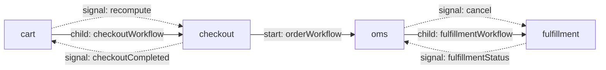
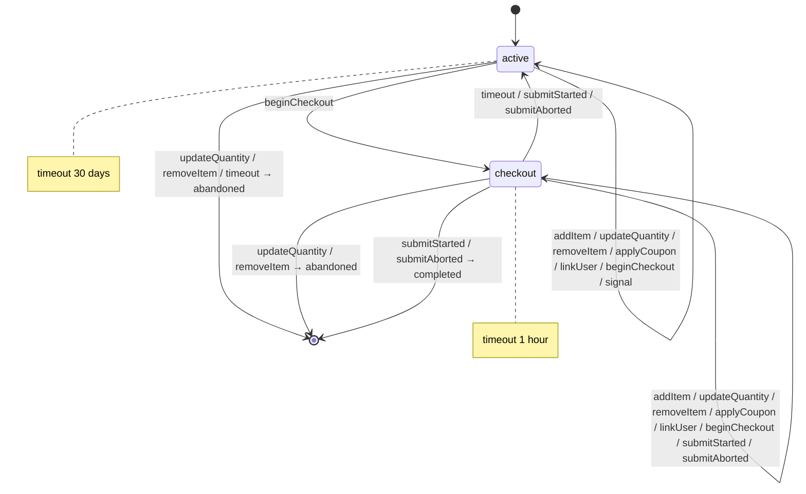
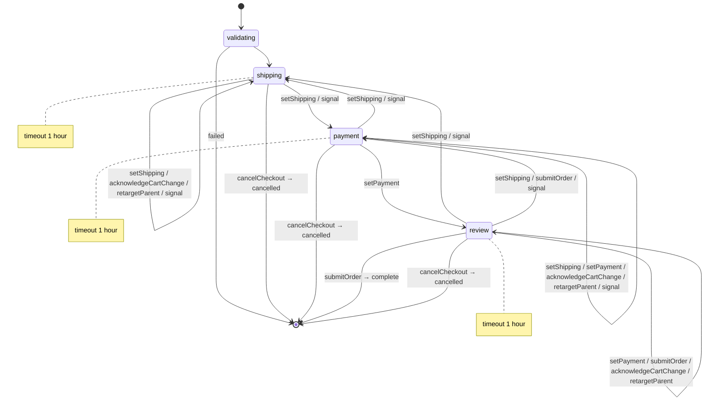
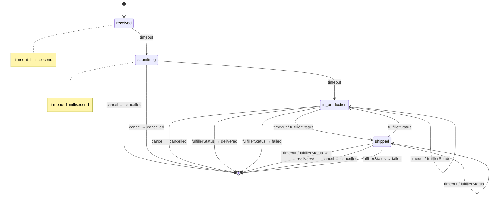
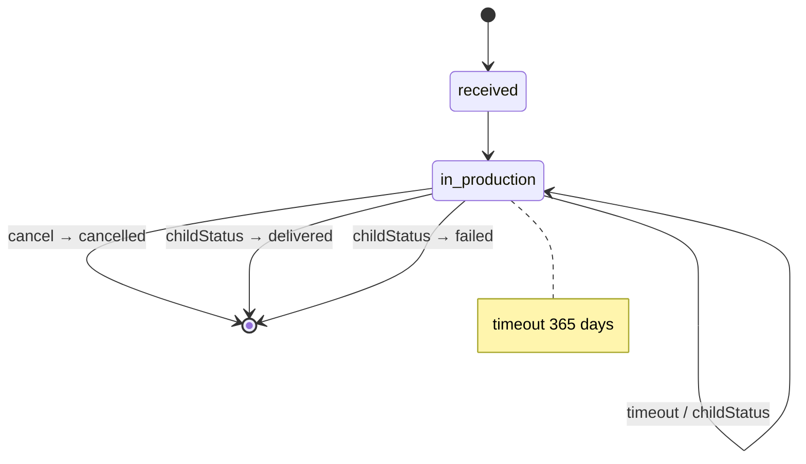
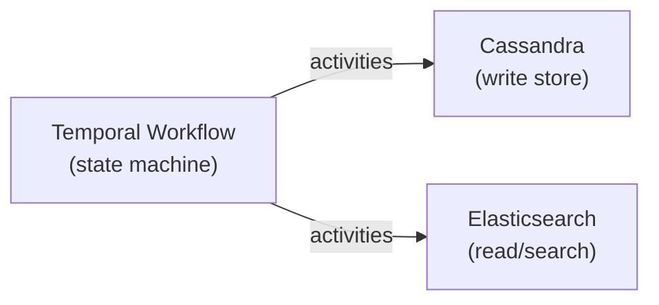

<!-- AUTO-GENERATED by scripts/generate-state-diagrams.mjs
     Run `npm run docs:diagrams` to regenerate. Do not edit manually.
     Prose descriptions are extracted from JSDoc comments in the source files.
     The "Persistence and Projection" section is maintained in the generator script. -->

# State Machine Reference

Reference for every domain state machine in `temporal-commerce-demo`. Regenerated from source by `npm run docs:diagrams`.

> **Trigger kinds** — `update:` (Temporal Update, synchronous), `signal` (fire-and-forget Signal), `timeout` (wall-clock deadline), *(auto)* (transitional state, no input). Self-loops (event processed but state stays the same) are shown as looping arcs on the state. Notes show `prepare:` activities (I/O), `if:` conditions tested in `decide`, and `finalize:` activities (side-effects).

## Cross-Domain Orchestration

How domains coordinate at runtime. Per invariant #1 there are **no** cross-domain workflow imports — domains start each other's workflows by string name (`startChild`, solid arrows) and signal each other through `getExternalWorkflowHandle` (dashed arrows). Generated from source; edge labels are the registered workflow names and signal wire-names.

---

## Cart — `CART_STATES`

Source: [src/temporal/cart/states.ts](../../src/temporal/cart/states.ts)

### State: `active`

| Trigger | Next | Notes |
|---------|------|-------|
| `update: addItem` | `active` | prepare: `releaseCartItem`, `reserveCartItem` · if: `ctx.submitting`; `prepared.reserveError` |
| `update: updateQuantity` | `active` | prepare: `releaseCartItem`, `reserveCartItem` · if: `ctx.submitting`; `prepared.reserveError`; `context.cart.items.length === 0` |
| `update: updateQuantity` | ⇒ abandoned | prepare: `releaseCartItem`, `reserveCartItem` · if: `ctx.submitting`; `prepared.reserveError`; `context.cart.items.length === 0` |
| `update: removeItem` | `active` | prepare: `releaseCartItem` · if: `ctx.submitting`; `context.cart.items.length === 0` |
| `update: removeItem` | ⇒ abandoned | prepare: `releaseCartItem` · if: `ctx.submitting`; `context.cart.items.length === 0` |
| `update: applyCoupon` | `active` | if: `ctx.submitting` |
| `update: linkUser` | `active` |  |
| `update: beginCheckout` | `active` | prepare: `startChild` · if: `prepared.empty` |
| `update: beginCheckout` | `checkout` | prepare: `startChild` · if: `prepared.empty` |
| `timeout` | ⇒ abandoned |  |
| `signal` | `active` |  |

**Timeout:** 30 days

### State: `checkout`

| Trigger | Next | Notes |
|---------|------|-------|
| `update: addItem` | `checkout` | prepare: `releaseCartItem`, `reserveCartItem` · if: `ctx.submitting`; `prepared.reserveError` |
| `update: updateQuantity` | `checkout` | prepare: `releaseCartItem`, `reserveCartItem` · if: `ctx.submitting`; `prepared.reserveError`; `context.cart.items.length === 0` |
| `update: updateQuantity` | ⇒ abandoned | prepare: `releaseCartItem`, `reserveCartItem` · if: `ctx.submitting`; `prepared.reserveError`; `context.cart.items.length === 0` |
| `update: removeItem` | `checkout` | prepare: `releaseCartItem` · if: `ctx.submitting`; `context.cart.items.length === 0` |
| `update: removeItem` | ⇒ abandoned | prepare: `releaseCartItem` · if: `ctx.submitting`; `context.cart.items.length === 0` |
| `update: applyCoupon` | `checkout` | if: `ctx.submitting` |
| `update: linkUser` | `checkout` |  |
| `update: beginCheckout` | `checkout` |  |
| `timeout` | `active` |  |
| `signal` | `checkout` | if: `signal.kind === 'submitStarted'`; `signal.kind === 'submitAborted'`; `result.checkoutVersion !== undefined && result.checkoutVersion !== ctx.checkoutVersion`; `context.cart.status === 'completed'` · signal kinds: `submitStarted`, `submitAborted` |
| `signal` | ⇒ completed | if: `signal.kind === 'submitStarted'`; `signal.kind === 'submitAborted'`; `result.checkoutVersion !== undefined && result.checkoutVersion !== ctx.checkoutVersion`; `context.cart.status === 'completed'` · signal kinds: `submitStarted`, `submitAborted` |
| `signal` | `active` | if: `signal.kind === 'submitStarted'`; `signal.kind === 'submitAborted'`; `result.checkoutVersion !== undefined && result.checkoutVersion !== ctx.checkoutVersion`; `context.cart.status === 'completed'` · signal kinds: `submitStarted`, `submitAborted` |

**Timeout:** 1 hour

---

## Checkout — `CHECKOUT_STATES`

Source: [src/temporal/checkout/states.ts](../../src/temporal/checkout/states.ts)

### State: `validating`

| Trigger | Next | Notes |
|---------|------|-------|
| *(auto)* | `shipping` |  |
| *(auto)* | ⇒ failed |  |

### State: `shipping`

| Trigger | Next | Notes |
|---------|------|-------|
| `update: setShipping` | `shipping` | if: `prepared.paymentIntentError` |
| `update: setShipping` | `payment` | if: `prepared.paymentIntentError` |
| `update: cancelCheckout` | ⇒ cancelled | finalize: `releaseReservations` |
| `update: acknowledgeCartChange` | `shipping` |  |
| `update: retargetParent` | `shipping` |  |
| `signal` | `payment` | prepare: `queryCart`, `calculateShipping`, `calculateTax` |
| `signal` | `shipping` | prepare: `queryCart`, `calculateShipping`, `calculateTax` |

**Timeout:** 1 hour

### State: `payment`

| Trigger | Next | Notes |
|---------|------|-------|
| `update: setShipping` | `shipping` | if: `prepared.paymentIntentError` |
| `update: setShipping` | `payment` | if: `prepared.paymentIntentError` |
| `update: setPayment` | `payment` | if: `!ctx.state.shippingAddress` |
| `update: setPayment` | `review` | if: `!ctx.state.shippingAddress` |
| `update: cancelCheckout` | ⇒ cancelled | finalize: `releaseReservations` |
| `update: acknowledgeCartChange` | `payment` |  |
| `update: retargetParent` | `payment` |  |
| `signal` | `payment` | prepare: `queryCart`, `calculateShipping`, `calculateTax` |
| `signal` | `shipping` | prepare: `queryCart`, `calculateShipping`, `calculateTax` |

**Timeout:** 1 hour

### State: `review`

| Trigger | Next | Notes |
|---------|------|-------|
| `update: setShipping` | `shipping` | if: `prepared.paymentIntentError` |
| `update: setShipping` | `payment` | if: `prepared.paymentIntentError` |
| `update: setPayment` | `review` |  |
| `update: submitOrder` | `review` | prepare: `freeze`, `queryCart`, `prepareSubmitOrder` · if: `!prepared.success && prepared.error === 'Shipping and payment required'`; `!prepared.success` |
| `update: submitOrder` | `payment` | prepare: `freeze`, `queryCart`, `prepareSubmitOrder` · if: `!prepared.success && prepared.error === 'Shipping and payment required'`; `!prepared.success` |
| `update: submitOrder` | ⇒ complete | prepare: `freeze`, `queryCart`, `prepareSubmitOrder` · if: `!prepared.success && prepared.error === 'Shipping and payment required'`; `!prepared.success` |
| `update: cancelCheckout` | ⇒ cancelled | finalize: `releaseReservations` |
| `update: acknowledgeCartChange` | `review` |  |
| `update: retargetParent` | `review` |  |
| `signal` | `payment` | prepare: `queryCart`, `calculateShipping`, `calculateTax` |
| `signal` | `shipping` | prepare: `queryCart`, `calculateShipping`, `calculateTax` |

**Timeout:** 1 hour

---

## Fulfillment — `FULFILLER_ORDER_STATES`

Source: [src/temporal/fulfillment/fulfiller-states.ts](../../src/temporal/fulfillment/fulfiller-states.ts)

The fulfiller-order state registry. `in_production`/`shipped` timeouts are placeholders
here — {@link buildFulfillerOrderStates} overrides them with the memo-driven simulation
delays at workflow start. Exported as a const so the state-diagram generator (static
AST analysis over `*_STATES` registries) can discover the machine.

### State: `received`

received — book-keeping hop; marks the order as submitting.

| Trigger | Next | Notes |
|---------|------|-------|
| `timeout` | `submitting` |  |
| `signal` | ⇒ cancelled | signal kinds: `cancel` |

**Timeout:** 1 millisecond

### State: `submitting`

submitting — submits the order to the (simulated) fulfiller.

| Trigger | Next | Notes |
|---------|------|-------|
| `timeout` | `in_production` | prepare: `submitFulfillerOrder` |
| `signal` | ⇒ cancelled | signal kinds: `cancel` |

**Timeout:** 1 millisecond

### State: `in_production`

in_production — auto-ships on timeout (unless manual mode); accepts fulfiller updates.

| Trigger | Next | Notes |
|---------|------|-------|
| `timeout` | `in_production` | if: `ctx.manualMode` |
| `timeout` | `shipped` | if: `ctx.manualMode` |
| `signal` | ⇒ cancelled | signal kinds: `cancel` |
| `signal` | `shipped` | finalize: `indexNewestShipment` · signal kinds: `fulfillerStatus` |
| `signal` | ⇒ delivered | finalize: `indexNewestShipment` · signal kinds: `fulfillerStatus` |
| `signal` | ⇒ failed | finalize: `indexNewestShipment` · signal kinds: `fulfillerStatus` |
| `signal` | `in_production` | finalize: `indexNewestShipment` · signal kinds: `fulfillerStatus` |

### State: `shipped`

shipped — auto-delivers on timeout (unless manual mode); accepts fulfiller updates.

| Trigger | Next | Notes |
|---------|------|-------|
| `timeout` | `shipped` | if: `ctx.manualMode` |
| `timeout` | ⇒ delivered | if: `ctx.manualMode` |
| `signal` | ⇒ cancelled | signal kinds: `cancel` |
| `signal` | `shipped` | finalize: `indexNewestShipment` · signal kinds: `fulfillerStatus` |
| `signal` | ⇒ delivered | finalize: `indexNewestShipment` · signal kinds: `fulfillerStatus` |
| `signal` | ⇒ failed | finalize: `indexNewestShipment` · signal kinds: `fulfillerStatus` |
| `signal` | `in_production` | finalize: `indexNewestShipment` · signal kinds: `fulfillerStatus` |

---

## Fulfillment — `FULFILLMENT_STATES`

Source: [src/temporal/fulfillment/states.ts](../../src/temporal/fulfillment/states.ts)

### State: `received`

| Trigger | Next | Notes |
|---------|------|-------|
| *(auto)* | `in_production` |  |

### State: `in_production`

| Trigger | Next | Notes |
|---------|------|-------|
| `timeout` | `in_production` |  |
| `signal` | ⇒ cancelled | signal kinds: `cancel` |
| `signal` | ⇒ delivered | if: `context.status === 'delivered'`; `context.status === 'failed'`; `context.status === 'cancelled'` · signal kinds: `childStatus` |
| `signal` | ⇒ failed | if: `context.status === 'delivered'`; `context.status === 'failed'`; `context.status === 'cancelled'` · signal kinds: `childStatus` |
| `signal` | `in_production` | if: `context.status === 'delivered'`; `context.status === 'failed'`; `context.status === 'cancelled'` · signal kinds: `childStatus` |

**Timeout:** 365 days

---

## OMS — `OMS_STATES`

Source: [src/temporal/oms/states.ts](../../src/temporal/oms/states.ts)

```mermaid
stateDiagram-v2
  pending_assignment
  assigning_fulfillers
  requesting_fulfillment
  ready_to_fulfill
  processing
  partially_shipped
  shipped
  delivered
  return_requested
  [*] --> pending_assignment
  pending_assignment --> assigning_fulfillers
  assigning_fulfillers --> requesting_fulfillment
  assigning_fulfillers --> ready_to_fulfill
  requesting_fulfillment --> processing
  ready_to_fulfill --> [*]: cancelOrder / updateStatus → cancelled
  ready_to_fulfill --> processing: updateStatus
  ready_to_fulfill --> partially_shipped: updateStatus
  ready_to_fulfill --> shipped: updateStatus
  ready_to_fulfill --> delivered: updateStatus
  ready_to_fulfill --> return_requested: updateStatus
  ready_to_fulfill --> [*]: updateStatus → refunded
  ready_to_fulfill --> [*]: updateStatus → returned
  ready_to_fulfill --> [*]: updateStatus → complete
  ready_to_fulfill --> ready_to_fulfill: timeout / signal
  processing --> [*]: cancelOrder / updateStatus → cancelled
  processing --> processing: updateStatus / timeout / applyFulfillmentStatus
  processing --> partially_shipped: updateStatus / applyFulfillmentStatus
  processing --> shipped: updateStatus / applyFulfillmentStatus
  processing --> delivered: updateStatus / applyFulfillmentStatus
  processing --> return_requested: updateStatus
  processing --> [*]: updateStatus → refunded
  processing --> [*]: updateStatus → returned
  processing --> [*]: updateStatus → complete
  partially_shipped --> [*]: cancelOrder / updateStatus → cancelled
  partially_shipped --> processing: updateStatus / applyFulfillmentStatus
  partially_shipped --> partially_shipped: updateStatus / timeout / applyFulfillmentStatus
  partially_shipped --> shipped: updateStatus / applyFulfillmentStatus
  partially_shipped --> delivered: updateStatus / applyFulfillmentStatus
  partially_shipped --> return_requested: updateStatus
  partially_shipped --> [*]: updateStatus → refunded
  partially_shipped --> [*]: updateStatus → returned
  partially_shipped --> [*]: updateStatus → complete
  shipped --> [*]: cancelOrder / updateStatus → cancelled
  shipped --> processing: updateStatus / applyFulfillmentStatus
  shipped --> partially_shipped: updateStatus / applyFulfillmentStatus
  shipped --> shipped: updateStatus / timeout / applyFulfillmentStatus
  shipped --> delivered: updateStatus / applyFulfillmentStatus
  shipped --> return_requested: updateStatus
  shipped --> [*]: updateStatus → refunded
  shipped --> [*]: updateStatus → returned
  shipped --> [*]: updateStatus → complete
  delivered --> [*]: submitFeedback / updateStatus → complete
  delivered --> [*]: updateStatus / refundOrder → refunded
  delivered --> delivered: updateStatus / refundOrder / timeout / signal
  delivered --> processing: updateStatus
  delivered --> partially_shipped: updateStatus
  delivered --> shipped: updateStatus
  delivered --> return_requested: updateStatus / requestReturn
  delivered --> [*]: updateStatus → cancelled
  delivered --> [*]: updateStatus → returned
  return_requested --> [*]: confirmReturn → returned
  return_requested --> delivered: denyReturn
  return_requested --> return_requested: timeout / signal
  note right of pending_assignment: timeout 1 minute
  note right of assigning_fulfillers: timeout 1 minute
  note right of requesting_fulfillment: timeout 1 minute
  note right of ready_to_fulfill: timeout 365 days
  note right of processing: timeout 365 days
  note right of partially_shipped: timeout 365 days
  note right of shipped: timeout 365 days
  note right of delivered: timeout 30 days
  note right of return_requested: timeout 30 days
```

### State: `pending_assignment`

Transitional initial state. (The mono posts the ORDER_CAPTURE accounting transaction
here; the demo has no ledger, so this is a pure hop to `assigning_fulfillers`.)

| Trigger | Next | Notes |
|---------|------|-------|
| *(auto)* | `assigning_fulfillers` |  |

**Timeout:** 1 minute

### State: `assigning_fulfillers`

Transitional state. `prepare` calls the fulfiller-resolution activity (impure I/O);
`decide` records the resulting assignments on the order. Advances to
`requesting_fulfillment` when at least one assignment resolved, otherwise falls back
to the manual `ready_to_fulfill` path.

| Trigger | Next | Notes |
|---------|------|-------|
| *(auto)* | `requesting_fulfillment` |  |
| *(auto)* | `ready_to_fulfill` |  |

**Timeout:** 1 minute

### State: `requesting_fulfillment`

| Trigger | Next | Notes |
|---------|------|-------|
| *(auto)* | `processing` |  |

**Timeout:** 1 minute

### State: `ready_to_fulfill`

| Trigger | Next | Notes |
|---------|------|-------|
| `update: cancelOrder` | ⇒ cancelled | finalize: `sendOrderStatusEmail`, `triggerFulfillmentCancel`, `sendFeedbackThankYouEmail`, `indexFulfillerOrder`, `startChild` |
| `update: updateStatus` | `processing` | finalize: `sendOrderStatusEmail`, `triggerFulfillmentCancel`, `sendFeedbackThankYouEmail`, `indexFulfillerOrder`, `startChild` |
| `update: updateStatus` | `partially_shipped` | finalize: `sendOrderStatusEmail`, `triggerFulfillmentCancel`, `sendFeedbackThankYouEmail`, `indexFulfillerOrder`, `startChild` |
| `update: updateStatus` | `shipped` | finalize: `sendOrderStatusEmail`, `triggerFulfillmentCancel`, `sendFeedbackThankYouEmail`, `indexFulfillerOrder`, `startChild` |
| `update: updateStatus` | `delivered` | finalize: `sendOrderStatusEmail`, `triggerFulfillmentCancel`, `sendFeedbackThankYouEmail`, `indexFulfillerOrder`, `startChild` |
| `update: updateStatus` | `return_requested` | finalize: `sendOrderStatusEmail`, `triggerFulfillmentCancel`, `sendFeedbackThankYouEmail`, `indexFulfillerOrder`, `startChild` |
| `update: updateStatus` | ⇒ cancelled | finalize: `sendOrderStatusEmail`, `triggerFulfillmentCancel`, `sendFeedbackThankYouEmail`, `indexFulfillerOrder`, `startChild` |
| `update: updateStatus` | ⇒ refunded | finalize: `sendOrderStatusEmail`, `triggerFulfillmentCancel`, `sendFeedbackThankYouEmail`, `indexFulfillerOrder`, `startChild` |
| `update: updateStatus` | ⇒ returned | finalize: `sendOrderStatusEmail`, `triggerFulfillmentCancel`, `sendFeedbackThankYouEmail`, `indexFulfillerOrder`, `startChild` |
| `update: updateStatus` | ⇒ complete | finalize: `sendOrderStatusEmail`, `triggerFulfillmentCancel`, `sendFeedbackThankYouEmail`, `indexFulfillerOrder`, `startChild` |
| `timeout` | `ready_to_fulfill` | finalize: `sendOrderStatusEmail`, `triggerFulfillmentCancel`, `sendFeedbackThankYouEmail`, `indexFulfillerOrder`, `startChild` |
| `signal` | `ready_to_fulfill` | finalize: `sendOrderStatusEmail`, `triggerFulfillmentCancel`, `sendFeedbackThankYouEmail`, `indexFulfillerOrder`, `startChild` |

**Timeout:** 365 days

### State: `processing`

| Trigger | Next | Notes |
|---------|------|-------|
| `update: cancelOrder` | ⇒ cancelled | finalize: `sendOrderStatusEmail`, `triggerFulfillmentCancel`, `sendFeedbackThankYouEmail`, `indexFulfillerOrder`, `startChild` |
| `update: updateStatus` | `processing` | finalize: `sendOrderStatusEmail`, `triggerFulfillmentCancel`, `sendFeedbackThankYouEmail`, `indexFulfillerOrder`, `startChild` |
| `update: updateStatus` | `partially_shipped` | finalize: `sendOrderStatusEmail`, `triggerFulfillmentCancel`, `sendFeedbackThankYouEmail`, `indexFulfillerOrder`, `startChild` |
| `update: updateStatus` | `shipped` | finalize: `sendOrderStatusEmail`, `triggerFulfillmentCancel`, `sendFeedbackThankYouEmail`, `indexFulfillerOrder`, `startChild` |
| `update: updateStatus` | `delivered` | finalize: `sendOrderStatusEmail`, `triggerFulfillmentCancel`, `sendFeedbackThankYouEmail`, `indexFulfillerOrder`, `startChild` |
| `update: updateStatus` | `return_requested` | finalize: `sendOrderStatusEmail`, `triggerFulfillmentCancel`, `sendFeedbackThankYouEmail`, `indexFulfillerOrder`, `startChild` |
| `update: updateStatus` | ⇒ cancelled | finalize: `sendOrderStatusEmail`, `triggerFulfillmentCancel`, `sendFeedbackThankYouEmail`, `indexFulfillerOrder`, `startChild` |
| `update: updateStatus` | ⇒ refunded | finalize: `sendOrderStatusEmail`, `triggerFulfillmentCancel`, `sendFeedbackThankYouEmail`, `indexFulfillerOrder`, `startChild` |
| `update: updateStatus` | ⇒ returned | finalize: `sendOrderStatusEmail`, `triggerFulfillmentCancel`, `sendFeedbackThankYouEmail`, `indexFulfillerOrder`, `startChild` |
| `update: updateStatus` | ⇒ complete | finalize: `sendOrderStatusEmail`, `triggerFulfillmentCancel`, `sendFeedbackThankYouEmail`, `indexFulfillerOrder`, `startChild` |
| `timeout` | `processing` | finalize: `sendOrderStatusEmail`, `triggerFulfillmentCancel`, `sendFeedbackThankYouEmail`, `indexFulfillerOrder`, `startChild` |
| `signal` | `processing` | if: `facts.length === 0`; `agg === 'delivered'`; `agg === 'shipped'`; `agg === 'partially_shipped'` · finalize: `sendOrderStatusEmail`, `triggerFulfillmentCancel`, `sendFeedbackThankYouEmail`, `indexFulfillerOrder`, `startChild` · signal kinds: `applyFulfillmentStatus` |
| `signal` | `delivered` | if: `facts.length === 0`; `agg === 'delivered'`; `agg === 'shipped'`; `agg === 'partially_shipped'` · finalize: `sendOrderStatusEmail`, `triggerFulfillmentCancel`, `sendFeedbackThankYouEmail`, `indexFulfillerOrder`, `startChild` · signal kinds: `applyFulfillmentStatus` |
| `signal` | `shipped` | if: `facts.length === 0`; `agg === 'delivered'`; `agg === 'shipped'`; `agg === 'partially_shipped'` · finalize: `sendOrderStatusEmail`, `triggerFulfillmentCancel`, `sendFeedbackThankYouEmail`, `indexFulfillerOrder`, `startChild` · signal kinds: `applyFulfillmentStatus` |
| `signal` | `partially_shipped` | if: `facts.length === 0`; `agg === 'delivered'`; `agg === 'shipped'`; `agg === 'partially_shipped'` · finalize: `sendOrderStatusEmail`, `triggerFulfillmentCancel`, `sendFeedbackThankYouEmail`, `indexFulfillerOrder`, `startChild` · signal kinds: `applyFulfillmentStatus` |

**Timeout:** 365 days

### State: `partially_shipped`

| Trigger | Next | Notes |
|---------|------|-------|
| `update: cancelOrder` | ⇒ cancelled | finalize: `sendOrderStatusEmail`, `triggerFulfillmentCancel`, `sendFeedbackThankYouEmail`, `indexFulfillerOrder`, `startChild` |
| `update: updateStatus` | `processing` | finalize: `sendOrderStatusEmail`, `triggerFulfillmentCancel`, `sendFeedbackThankYouEmail`, `indexFulfillerOrder`, `startChild` |
| `update: updateStatus` | `partially_shipped` | finalize: `sendOrderStatusEmail`, `triggerFulfillmentCancel`, `sendFeedbackThankYouEmail`, `indexFulfillerOrder`, `startChild` |
| `update: updateStatus` | `shipped` | finalize: `sendOrderStatusEmail`, `triggerFulfillmentCancel`, `sendFeedbackThankYouEmail`, `indexFulfillerOrder`, `startChild` |
| `update: updateStatus` | `delivered` | finalize: `sendOrderStatusEmail`, `triggerFulfillmentCancel`, `sendFeedbackThankYouEmail`, `indexFulfillerOrder`, `startChild` |
| `update: updateStatus` | `return_requested` | finalize: `sendOrderStatusEmail`, `triggerFulfillmentCancel`, `sendFeedbackThankYouEmail`, `indexFulfillerOrder`, `startChild` |
| `update: updateStatus` | ⇒ cancelled | finalize: `sendOrderStatusEmail`, `triggerFulfillmentCancel`, `sendFeedbackThankYouEmail`, `indexFulfillerOrder`, `startChild` |
| `update: updateStatus` | ⇒ refunded | finalize: `sendOrderStatusEmail`, `triggerFulfillmentCancel`, `sendFeedbackThankYouEmail`, `indexFulfillerOrder`, `startChild` |
| `update: updateStatus` | ⇒ returned | finalize: `sendOrderStatusEmail`, `triggerFulfillmentCancel`, `sendFeedbackThankYouEmail`, `indexFulfillerOrder`, `startChild` |
| `update: updateStatus` | ⇒ complete | finalize: `sendOrderStatusEmail`, `triggerFulfillmentCancel`, `sendFeedbackThankYouEmail`, `indexFulfillerOrder`, `startChild` |
| `timeout` | `partially_shipped` | finalize: `sendOrderStatusEmail`, `triggerFulfillmentCancel`, `sendFeedbackThankYouEmail`, `indexFulfillerOrder`, `startChild` |
| `signal` | `partially_shipped` | if: `facts.length === 0`; `agg === 'delivered'`; `agg === 'shipped'`; `agg === 'partially_shipped'` · finalize: `sendOrderStatusEmail`, `triggerFulfillmentCancel`, `sendFeedbackThankYouEmail`, `indexFulfillerOrder`, `startChild` · signal kinds: `applyFulfillmentStatus` |
| `signal` | `delivered` | if: `facts.length === 0`; `agg === 'delivered'`; `agg === 'shipped'`; `agg === 'partially_shipped'` · finalize: `sendOrderStatusEmail`, `triggerFulfillmentCancel`, `sendFeedbackThankYouEmail`, `indexFulfillerOrder`, `startChild` · signal kinds: `applyFulfillmentStatus` |
| `signal` | `shipped` | if: `facts.length === 0`; `agg === 'delivered'`; `agg === 'shipped'`; `agg === 'partially_shipped'` · finalize: `sendOrderStatusEmail`, `triggerFulfillmentCancel`, `sendFeedbackThankYouEmail`, `indexFulfillerOrder`, `startChild` · signal kinds: `applyFulfillmentStatus` |
| `signal` | `processing` | if: `facts.length === 0`; `agg === 'delivered'`; `agg === 'shipped'`; `agg === 'partially_shipped'` · finalize: `sendOrderStatusEmail`, `triggerFulfillmentCancel`, `sendFeedbackThankYouEmail`, `indexFulfillerOrder`, `startChild` · signal kinds: `applyFulfillmentStatus` |

**Timeout:** 365 days

### State: `shipped`

| Trigger | Next | Notes |
|---------|------|-------|
| `update: cancelOrder` | ⇒ cancelled | finalize: `sendOrderStatusEmail`, `triggerFulfillmentCancel`, `sendFeedbackThankYouEmail`, `indexFulfillerOrder`, `startChild` |
| `update: updateStatus` | `processing` | finalize: `sendOrderStatusEmail`, `triggerFulfillmentCancel`, `sendFeedbackThankYouEmail`, `indexFulfillerOrder`, `startChild` |
| `update: updateStatus` | `partially_shipped` | finalize: `sendOrderStatusEmail`, `triggerFulfillmentCancel`, `sendFeedbackThankYouEmail`, `indexFulfillerOrder`, `startChild` |
| `update: updateStatus` | `shipped` | finalize: `sendOrderStatusEmail`, `triggerFulfillmentCancel`, `sendFeedbackThankYouEmail`, `indexFulfillerOrder`, `startChild` |
| `update: updateStatus` | `delivered` | finalize: `sendOrderStatusEmail`, `triggerFulfillmentCancel`, `sendFeedbackThankYouEmail`, `indexFulfillerOrder`, `startChild` |
| `update: updateStatus` | `return_requested` | finalize: `sendOrderStatusEmail`, `triggerFulfillmentCancel`, `sendFeedbackThankYouEmail`, `indexFulfillerOrder`, `startChild` |
| `update: updateStatus` | ⇒ cancelled | finalize: `sendOrderStatusEmail`, `triggerFulfillmentCancel`, `sendFeedbackThankYouEmail`, `indexFulfillerOrder`, `startChild` |
| `update: updateStatus` | ⇒ refunded | finalize: `sendOrderStatusEmail`, `triggerFulfillmentCancel`, `sendFeedbackThankYouEmail`, `indexFulfillerOrder`, `startChild` |
| `update: updateStatus` | ⇒ returned | finalize: `sendOrderStatusEmail`, `triggerFulfillmentCancel`, `sendFeedbackThankYouEmail`, `indexFulfillerOrder`, `startChild` |
| `update: updateStatus` | ⇒ complete | finalize: `sendOrderStatusEmail`, `triggerFulfillmentCancel`, `sendFeedbackThankYouEmail`, `indexFulfillerOrder`, `startChild` |
| `timeout` | `shipped` | finalize: `sendOrderStatusEmail`, `triggerFulfillmentCancel`, `sendFeedbackThankYouEmail`, `indexFulfillerOrder`, `startChild` |
| `signal` | `shipped` | if: `facts.length === 0`; `agg === 'delivered'`; `agg === 'shipped'`; `agg === 'partially_shipped'` · finalize: `sendOrderStatusEmail`, `triggerFulfillmentCancel`, `sendFeedbackThankYouEmail`, `indexFulfillerOrder`, `startChild` · signal kinds: `applyFulfillmentStatus` |
| `signal` | `delivered` | if: `facts.length === 0`; `agg === 'delivered'`; `agg === 'shipped'`; `agg === 'partially_shipped'` · finalize: `sendOrderStatusEmail`, `triggerFulfillmentCancel`, `sendFeedbackThankYouEmail`, `indexFulfillerOrder`, `startChild` · signal kinds: `applyFulfillmentStatus` |
| `signal` | `partially_shipped` | if: `facts.length === 0`; `agg === 'delivered'`; `agg === 'shipped'`; `agg === 'partially_shipped'` · finalize: `sendOrderStatusEmail`, `triggerFulfillmentCancel`, `sendFeedbackThankYouEmail`, `indexFulfillerOrder`, `startChild` · signal kinds: `applyFulfillmentStatus` |
| `signal` | `processing` | if: `facts.length === 0`; `agg === 'delivered'`; `agg === 'shipped'`; `agg === 'partially_shipped'` · finalize: `sendOrderStatusEmail`, `triggerFulfillmentCancel`, `sendFeedbackThankYouEmail`, `indexFulfillerOrder`, `startChild` · signal kinds: `applyFulfillmentStatus` |

**Timeout:** 365 days

### State: `delivered`

| Trigger | Next | Notes |
|---------|------|-------|
| `update: submitFeedback` | ⇒ complete | finalize: `sendOrderStatusEmail`, `triggerFulfillmentCancel`, `sendFeedbackThankYouEmail`, `indexFulfillerOrder`, `startChild` |
| `update: updateStatus` | ⇒ refunded | if: `event.status === 'refunded'` · finalize: `sendOrderStatusEmail`, `triggerFulfillmentCancel`, `sendFeedbackThankYouEmail`, `indexFulfillerOrder`, `startChild` |
| `update: updateStatus` | `delivered` | if: `event.status === 'refunded'` · finalize: `sendOrderStatusEmail`, `triggerFulfillmentCancel`, `sendFeedbackThankYouEmail`, `indexFulfillerOrder`, `startChild` |
| `update: updateStatus` | `processing` | if: `event.status === 'refunded'` · finalize: `sendOrderStatusEmail`, `triggerFulfillmentCancel`, `sendFeedbackThankYouEmail`, `indexFulfillerOrder`, `startChild` |
| `update: updateStatus` | `partially_shipped` | if: `event.status === 'refunded'` · finalize: `sendOrderStatusEmail`, `triggerFulfillmentCancel`, `sendFeedbackThankYouEmail`, `indexFulfillerOrder`, `startChild` |
| `update: updateStatus` | `shipped` | if: `event.status === 'refunded'` · finalize: `sendOrderStatusEmail`, `triggerFulfillmentCancel`, `sendFeedbackThankYouEmail`, `indexFulfillerOrder`, `startChild` |
| `update: updateStatus` | `return_requested` | if: `event.status === 'refunded'` · finalize: `sendOrderStatusEmail`, `triggerFulfillmentCancel`, `sendFeedbackThankYouEmail`, `indexFulfillerOrder`, `startChild` |
| `update: updateStatus` | ⇒ cancelled | if: `event.status === 'refunded'` · finalize: `sendOrderStatusEmail`, `triggerFulfillmentCancel`, `sendFeedbackThankYouEmail`, `indexFulfillerOrder`, `startChild` |
| `update: updateStatus` | ⇒ returned | if: `event.status === 'refunded'` · finalize: `sendOrderStatusEmail`, `triggerFulfillmentCancel`, `sendFeedbackThankYouEmail`, `indexFulfillerOrder`, `startChild` |
| `update: updateStatus` | ⇒ complete | if: `event.status === 'refunded'` · finalize: `sendOrderStatusEmail`, `triggerFulfillmentCancel`, `sendFeedbackThankYouEmail`, `indexFulfillerOrder`, `startChild` |
| `update: refundOrder` | ⇒ refunded | finalize: `sendOrderStatusEmail`, `triggerFulfillmentCancel`, `sendFeedbackThankYouEmail`, `indexFulfillerOrder`, `startChild` |
| `update: refundOrder` | `delivered` | finalize: `sendOrderStatusEmail`, `triggerFulfillmentCancel`, `sendFeedbackThankYouEmail`, `indexFulfillerOrder`, `startChild` |
| `update: requestReturn` | `return_requested` | finalize: `sendOrderStatusEmail`, `triggerFulfillmentCancel`, `sendFeedbackThankYouEmail`, `indexFulfillerOrder`, `startChild` |
| `timeout` | `delivered` | finalize: `sendOrderStatusEmail`, `triggerFulfillmentCancel`, `sendFeedbackThankYouEmail`, `indexFulfillerOrder`, `startChild` |
| `signal` | `delivered` | finalize: `sendOrderStatusEmail`, `triggerFulfillmentCancel`, `sendFeedbackThankYouEmail`, `indexFulfillerOrder`, `startChild` |

**Timeout:** 30 days

### State: `return_requested`

A return has been requested on a delivered order. `confirmReturn` issues the refund
(via the decider's ReturnConfirmed fact) and finishes the order as `returned`; `denyReturn`
clears the request and drops back to `delivered`.

| Trigger | Next | Notes |
|---------|------|-------|
| `update: confirmReturn` | ⇒ returned | finalize: `sendOrderStatusEmail`, `triggerFulfillmentCancel`, `sendFeedbackThankYouEmail`, `indexFulfillerOrder`, `startChild` |
| `update: denyReturn` | `delivered` | finalize: `sendOrderStatusEmail`, `triggerFulfillmentCancel`, `sendFeedbackThankYouEmail`, `indexFulfillerOrder`, `startChild` |
| `timeout` | `return_requested` | finalize: `sendOrderStatusEmail`, `triggerFulfillmentCancel`, `sendFeedbackThankYouEmail`, `indexFulfillerOrder`, `startChild` |
| `signal` | `return_requested` | finalize: `sendOrderStatusEmail`, `triggerFulfillmentCancel`, `sendFeedbackThankYouEmail`, `indexFulfillerOrder`, `startChild` |

**Timeout:** 30 days

---

## Persistence and Projection

State-machine writes propagate to two stores: **Cassandra** (durable write store) and **Elasticsearch** (read/search projections). Both are driven exclusively from activities called in `prepare`/`finalize` phases or driver hooks (`onTransition`/`onTerminal`) — never from `decide`.

### Key Projections

| Domain | Store | Trigger |
|--------|-------|---------|
| **Cart** | ES `carts` | Every transition — `indexCart` from the `onTransition` hook |
| **Checkout** | Cassandra `orders` + ES `orders` | `submitOrder` pipeline — `createOrder`, then OMS startup indexes |
| **OMS** | Cassandra `orders`, `order_status_history` | Startup pipeline + every status change (`updateOrderInDatabase`, `insertStatusHistoryEntry`) |
| **OMS** | ES `orders`, `supplier_orders`, `customers` | `onStart` + every transition (`indexOrder`, `indexSupplierOrder`, `indexCustomer`) |
| **Fulfillment** | ES `fulfillments`, `shipments` | `onTransition`/finalize — `indexFulfillment`, `indexShipment` |
| **Inventory** | Cassandra read tables + ES `inventory` | Signal-driven targeted projections in `inventoryServiceWorkflow` (CQRS) |

### State-Transition Audit (ADR-0010)

Independently of the domain projections above, the framework records **every state-machine transition** to the Cassandra `workflow_state_transitions` table — from/to state, trigger + payload, a full context snapshot, and the captured `prepare`/`finalize` activity calls — via an async in-workflow recorder (off the hot path, 90-day TTL). The [order-trace dev tool](/dev/order-trace) reads this to show per-transition state diffs across a whole order journey.

> Cassandra UUIDs must always be passed as `types.Uuid.fromString(id)` — raw strings cause silent zero-row returns.
