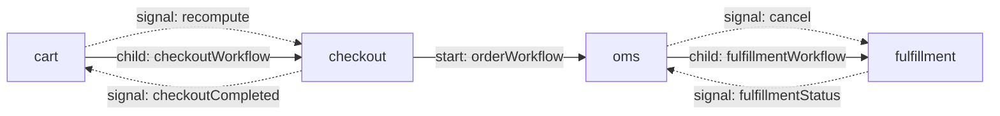
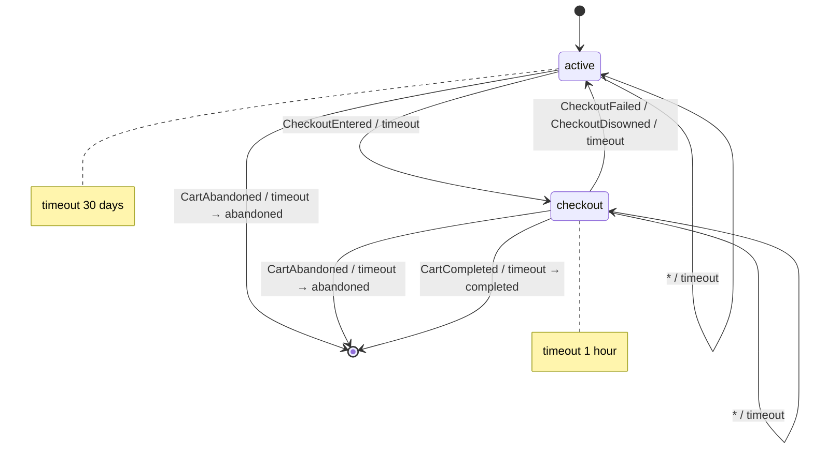
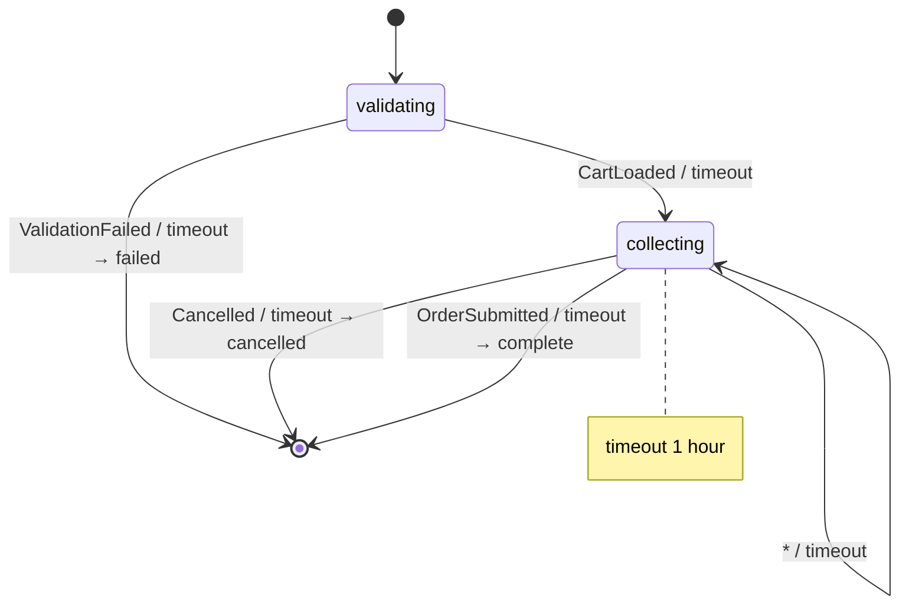
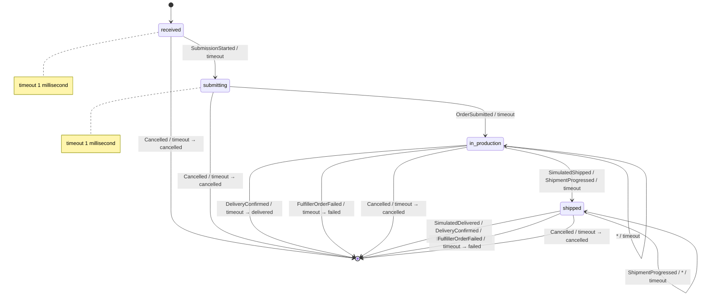
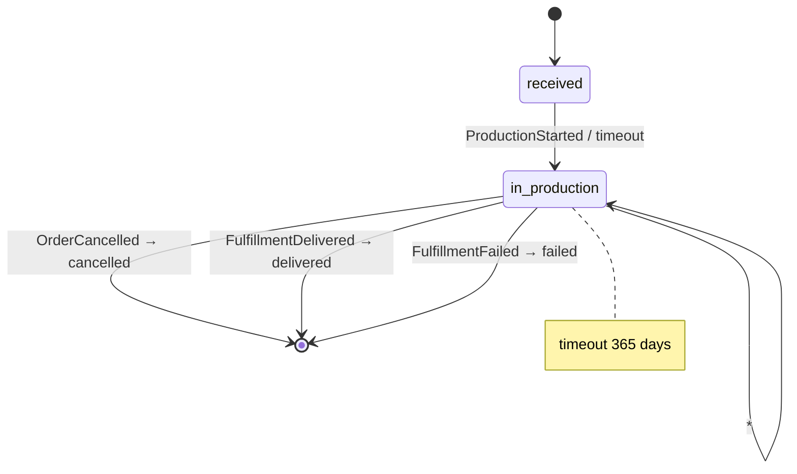
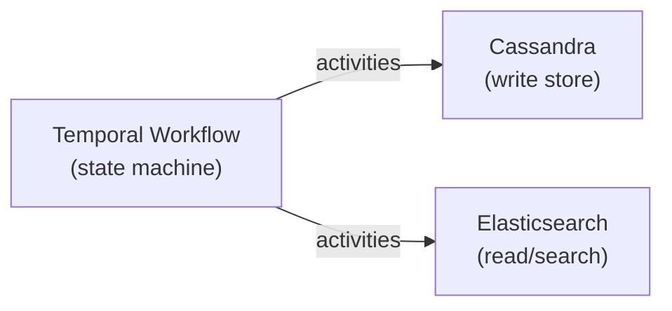

<!-- AUTO-GENERATED by scripts/generate-state-diagrams.mjs
     Run `npm run docs:diagrams` to regenerate. Do not edit manually.
     Prose descriptions are extracted from JSDoc comments in the source files.
     The "Persistence and Projection" section is maintained in the generator script. -->

# State Machine Reference

Reference for every domain state machine in `temporal-commerce-demo`. Regenerated from source by `npm run docs:diagrams`.

> **Trigger kinds** — `update:` (Temporal Update, synchronous), `signal` (fire-and-forget Signal), `timeout` (wall-clock deadline), *(auto)* (transitional state, no input). Self-loops (event processed but state stays the same) are shown as looping arcs on the state. The auto-vs-timeout distinction is recorded, not just displayed: transitional advancement is persisted to `workflow_state_transitions` as trigger kind `automatic` (PR #45). Notes show `prepare:` activities (I/O), `if:` conditions tested in `decide`, and `finalize:` activities (side-effects).

## Cross-Domain Orchestration

How domains coordinate at runtime. Per invariant #1 there are **no** cross-domain workflow imports — domains start each other's workflows by string name (`startChild`, solid arrows) and signal each other through `getExternalWorkflowHandle` (dashed arrows). Generated from source; edge labels are the registered workflow names and signal wire-names.

---

## Cart — `CART_STATES`

Source: [src/temporal/cart/states.ts](../../src/temporal/cart/states.ts)

### State: `active`

**Accepts** (each command → the events it can emit ⇒ where each leads):

- `addItem` *(guarded; prepare: releaseCartItem, reserveCartItem)* → `ItemAdded` ⇒ *stays*
- `updateQuantity` *(guarded; prepare: releaseCartItem, reserveCartItem)* → `ItemQuantityChanged` ⇒ *stays* · `ItemRemoved` ⇒ *stays* · `CartAbandoned` ⇒ **abandoned** (terminal)
- `removeItem` *(guarded; prepare: releaseCartItem)* → `ItemRemoved` ⇒ *stays* · `CartAbandoned` ⇒ **abandoned** (terminal)
- `applyCoupon` *(guarded)* → `CouponApplied` ⇒ *stays*
- `linkUser` → `UserLinked` ⇒ *stays*
- `expireCart` → `CartAbandoned` ⇒ **abandoned** (terminal)
- `beginCheckout` *(guarded; prepare: startChild)* → `CheckoutEntered` ⇒ `checkout`

Any other command is rejected.

| Trigger | Next | Notes |
|---------|------|-------|
| `event: CartAbandoned` | ⇒ abandoned |  |
| `event: CheckoutEntered` | `checkout` |  |
| `event: *` | `active` | falls through: `ItemAdded`, `ItemQuantityChanged`, `ItemRemoved`, `CouponApplied`, `UserLinked` |
| `timeout → expireCart` | ⇒ abandoned |  |
| `timeout → expireCart` | `checkout` |  |
| `timeout → expireCart` | `active` |  |

**Timeout:** 30 days

### State: `checkout`

**Accepts** (each command → the events it can emit ⇒ where each leads):

- `addItem` *(guarded; prepare: releaseCartItem, reserveCartItem)* → `ItemAdded` ⇒ *stays*
- `updateQuantity` *(guarded; prepare: releaseCartItem, reserveCartItem)* → `ItemQuantityChanged` ⇒ *stays* · `ItemRemoved` ⇒ *stays* · `CartAbandoned` ⇒ **abandoned** (terminal)
- `removeItem` *(guarded; prepare: releaseCartItem)* → `ItemRemoved` ⇒ *stays* · `CartAbandoned` ⇒ **abandoned** (terminal)
- `applyCoupon` *(guarded)* → `CouponApplied` ⇒ *stays*
- `linkUser` → `UserLinked` ⇒ *stays*
- `beginCheckout` → *(no events — idempotent no-op)*
- `submitStarted` → `SubmitFreezeStarted` ⇒ *stays*
- `submitAborted` → `SubmitFreezeCleared` ⇒ *stays*
- `checkoutCompleted` → `CartCompleted` ⇒ **completed** (terminal) · `CheckoutFailed` ⇒ `active`
- `checkoutTimedOut` → `CheckoutDisowned` ⇒ `active`

Any other command is rejected.

| Trigger | Next | Notes |
|---------|------|-------|
| `event: CartAbandoned` | ⇒ abandoned |  |
| `event: CartCompleted` | ⇒ completed |  |
| `event: CheckoutFailed` | `active` |  |
| `event: CheckoutDisowned` | `active` |  |
| `event: *` | `checkout` | falls through: `ItemAdded`, `ItemQuantityChanged`, `ItemRemoved`, `CouponApplied`, `UserLinked`, `SubmitFreezeStarted`, `SubmitFreezeCleared` |
| `timeout → checkoutTimedOut` | ⇒ abandoned |  |
| `timeout → checkoutTimedOut` | ⇒ completed |  |
| `timeout → checkoutTimedOut` | `active` |  |
| `timeout → checkoutTimedOut` | `checkout` |  |

**Timeout:** 1 hour

---

## Checkout — `CHECKOUT_STATES`

Source: [src/temporal/checkout/states.ts](../../src/temporal/checkout/states.ts)

### State: `validating`

**Accepts** (each command → the events it can emit ⇒ where each leads):

- `validate` *(prepare: queryCart, renewReservationsForCheckout)* → `CartLoaded` ⇒ `collecting` · `ValidationFailed` ⇒ **failed** (terminal)

Any other command is rejected.

| Trigger | Next | Notes |
|---------|------|-------|
| `event: CartLoaded` | `collecting` |  |
| `event: ValidationFailed` | ⇒ failed |  |
| `timeout → validate` | `collecting` |  |
| `timeout → validate` | ⇒ failed |  |

### State: `collecting`

**Accepts** (each command → the events it can emit ⇒ where each leads):

- `setShipping` *(prepare: prepareSetShipping)* → `ShippingSet` ⇒ *stays* · `ShippingFailed` ⇒ *stays*
- `setPayment` → `PaymentSet` ⇒ *stays*
- `cancelCheckout` → `Cancelled` ⇒ **cancelled** (terminal)
- `acknowledgeCartChange` → `CartChangeAcknowledged` ⇒ *stays*
- `retargetParent` → `ParentRetargeted` ⇒ *stays*
- `checkoutTimedOut` → `Cancelled` ⇒ **cancelled** (terminal)
- `submitOrder` *(prepare: freeze, queryCart, prepareSubmitOrder)* → `OrderSubmitted` ⇒ **complete** (terminal) · `SubmitRejected` ⇒ *stays*
- `recompute` *(prepare: queryCart, calculateShipping, calculateTax)* → `Recomputed` ⇒ *stays*

Any other command is rejected.

| Trigger | Next | Notes |
|---------|------|-------|
| `event: Cancelled` | ⇒ cancelled |  |
| `event: OrderSubmitted` | ⇒ complete |  |
| `event: *` | `collecting` | falls through: `ShippingSet`, `ShippingFailed`, `PaymentSet`, `CartChangeAcknowledged`, `ParentRetargeted`, `SubmitRejected`, `Recomputed` |
| `timeout → checkoutTimedOut` | ⇒ cancelled |  |
| `timeout → checkoutTimedOut` | ⇒ complete |  |
| `timeout → checkoutTimedOut` | `collecting` |  |

**Timeout:** 1 hour

---

## Fulfillment — `FULFILLER_ORDER_STATES`

Source: [src/temporal/fulfillment/fulfiller-states.ts](../../src/temporal/fulfillment/fulfiller-states.ts)

### State: `received`

received — book-keeping hop; marks the order as submitting.

**Accepts** (each command → the events it can emit ⇒ where each leads):

- `beginSubmit` → `SubmissionStarted` ⇒ `submitting`
- `cancel` → `Cancelled` ⇒ **cancelled** (terminal)

Any other command is rejected.

| Trigger | Next | Notes |
|---------|------|-------|
| `event: SubmissionStarted` | `submitting` |  |
| `event: Cancelled` | ⇒ cancelled |  |
| `timeout → beginSubmit` | `submitting` |  |
| `timeout → beginSubmit` | ⇒ cancelled |  |

**Timeout:** 1 millisecond

### State: `submitting`

submitting — submits the order to the (simulated) fulfiller.

**Accepts** (each command → the events it can emit ⇒ where each leads):

- `submitted` *(prepare: submitFulfillerOrder)* → `OrderSubmitted` ⇒ `in_production`
- `cancel` → `Cancelled` ⇒ **cancelled** (terminal)

Any other command is rejected.

| Trigger | Next | Notes |
|---------|------|-------|
| `event: OrderSubmitted` | `in_production` |  |
| `event: Cancelled` | ⇒ cancelled |  |
| `timeout → submitted` | `in_production` |  |
| `timeout → submitted` | ⇒ cancelled |  |

**Timeout:** 1 millisecond

### State: `in_production`

in_production — auto-ships on timeout (unless manual mode); accepts fulfiller updates.

**Accepts** (each command → the events it can emit ⇒ where each leads):

- `simulatedShip` → `SimulatedShipped` ⇒ `shipped`
- `fulfillerStatus` → `FulfillerStatusApplied` ⇒ *stays* · `ShipmentProgressed` ⇒ `shipped` · `DeliveryConfirmed` ⇒ **delivered** (terminal) · `FulfillerOrderFailed` ⇒ **failed** (terminal) · `Cancelled` ⇒ **cancelled** (terminal)
- `cancel` → `Cancelled` ⇒ **cancelled** (terminal)

Any other command is rejected.

| Trigger | Next | Notes |
|---------|------|-------|
| `event: SimulatedShipped` | `shipped` |  |
| `event: ShipmentProgressed` | `shipped` |  |
| `event: DeliveryConfirmed` | ⇒ delivered |  |
| `event: FulfillerOrderFailed` | ⇒ failed |  |
| `event: Cancelled` | ⇒ cancelled |  |
| `event: *` | `in_production` | falls through: `FulfillerStatusApplied` |
| `timeout` | `shipped` |  |
| `timeout` | ⇒ delivered |  |
| `timeout` | ⇒ failed |  |
| `timeout` | ⇒ cancelled |  |
| `timeout` | `in_production` |  |

### State: `shipped`

shipped — auto-delivers on timeout (unless manual mode); accepts fulfiller updates.

**Accepts** (each command → the events it can emit ⇒ where each leads):

- `simulatedDeliver` → `SimulatedDelivered` ⇒ **delivered** (terminal)
- `fulfillerStatus` → `FulfillerStatusApplied` ⇒ *stays* · `ShipmentProgressed` ⇒ *stays* · `DeliveryConfirmed` ⇒ **delivered** (terminal) · `FulfillerOrderFailed` ⇒ **failed** (terminal) · `Cancelled` ⇒ **cancelled** (terminal)
- `cancel` → `Cancelled` ⇒ **cancelled** (terminal)

Any other command is rejected.

| Trigger | Next | Notes |
|---------|------|-------|
| `event: SimulatedDelivered` | ⇒ delivered |  |
| `event: ShipmentProgressed` | `shipped` |  |
| `event: DeliveryConfirmed` | ⇒ delivered |  |
| `event: FulfillerOrderFailed` | ⇒ failed |  |
| `event: Cancelled` | ⇒ cancelled |  |
| `event: *` | `shipped` | falls through: `FulfillerStatusApplied` |
| `timeout` | ⇒ delivered |  |
| `timeout` | `shipped` |  |
| `timeout` | ⇒ failed |  |
| `timeout` | ⇒ cancelled |  |

---

## Fulfillment — `FULFILLMENT_STATES`

Source: [src/temporal/fulfillment/states.ts](../../src/temporal/fulfillment/states.ts)

### State: `received`

**Accepts** (each command → the events it can emit ⇒ where each leads):

- `beginProduction` → `ProductionStarted` ⇒ `in_production`

Any other command is rejected.

| Trigger | Next | Notes |
|---------|------|-------|
| `event: ProductionStarted` | `in_production` |  |
| `timeout → beginProduction` | `in_production` |  |

### State: `in_production`

**Accepts** (each command → the events it can emit ⇒ where each leads):

- `cancel` → `OrderCancelled` ⇒ **cancelled** (terminal)
- `childStatus` → `ChildStatusApplied` ⇒ *stays* · `FulfillmentDelivered` ⇒ **delivered** (terminal) · `FulfillmentFailed` ⇒ **failed** (terminal)

Any other command is rejected.

| Trigger | Next | Notes |
|---------|------|-------|
| `event: OrderCancelled` | ⇒ cancelled |  |
| `event: FulfillmentDelivered` | ⇒ delivered |  |
| `event: FulfillmentFailed` | ⇒ failed |  |
| `event: *` | `in_production` | falls through: `ChildStatusApplied` |

**Timeout:** 365 days

---

## OMS — `OMS_STATES`

Source: [src/temporal/oms/states.ts](../../src/temporal/oms/states.ts)

```mermaid
stateDiagram-v2
  pending_assignment
  assigning_fulfillers
  requesting_fulfillment
  ready_to_fulfill
  processing
  partially_shipped
  shipped
  delivered
  return_requested
  [*] --> pending_assignment
  pending_assignment --> assigning_fulfillers: PaymentCaptured / timeout
  assigning_fulfillers --> requesting_fulfillment: FulfillersAssigned / timeout
  assigning_fulfillers --> ready_to_fulfill: NoFulfillersResolved / timeout
  requesting_fulfillment --> processing: FulfillmentRequested / timeout
  ready_to_fulfill --> [*]: OrderCancelled → cancelled
  ready_to_fulfill --> processing: OrderProcessing
  ready_to_fulfill --> partially_shipped: OrderPartiallyShipped
  ready_to_fulfill --> shipped: OrderShipped
  ready_to_fulfill --> delivered: OrderDelivered
  ready_to_fulfill --> return_requested: OrderReturnRequested
  ready_to_fulfill --> [*]: OrderRefunded → refunded
  ready_to_fulfill --> [*]: OrderReturned → returned
  ready_to_fulfill --> [*]: OrderCompleted → complete
  processing --> [*]: OrderCancelled → cancelled
  processing --> processing: OrderProcessing / *
  processing --> partially_shipped: OrderPartiallyShipped / FulfillmentPartiallyShipped
  processing --> shipped: OrderShipped / FulfillmentShipped
  processing --> delivered: OrderDelivered / FulfillmentDelivered
  processing --> return_requested: OrderReturnRequested
  processing --> [*]: OrderRefunded → refunded
  processing --> [*]: OrderReturned → returned
  processing --> [*]: OrderCompleted → complete
  processing --> [*]: FulfillmentRejected → failed
  partially_shipped --> [*]: OrderCancelled → cancelled
  partially_shipped --> processing: OrderProcessing
  partially_shipped --> partially_shipped: OrderPartiallyShipped / FulfillmentPartiallyShipped / *
  partially_shipped --> shipped: OrderShipped / FulfillmentShipped
  partially_shipped --> delivered: OrderDelivered / FulfillmentDelivered
  partially_shipped --> return_requested: OrderReturnRequested
  partially_shipped --> [*]: OrderRefunded → refunded
  partially_shipped --> [*]: OrderReturned → returned
  partially_shipped --> [*]: OrderCompleted → complete
  partially_shipped --> [*]: FulfillmentRejected → failed
  shipped --> [*]: OrderCancelled → cancelled
  shipped --> processing: OrderProcessing
  shipped --> partially_shipped: OrderPartiallyShipped
  shipped --> shipped: OrderShipped / FulfillmentPartiallyShipped / FulfillmentShipped / *
  shipped --> delivered: OrderDelivered / FulfillmentDelivered
  shipped --> return_requested: OrderReturnRequested
  shipped --> [*]: OrderRefunded → refunded
  shipped --> [*]: OrderReturned → returned
  shipped --> [*]: OrderCompleted → complete
  shipped --> [*]: FulfillmentRejected → failed
  delivered --> [*]: FeedbackSubmitted / OrderCompleted → complete
  delivered --> [*]: OrderCancelled → cancelled
  delivered --> processing: OrderProcessing
  delivered --> partially_shipped: OrderPartiallyShipped
  delivered --> shipped: OrderShipped
  delivered --> delivered: OrderDelivered / Refunded
  delivered --> return_requested: OrderReturnRequested / ReturnRequested
  delivered --> [*]: OrderRefunded → refunded
  delivered --> [*]: OrderReturned → returned
  return_requested --> [*]: ReturnConfirmed → returned
  return_requested --> delivered: ReturnDenied
  note right of pending_assignment: timeout 1 minute
  note right of assigning_fulfillers: timeout 1 minute
  note right of requesting_fulfillment: timeout 1 minute
  note right of ready_to_fulfill: timeout 365 days
  note right of processing: timeout 365 days
  note right of partially_shipped: timeout 365 days
  note right of shipped: timeout 365 days
  note right of delivered: timeout 30 days
  note right of return_requested: timeout 30 days
```

### State: `pending_assignment`

Transitional intake 1/3: a pure hop — the mono decides the ORDER_CAPTURE ledger
numbers here and posts them as the `PaymentCaptured` effect; the demo has no
accounting, so the event carries nothing and has no effect (see `capturePaymentBlock`).

**Accepts** (each command → the events it can emit ⇒ where each leads):

- `capturePayment` → `PaymentCaptured` ⇒ `assigning_fulfillers`

Any other command is rejected.

| Trigger | Next | Notes |
|---------|------|-------|
| `event: PaymentCaptured` | `assigning_fulfillers` |  |
| `timeout → capturePayment` | `assigning_fulfillers` |  |

**Timeout:** 1 minute

### State: `assigning_fulfillers`

Transitional intake 2/3: `prepare` resolves fulfillers (impure I/O) and mints
assignment ids; `decide` records the assignments. No resolution at all falls back
to the manual `ready_to_fulfill` path.

**Accepts** (each command → the events it can emit ⇒ where each leads):

- `assignFulfillers` *(prepare: resolveFulfillerAssignments)* → `FulfillersAssigned` ⇒ `requesting_fulfillment` · `NoFulfillersResolved` ⇒ `ready_to_fulfill`

Any other command is rejected.

| Trigger | Next | Notes |
|---------|------|-------|
| `event: FulfillersAssigned` | `requesting_fulfillment` |  |
| `event: NoFulfillersResolved` | `ready_to_fulfill` |  |
| `timeout → assignFulfillers` | `requesting_fulfillment` |  |
| `timeout → assignFulfillers` | `ready_to_fulfill` |  |

**Timeout:** 1 minute

### State: `requesting_fulfillment`

Transitional intake 3/3: `prepare` mints fulfiller-order ids; `decide` groups
assignments into fulfiller orders; the child start + indexing are the
`FulfillmentRequested` effect.

**Accepts** (each command → the events it can emit ⇒ where each leads):

- `requestFulfillment` → `FulfillmentRequested` ⇒ `processing`

Any other command is rejected.

| Trigger | Next | Notes |
|---------|------|-------|
| `event: FulfillmentRequested` | `processing` |  |
| `timeout → requestFulfillment` | `processing` |  |

**Timeout:** 1 minute

### State: `ready_to_fulfill`

No fulfiller resolved — the order waits for manual handling (admin status moves).

**Accepts** (each command → the events it can emit ⇒ where each leads):

- `cancelOrder` → `OrderCancelled` ⇒ **cancelled** (terminal)
- `updateStatus` *(guarded)* → `OrderProcessing` ⇒ `processing` · `OrderPartiallyShipped` ⇒ `partially_shipped` · `OrderShipped` ⇒ `shipped` · `OrderDelivered` ⇒ `delivered` · `OrderReturnRequested` ⇒ `return_requested` · `OrderReturned` ⇒ **returned** (terminal) · `OrderCompleted` ⇒ **complete** (terminal) · `OrderCancelled` ⇒ **cancelled** (terminal) · `OrderRefunded` ⇒ **refunded** (terminal)

Any other command is rejected.

| Trigger | Next | Notes |
|---------|------|-------|
| `event: OrderCancelled` | ⇒ cancelled |  |
| `event: OrderProcessing` | `processing` |  |
| `event: OrderPartiallyShipped` | `partially_shipped` |  |
| `event: OrderShipped` | `shipped` | finalize: `sendOrderStatusEmail` |
| `event: OrderDelivered` | `delivered` | finalize: `sendOrderStatusEmail` |
| `event: OrderReturnRequested` | `return_requested` |  |
| `event: OrderRefunded` | ⇒ refunded |  |
| `event: OrderReturned` | ⇒ returned |  |
| `event: OrderCompleted` | ⇒ complete |  |

**Timeout:** 365 days

### State: `processing`

**Accepts** (each command → the events it can emit ⇒ where each leads):

- `cancelOrder` → `OrderCancelled` ⇒ **cancelled** (terminal)
- `updateStatus` *(guarded)* → `OrderProcessing` ⇒ *stays* · `OrderPartiallyShipped` ⇒ `partially_shipped` · `OrderShipped` ⇒ `shipped` · `OrderDelivered` ⇒ `delivered` · `OrderReturnRequested` ⇒ `return_requested` · `OrderReturned` ⇒ **returned** (terminal) · `OrderCompleted` ⇒ **complete** (terminal) · `OrderCancelled` ⇒ **cancelled** (terminal) · `OrderRefunded` ⇒ **refunded** (terminal)
- `fulfillmentStatus` → `FulfillmentApplied` ⇒ *stays* · `FulfillmentPartiallyShipped` ⇒ `partially_shipped` · `FulfillmentShipped` ⇒ `shipped` · `FulfillmentDelivered` ⇒ `delivered` · `FulfillmentRejected` ⇒ **failed** (terminal)

Any other command is rejected.

| Trigger | Next | Notes |
|---------|------|-------|
| `event: OrderCancelled` | ⇒ cancelled |  |
| `event: OrderProcessing` | `processing` |  |
| `event: OrderPartiallyShipped` | `partially_shipped` |  |
| `event: OrderShipped` | `shipped` | finalize: `sendOrderStatusEmail` |
| `event: OrderDelivered` | `delivered` | finalize: `sendOrderStatusEmail` |
| `event: OrderReturnRequested` | `return_requested` |  |
| `event: OrderRefunded` | ⇒ refunded |  |
| `event: OrderReturned` | ⇒ returned |  |
| `event: OrderCompleted` | ⇒ complete |  |
| `event: FulfillmentPartiallyShipped` | `partially_shipped` |  |
| `event: FulfillmentShipped` | `shipped` |  |
| `event: FulfillmentDelivered` | `delivered` |  |
| `event: FulfillmentRejected` | ⇒ failed |  |
| `event: *` | `processing` | falls through: `FulfillmentApplied` |

**Timeout:** 365 days

### State: `partially_shipped`

**Accepts** (each command → the events it can emit ⇒ where each leads):

- `cancelOrder` → `OrderCancelled` ⇒ **cancelled** (terminal)
- `updateStatus` *(guarded)* → `OrderProcessing` ⇒ `processing` · `OrderPartiallyShipped` ⇒ *stays* · `OrderShipped` ⇒ `shipped` · `OrderDelivered` ⇒ `delivered` · `OrderReturnRequested` ⇒ `return_requested` · `OrderReturned` ⇒ **returned** (terminal) · `OrderCompleted` ⇒ **complete** (terminal) · `OrderCancelled` ⇒ **cancelled** (terminal) · `OrderRefunded` ⇒ **refunded** (terminal)
- `fulfillmentStatus` → `FulfillmentApplied` ⇒ *stays* · `FulfillmentPartiallyShipped` ⇒ *stays* · `FulfillmentShipped` ⇒ `shipped` · `FulfillmentDelivered` ⇒ `delivered` · `FulfillmentRejected` ⇒ **failed** (terminal)

Any other command is rejected.

| Trigger | Next | Notes |
|---------|------|-------|
| `event: OrderCancelled` | ⇒ cancelled |  |
| `event: OrderProcessing` | `processing` |  |
| `event: OrderPartiallyShipped` | `partially_shipped` |  |
| `event: OrderShipped` | `shipped` | finalize: `sendOrderStatusEmail` |
| `event: OrderDelivered` | `delivered` | finalize: `sendOrderStatusEmail` |
| `event: OrderReturnRequested` | `return_requested` |  |
| `event: OrderRefunded` | ⇒ refunded |  |
| `event: OrderReturned` | ⇒ returned |  |
| `event: OrderCompleted` | ⇒ complete |  |
| `event: FulfillmentPartiallyShipped` | `partially_shipped` |  |
| `event: FulfillmentShipped` | `shipped` |  |
| `event: FulfillmentDelivered` | `delivered` |  |
| `event: FulfillmentRejected` | ⇒ failed |  |
| `event: *` | `partially_shipped` | falls through: `FulfillmentApplied` |

**Timeout:** 365 days

### State: `shipped`

**Accepts** (each command → the events it can emit ⇒ where each leads):

- `cancelOrder` → `OrderCancelled` ⇒ **cancelled** (terminal)
- `updateStatus` *(guarded)* → `OrderProcessing` ⇒ `processing` · `OrderPartiallyShipped` ⇒ `partially_shipped` · `OrderShipped` ⇒ *stays* · `OrderDelivered` ⇒ `delivered` · `OrderReturnRequested` ⇒ `return_requested` · `OrderReturned` ⇒ **returned** (terminal) · `OrderCompleted` ⇒ **complete** (terminal) · `OrderCancelled` ⇒ **cancelled** (terminal) · `OrderRefunded` ⇒ **refunded** (terminal)
- `fulfillmentStatus` → `FulfillmentApplied` ⇒ *stays* · `FulfillmentPartiallyShipped` ⇒ *stays* · `FulfillmentShipped` ⇒ *stays* · `FulfillmentDelivered` ⇒ `delivered` · `FulfillmentRejected` ⇒ **failed** (terminal)

Any other command is rejected.

| Trigger | Next | Notes |
|---------|------|-------|
| `event: OrderCancelled` | ⇒ cancelled |  |
| `event: OrderProcessing` | `processing` |  |
| `event: OrderPartiallyShipped` | `partially_shipped` |  |
| `event: OrderShipped` | `shipped` | finalize: `sendOrderStatusEmail` |
| `event: OrderDelivered` | `delivered` | finalize: `sendOrderStatusEmail` |
| `event: OrderReturnRequested` | `return_requested` |  |
| `event: OrderRefunded` | ⇒ refunded |  |
| `event: OrderReturned` | ⇒ returned |  |
| `event: OrderCompleted` | ⇒ complete |  |
| `event: FulfillmentPartiallyShipped` | `shipped` |  |
| `event: FulfillmentShipped` | `shipped` |  |
| `event: FulfillmentDelivered` | `delivered` |  |
| `event: FulfillmentRejected` | ⇒ failed |  |
| `event: *` | `shipped` | falls through: `FulfillmentApplied` |

**Timeout:** 365 days

### State: `delivered`

Delivered — post-delivery lifecycle (feedback, refunds, returns). An admin
'refunded' status is enriched into a real `refundOrder` command, so it records a
refund and trues up tax exactly (handles the case where partials came first).
Timeouts are ignored (no `onTimeout`): the demo has no return-window auto-close.

**Accepts** (each command → the events it can emit ⇒ where each leads):

- `submitFeedback` → `FeedbackSubmitted` ⇒ **complete** (terminal)
- `updateStatus` *(guarded)* → `OrderProcessing` ⇒ `processing` · `OrderPartiallyShipped` ⇒ `partially_shipped` · `OrderShipped` ⇒ `shipped` · `OrderDelivered` ⇒ *stays* · `OrderReturnRequested` ⇒ `return_requested` · `OrderReturned` ⇒ **returned** (terminal) · `OrderCompleted` ⇒ **complete** (terminal) · `OrderCancelled` ⇒ **cancelled** (terminal) · `OrderRefunded` ⇒ **refunded** (terminal)
- `refundOrder` *(guarded)* → `Refunded` ⇒ *stays* · `OrderRefunded` ⇒ **refunded** (terminal)
- `requestReturn` → `ReturnRequested` ⇒ `return_requested`

Any other command is rejected.

| Trigger | Next | Notes |
|---------|------|-------|
| `event: FeedbackSubmitted` | ⇒ complete |  |
| `event: OrderCancelled` | ⇒ cancelled |  |
| `event: OrderProcessing` | `processing` |  |
| `event: OrderPartiallyShipped` | `partially_shipped` |  |
| `event: OrderShipped` | `shipped` |  |
| `event: OrderDelivered` | `delivered` |  |
| `event: OrderReturnRequested` | `return_requested` |  |
| `event: OrderRefunded` | ⇒ refunded |  |
| `event: OrderReturned` | ⇒ returned |  |
| `event: OrderCompleted` | ⇒ complete |  |
| `event: Refunded` | `delivered` |  |
| `event: ReturnRequested` | `return_requested` |  |

**Timeout:** 30 days

### State: `return_requested`

A return has been requested on a delivered order. `confirmReturn` issues the refund
(the decided `ReturnConfirmed` carries the record; the customer email is its effect)
and finishes the order as `returned`; `denyReturn` clears the request and drops back
to `delivered`. Timeouts are ignored — the demo has no review-SLA auto-close.

**Accepts** (each command → the events it can emit ⇒ where each leads):

- `confirmReturn` *(guarded)* → `ReturnConfirmed` ⇒ **returned** (terminal)
- `denyReturn` → `ReturnDenied` ⇒ `delivered`

Any other command is rejected.

| Trigger | Next | Notes |
|---------|------|-------|
| `event: ReturnConfirmed` | ⇒ returned |  |
| `event: ReturnDenied` | `delivered` |  |

**Timeout:** 30 days

---

## Persistence and Projection

State-machine writes propagate to two stores: **Cassandra** (durable write store) and **Elasticsearch** (read/search projections). Both are driven exclusively from activities called in `prepare`/`finalize` phases or driver hooks (`onTransition`/`onTerminal`) — never from `decide`.

### Key Projections

| Domain | Store | Trigger |
|--------|-------|---------|
| **Cart** | ES `carts` | Every transition — `indexCart` from the `onTransition` hook |
| **Checkout** | Cassandra `orders` + ES `orders` | `submitOrder` pipeline — `createOrder`, then OMS startup indexes |
| **OMS** | Cassandra `orders`, `order_status_history` | Startup pipeline + every status change (`updateOrderInDatabase`, `insertStatusHistoryEntry`) |
| **OMS** | ES `orders`, `fulfiller_orders`, `customers` | `onStart` + every transition (`indexOrder`, `indexFulfillerOrder`, `indexCustomer`) |
| **Fulfillment** | ES `fulfillments`, `shipments` | `onTransition`/finalize — `indexFulfillment`, `indexShipment` |
| **Inventory** | Cassandra read tables + ES `inventory` | Signal-driven targeted projections in `inventoryServiceWorkflow` (CQRS) |
| **Communications** | Cassandra `customer_communications` + ES `communications` | Every `sendEmail()` call — best-effort write-through from the send choke point |

### State-Transition Audit (ADR-0010)

Independently of the domain projections above, the framework records **every state-machine transition** to the Cassandra `workflow_state_transitions` table — from/to state, trigger + payload, a full context snapshot, and the captured `prepare`/`finalize` activity calls — via an async in-workflow recorder (off the hot path, 90-day TTL). The [order-trace dev tool](http://localhost:3000/dev/order-trace) reads this to show per-transition state diffs across a whole order journey. Alongside it, projections are **lifecycle-stamped**: workflow-owned ES docs gain `workflowStatus`/`workflowOutcome`/`workflowClosedAt` when their workflow closes, and `fulfiller_orders` docs are stamped at terminal fulfiller-order status — powering the admin Explorer's live/completed filter.

> Cassandra UUIDs must always be passed as `types.Uuid.fromString(id)` — raw strings cause silent zero-row returns.
