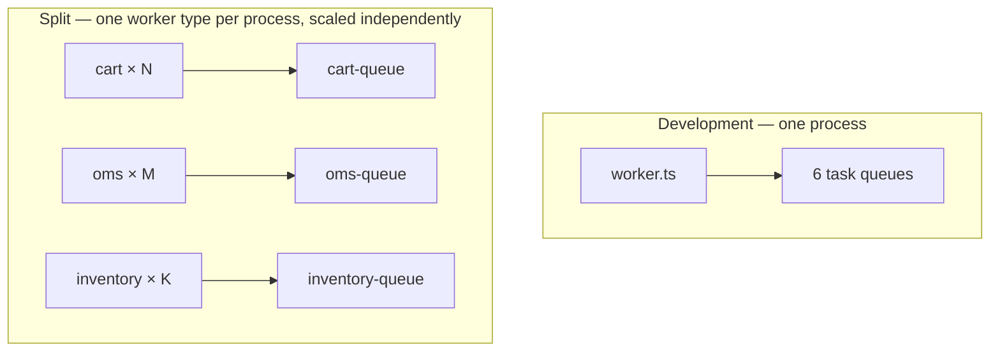

# Worker Topology: From One Process to Many

In development, all six domain workers run in a single Node.js process over one gRPC connection,
each polling its own task queue (`src/temporal/worker.ts`) — one thing to start, restart, and read
logs from. The same unified process is also the pragmatic first *hosted* shape
([Deployment Options](cloud-deployment.md), Option B: one always-on container running all six
domains). The split topology — one worker type per process, with as many processes per queue as
its load demands — is what the architecture is shaped for when load arrives: because the task
queues were separate all along, moving from the unified process to the split one is a deployment
change, not a refactor. This guide covers both shapes and the path between them.

## The development topology

The unified launcher ([worker.ts](../src/temporal/worker.ts)) opens **one `NativeConnection`** and
starts six domain workers on it, each created by its domain's `worker.ts` with its own
`workflowsPath`, activity map, and task queue:

```ts
const worker = await Worker.create({
  connection,                                    // shared NativeConnection
  workflowsPath: require.resolve('./workflows'),
  activities: { ...activities, ...transitionRecorderActivities },
  taskQueue: CART_TASK_QUEUE,
});
```

One process, six pollers, six queues. The point of keeping the queues separate even in a single
process: **task-queue isolation is already doing its job.** A slow fulfillment activity saturates
the fulfillment worker's task slots, not the cart worker's — cart updates stay responsive because
they never share a queue with batch work. The unified process is a packaging convenience, not a
coupling.

## The production topology

In the split shape, each domain worker runs as its own process — the same `worker.ts` modules,
launched selectively — with **N processes per queue as that queue's load demands**. Temporal's
task queues are the load balancer: every process polling `cart-queue` competes for the same tasks,
and adding capacity is starting another process. Nothing in the code knows or cares how many
processes are polling.



Same six task queues in both topologies; only the number of processes polling each one changes.
Scaling policy can differ per domain — hold latency-sensitive domains (cart, checkout, where the
`executeUpdateWithStart` round trip is user-visible) at a warm floor while batch-shaped domains
(fulfillment simulation, projections) run lean.

## Splitting the launcher

The seam is already in place: each domain exports a `start(connection, otelConfig?)` from
`src/temporal/<domain>/worker.ts`, and the unified launcher just calls all six. Running a single
domain per process is a thin entry point that opens a connection and calls one of them — selected
by an environment variable (the parent platform uses `WORKER_TYPE` for exactly this), so one
container image serves every worker type:

```ts
const workers = { cart: cartWorker, checkout: checkoutWorker, /* … */ };
await workers[process.env.WORKER_TYPE ?? 'all'](connection, otelConfig);
```

[deploy/worker.Dockerfile](../deploy/worker.Dockerfile) builds that image today (running the
unified launcher); the split is the same image with a different env var per service — a deployment
change, as promised.

## Sizing, hosting, and Temporal Cloud

The remaining questions are covered where they're best treated:

- **Scaling signals** — task-queue backlog and schedule-to-start latency, and who acts on them
  (push vs. pull, KEDA, worker pools, Serverless Workers):
  [Autoscaling by Push and by Pull](push-vs-pull-autoscaling.md).
- **Hosting constraints** — a poller can't scale to zero, and a throttled CPU stops it polling;
  the option-by-option survey with a stated bias toward serverless push:
  [Deployment Options](cloud-deployment.md).
- **Managed Temporal deltas** — mTLS env vars, and Search Attribute registration as a hard
  prerequisite (workflow starts are rejected without it):
  [Deployment Options § Search Attributes](cloud-deployment.md#required-regardless-of-option-search-attributes)
  and [ADR-0011](adr/0011-workflow-id-and-correlation-tagging.md). Worker code is identical
  against local Temporal and Temporal Cloud.
